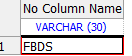
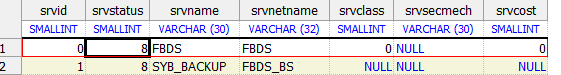
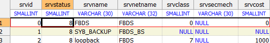

ase数据库开启 sp_sysmon

 

# 第一步

建立loopback服务，以下步骤都是在windowns sqldbx上执行的 

SELECT @@SERVERNAME

 

 

SELECT * FROM sysservers

 

 

exec sp_addserver loopback, NULL, FBDS    (这里的FBDS是srvnetname的名字)

 

SELECT * FROM sysservers

 

 

GRANT role mon_role TO sa 

必须给sa用户mon_role角色，否则差不了mon相关的系统表。

 

 

## 第二步

通过配置打开相应监控的开关，慢慢补充 

 

-- enable monitoring 控制 Adaptive Server 是否收集监控表数据。如果将

-- enable monitoring 设置为 0，则不收集数据。enable monitoring 充当主开关，

-- 用于确定是否启用以下任一配置参数。

sp_configure 'enable monitoring',1 

 

-- sql text pipe active 控制 Adaptive Server 是否收集 SQL 文本。如果启用此

-- 选项并设置 sql text pipe max messages，则 Adaptive Server 收集每个查询

-- 的 SQL 文本。您可以使用 monSysSQLText 来检索所有用户任务的 SQL

-- 文本。

sp_configure 'sql text pipe active' ,1 -- 激活sql文本记录管道，让系统可以记录正在运行的sql  激活后查询 monSysSQLText

sp_configure 'sql text pipe max messages',2000

SELECT * FROM monSysSQLText 

 

-- SQL batch capture 控制 Adaptive Server 是否收集 SQL 文本。如果同时启

-- 用 SQL batch capture 和 max SQL text monitored，则 Adaptive Server 收集每

-- 个用户任务的每个批处理的 SQL 文本。

sp_configure 'SQL batch capture', 1

 

-- plan text pipe active 确定 Adaptive Server 是否收集查询计划文本。如果同

-- 时启用 plan text pipe active 和 plan text pipe max messages，则 Adaptive

-- Server 收集每个查询的计划文本。您可以使用 monSysPlanText 检索所有

-- 用户任务的查询计划文本。

sp_configure 'plan text pipe active',1 -- 激活查询计划文本通道，收集每个查询的计划文本，激活后查询 monSysPlanText

sp_configure 'plan text pipe max messages',1000

  

-- statement pipe active 控制 Adaptive Server 是否收集语句级统计信息。如果

-- 同时启用 statement pipe active 和 statement pipe max messages，则 Adaptive

-- Server 收集每个查询的语句级统计信息。您可以使用 monSysStatement

-- 来检索所有已执行语句的统计信息。

sp_configure 'statement pipe active' ,1

sp_configure 'statement pipe max messages', 5000

  

-- errorlog pipe active 控制 Adaptive Server 是否收集错误日志消息。如果同

-- 时启用 errorlog pipe active 和 errorlog pipe max messages，则 Adaptive

-- Server 将收集发送到错误日志的所有消息。您可以使用 monErrorLog 检

-- 索这些错误日志消息。

sp_configure 'errorlog pipe active',1

sp_configure 'errorlog pipe max messages',1000

  

-- deadlock pipe active 控制 Adaptive Server 是否收集死锁消息。如果同时启

-- 用了 deadlock pipe active 和 deadlock pipe max messages，则 Adaptive Server

-- 收集每个死锁的文本。您可以使用 monDeadLock 检索这些死锁消息。

sp_configure 'deadlock pipe active',1

sp_configure 'deadlock pipe max messages',1000

 

 -- wait event timing 控制 Adaptive Server 是否收集单个等待事件的统计信息。

-- 任务可能会因各种原因而必须等待（例如，等待缓冲区读取完成）。

-- monSysWaits 表包含每个等待事件的统计信息。monWaitEventInfo 表包含

-- 等待事件的完整列表。

sp_configure 'wait event timing', 1

  

-- process wait events 控制 Adaptive Server 是否收集每个任务的每个等待事

-- 件的统计信息。您可以使用 monProcessWaits 获得特定任务的等待信息。

sp_configure 'process wait events', 1

  

-- object lockwait timing 控制 Adaptive Server 是否收集请求对象上的锁的计时

-- 统计信息。

sp_configure 'object lockwait timing',1

  

-- statement statistic active 控制 Adaptive Server 是否收集监控表语句级统

-- 计信息。您可以使用 monProcessStatement 来获取特定任务的语句统计

-- 信息。

sp_configure 'statement statistics active', 1

 

sp_configure 'per object statistice active', 1

 

 

-- max SQL text monitored 指定 Adaptive Server 为每个用户任务分配的用来

-- 存储 SQL 文本的总字节数。

sp_configure 'max SQL text monitored', 256

  

-- enable monitoring 控制 Adaptive Server 是否收集监控表数据。如果将
 -- enable monitoring 设置为 0，则不收集数据。enable monitoring 充当主开关，
 -- 用于确定是否启用以下任一配置参数。
 sp_configure 'enable monitoring',1

 

 -- sql text pipe active 控制 Adaptive Server 是否收集 SQL 文本。如果启用此
 -- 选项并设置 sql text pipe max messages，则 Adaptive Server 收集每个查询
 -- 的 SQL 文本。您可以使用 monSysSQLText 来检索所有用户任务的 SQL
 -- 文本。
 sp_configure 'sql text pipe active' ,1 -- 激活sql文本记录管道，让系统可以记录正在运行的sql  激活后查询 monSysSQLText
 sp_configure 'sql text pipe max messages',2000
 SELECT * FROM monSysSQLText

 -- plan text pipe active 确定 Adaptive Server 是否收集查询计划文本。如果同
 -- 时启用 plan text pipe active 和 plan text pipe max messages，则 Adaptive
 -- Server 收集每个查询的计划文本。您可以使用 monSysPlanText 检索所有
 -- 用户任务的查询计划文本。
 sp_configure 'plan text pipe active',1 -- 激活查询计划文本通道，收集每个查询的计划文本，激活后查询 monSysPlanText
 sp_configure 'plan text pipe max messages',1000

 

 -- statement pipe active 控制 Adaptive Server 是否收集语句级统计信息。如果
 -- 同时启用 statement pipe active 和 statement pipe max messages，则 Adaptive
 -- Server 收集每个查询的语句级统计信息。您可以使用 monSysStatement
 -- 来检索所有已执行语句的统计信息。
 sp_configure 'statement pipe active' ,1
 sp_configure 'statement pipe max messages', 5000

 -- errorlog pipe active 控制 Adaptive Server 是否收集错误日志消息。如果同
 -- 时启用 errorlog pipe active 和 errorlog pipe max messages，则 Adaptive
 -- Server 将收集发送到错误日志的所有消息。您可以使用 monErrorLog 检
 -- 索这些错误日志消息。
 sp_configure 'errorlog pipe active',1
 sp_configure 'errorlog pipe max messages',1000

 -- deadlock pipe active 控制 Adaptive Server 是否收集死锁消息。如果同时启
 -- 用了 deadlock pipe active 和 deadlock pipe max messages，则 Adaptive Server
 -- 收集每个死锁的文本。您可以使用 monDeadLock 检索这些死锁消息。
 sp_configure 'deadlock pipe active',1
 sp_configure 'deadlock pipe max messages',1000

 -- wait event timing 控制 Adaptive Server 是否收集单个等待事件的统计信息。
 -- 任务可能会因各种原因而必须等待（例如，等待缓冲区读取完成）。
 -- monSysWaits 表包含每个等待事件的统计信息。monWaitEventInfo 表包含
 -- 等待事件的完整列表。
 sp_configure 'wait event timing', 1

 -- process wait events 控制 Adaptive Server 是否收集每个任务的每个等待事
 -- 件的统计信息。您可以使用 monProcessWaits 获得特定任务的等待信息。
 sp_configure 'process wait events', 1

 -- object lockwait timing 控制 Adaptive Server 是否收集请求对象上的锁的计时
 -- 统计信息。
 sp_configure 'object lockwait timing',1

 -- statement statistic active 控制 Adaptive Server 是否收集监控表语句级统
 -- 计信息。您可以使用 monProcessStatement 来获取特定任务的语句统计
 -- 信息。
 sp_configure 'statement statistics active', 1

 sp_configure 'per object statistice active', 1

 -- max SQL text monitored 指定 Adaptive Server 为每个用户任务分配的用来
 -- 存储 SQL 文本的总字节数。
 sp_configure 'max SQL text monitored', 256