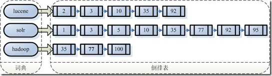

# 数据分类

结构化数据：数据库、元数据

非结构化数据：邮件、word文档

半结构化数据：xml、html

 

# 搜索分类

对结构化数据搜索

对非结构化数据搜索（全文搜索）

​	顺序扫描法

​	**全文检索**

 

# 全文检索

定义：从非结构化数据中提取一部分信息重新组织，再对这部分有一定结构的信息进行搜索，此种方式为**全文检索**，提取的这一部分信息叫**索引**。

 

全文检索过程

索引创建：提取结构化和非结构化数据的信息，并创建索引。

搜索索引：得到用户查询请求，搜索创建的索引，然后返回结果。

 

# 索引结构

假设文档集合有100篇，文档编号1到100。

左侧保存的一系列关键字符串，称为**词典**。

每个关键字符串执行包含此字符的文档链表，此文档链表称为**倒排表**。

 

# 如何创建索引

第一步：对文档进行分词

1、将文档分成一个一个单独的单词

2、去除标点

3、去除停词（没有特别意义的词，入英语中的“the”、“a”、“this”。）

第二步：对上步得到的词元进行语言处理

1、变小写

2、缩减为词根，如“cars”到“car”。

3、转变为词根，如“drove”到“drive”。

第三步：把词传给索引组件

1、建立字典

2、字典排序

3、去重，形成倒排表

 

# 如何对索引搜索

第一步：用户输入查询语句

第二步：对查询语句进行词法分析，语法分析，及语言处理

第三步：搜索索引，得到符合文档

第四步：根据得到文档和查询语句的相关性，对结果排序

1、计算权重

2、向量空间模型算法

第五步：返回结果

 

# Lucene介绍

总体架构

 

 

我们用Lucene做会有什么问题？

研究院是怎么做的？为什么不准？

给的几个场景怎么做搜索？输入是什么，输出是什么？

 

 

Lucene官网 http://lucene.apache.org/core/index.html