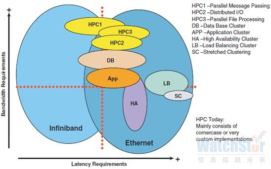

# 三个云计算服务层次

IaaS(Infrastructure as a Service)：硬件资源

PaaS(Platform as a Service)：平台资源

SaaS(Software as a Service)：应用资源

 

# 云计算-集中云

 

主备模式，以各类HA集群技术为代表。

负载均衡模式，以LB集群技术为代表。

LB集群技术有来回路径一致和三角传输两种，路径一致安全性高，三角传输性能好，安全降低。

网络需求

服务器之间交流量多，与外部交流少，故此数据中心网络内部通信增大，对带宽和延迟要求高。

 

# 云计算-分散云

技术实现方案分三类

​	操作系统虚拟化 OS-Level

​	主机虚拟化 Hosted

​	裸金属虚拟化 Bare-metal

 

vMotion是将一个正在提供服务的VM从一台物理服务器搬家到另一台物理服务器的技术。