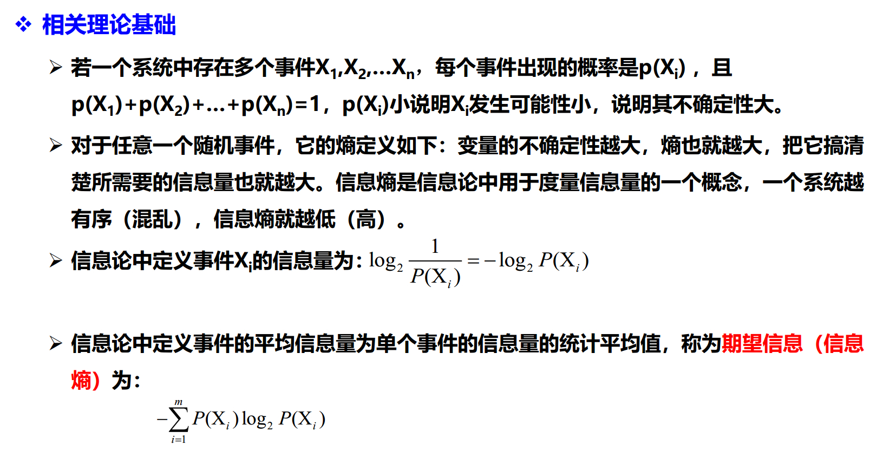
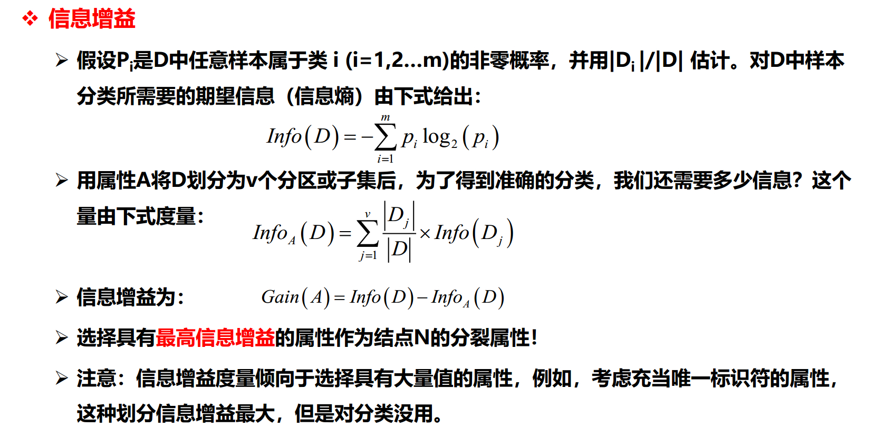
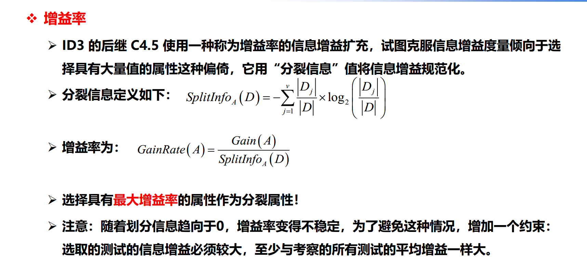

[TOC]

# 一、数据挖掘

数据挖掘，是指从大量的数据中，通过统计学、人工智能、机器学习等方法，挖掘出未知的具有价值的信息和知识的过程。

数据挖掘是一门交叉学科，覆盖了统计学、数据可视化、算法、数据库，机器学习、市场营销和其他学科等知识。

数据分析和数据挖掘区别

| 项目 | 数据分析                                                     | 数据挖掘                                                     |
| ---- | ------------------------------------------------------------ | ------------------------------------------------------------ |
| 定义 | 根据分析目的，用适当的方法即工具，对收集的数据进行处理与分析，提取有价值的信息，发挥数据的作用 | 从大量数据中，通过统计学、人工智能、机器学习等方法，挖掘出未知的、且有价值的信息和知识的过程。 |
| 作用 | 现状分析、原因分析、预测分析                                 | 解决四类问题：分类、聚类、关联、预测                         |
| 方法 | 对比分析、分组分析、交叉分析、回归分析等                     | 决策树、神经网络、关联规则、据类分析等                       |
| 结果 | 指标统计量结果，如综合/平均值等                              | 输出模型或规则                                               |

定量模型：一般是数学公式，比如Y=a*X

定性模型：一般是规则，比如年龄>30岁 and 收入>1万元

分类问题 - 有监督学习，使用已知的目标分类历史样本来训练，需要对未知分类的样本预测所属的分类。

- 常见算法：决策树，贝叶斯,KNN，支持向量机，神经网络，逻辑回归等

聚类问题 - 无监督学习，根据物以类聚的思想将目标按照一定规则进行分类。

- 常见算法：划分聚类，层次聚类，密度聚类，网格聚类，基于模型聚类等

关联问题 - 无监督学习，基于数据的项之间的关联，确定关联程度，识别有可能发生或频繁发生的模式。

- 常见算法：Aprior，Carma，序列算法

预测问题 - 有监督学习，需要已知目标值的历史样本作为训练模型，对未知的样本预测其目标值。

- 常见 算法：简单线性回归分析，多重线性回归分析，时间序列分析等

# 二、分类问题

## 1.概念

有监督学习的一种，模型的学习在被告知样本属于哪个类别下进行，新的数据用学习的结果进行分类。

所以，分类需要建立模型（分类器），然后使用模型对将来或者未知数据的对象进行分类。

## 2.常用算法

决策树是一种基本的分类与回归方法（ID3、C4.5、基于 Gini的CART分类、CART回归）。

### 2.1 决策树之C4.5算法（完）

#### 2.1.1 工作原理

给定一个数据集，所有实例都有一组属性来描述，每个实例仅属于一个类别，在给定数据集上运行C4.5算法可以学习得到一个从属性值到类别的映射，进而可以使用该映射去分类新的未知实例。

**安致宜释**：

拿到一组数据，数据中是一些属性和类别的对应关系，然后计算一下，得到一个<属性s-类别>的映射，等到新的只有属性数据到来，就可以用映射结果看看这些新数据都属于哪一类，有点预测的意思，属性-类别映射会发生变换，这时候应该是要更新模型了。

一般这个映射是一个棵决策树，那么在组装树时，众多属性中如何知道哪个属性是根节点，哪个属性和哪个属性是上下级关系呢？这里就需要知道 每个属性对类别的熵的信息增益情况。

熵

信息增益

增益率

#### 2.1.2 计算步骤 

1. 特征选择
2. 决策树生成 
3. 剪枝 - 识别和删除噪声或离群点的分支
4. 带入测试数据

#### 2.1.3 示例

参考[Algorithm\DataMining\c45](https://github.com/anzhiyi1988/Algorithm) 的代码实现

### 2.2 决策树之ID3算法

### 2.3 决策树之CART算法

# 三、聚类问题

## 1. 概念

聚类分析是按照个体的特征将他们分类，让同一个类别内的个体之间具有较高的相似度，不同类别间具有较大的差异性

聚类分析属于无监督学习

聚类对象可分Q型聚类和R型聚类

Q型聚类：样本/记录聚类 以距离为相似性的指标；

R型聚类：指标/变量聚类 以相似系数为相似性指标；

## 2. 常用算法

### 2.1 划分聚类之K-Means（完）

K表示聚类算法中类的个数，Means表示均值算法，K-Means既是用均值算法吧数据分成K个类的算法。

#### 2.1.1 目标

是把N个样本点划分到k个类中，使得每个点都属于离他最进的**质心**（一个类内部所有样本点的均值）对应的类，以之作为聚类的标准。

#### 2.1.2 计算步骤

1. 取的k个 初始质心：从数据中随机抽取k个点作为初始聚类的中心，来代表各个类
2. 把每个点划分进相应的类：根据**欧式距离**最小 原则，把每个点划分进距离最近 的类中
3. 重新计算质心：根据均值等方法，从新计算每个类的质心
4. 迭代计算质心：重复第二步和第三步，迭代计算
5. 聚类完成：聚类中心不再发生移动

#### 2.1.3 示例

参考[Algorithm\DataMining\kmeans](https://github.com/anzhiyi1988/Algorithm) 的代码实现

### 2.2 层次聚类

层次聚类又称为树聚类算法，它根据数据间的距离，透过一种层次架构方式，反复将数据进行聚合，创建一个层次以分解给定的数据。常用于一维数据的自动分组

#### 2.2.1 目标

通过数据间的相似性，按照相似性由高到低排序后重新连接各个节点，整个过程建立一个树结构。

#### 2.2.2计算步骤

1. 每个数据点单独作为一个类
2. 计算各个点之间的距离
3. 按照距离从小到大连接成对，得到树结构

#### 2.2.3示例

### 2.3 密度聚类之DBSCAN

# 四 、关联问题

## 1. 概念

## 2. 常用算法

### 2.1 Apriori

从一个事务数据集中发现频繁项集并推出关联规则

项集 

事务集

项集支持度 - 

频繁项集 - 

反向单调性 - 

向下闭合性 - 

# 五、预测问题

## 1. 概念

## 2. 常用算法

# 参考

测试数据下载地址：http://archive.ics.uci.edu/ml/index.php

数据挖掘概念参考：https://www.cnblogs.com/rix-yb/tag/%E6%95%B0%E6%8D%AE%E6%8C%96%E6%8E%98/

kmeans原理参考：http://www.aboutyun.com/thread-18178-1-1.html

kmeans算法参考：https://www.jb51.net/article/153737.htm

c45算法参考：https://www.cnblogs.com/multhree/p/10334400.html
