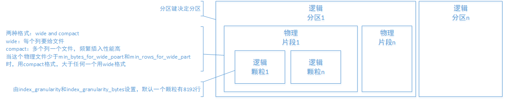

# 存储层

建表时，支持按照某列sortby，相同的key在磁盘上连续存储且有序摆放。

## 主键索引

每列按照index granularity划分，默认8192行

主键可以重复

## 稀疏索引

是一个index granularity索引的统计信息

类型有：

minmax

set（max_rows）

ngrambf_v1 进行ngram分词

tokenbf_v1  进行标点分词

bloom_filter  加速等值、like、in速度

## 数据sharding

random随机分片

constant固定分片

column value分片，按照某一列hash分片

自定义表达式分片，计算后hash分片

## 表引擎

老鼻子引擎了，需要仔细看啊。

## 数据partitioning

优点，分区裁剪，只查必要的数据

优点，TTL管理，淘汰过期分区数据

## 数据TTL

列级别TTL，列中数据过期，替换为默认值，全列过期后，删该列。

行级别TTL

分区级别TTL

## 高吞吐写入能力

LSM Tree

## 存储结构

# 计算层

多核并行：多个partition，每个partition多个index granularity，多个cpu处理部分数据。

分布式计算

向量化执行与SIMD：向量执行引擎。

动态代码生成runtime codegen

近似计算：损失精度、提升性能

复杂数据类型支持：array、json、tuple、set

# 性能

**单个大查询吞吐** page cache 中：2-10GB/s ； 磁盘中：读速 * 压缩率

**单个小查询吞吐** page cache 中：30GB/s  ；   磁盘中：读速 * 压缩率

**短查询延迟**         page cache ： <50ms ；        磁盘中：10ms * 列数 * 数据块数

**大量短查询QPS**：每秒最多查100次

**数据插入要求** ： 每次>1000行 ， 使用tab-separated格式写到mergeTree表中时，写入速度大约50~200MB/s 

# 数据库引擎

# 表引擎