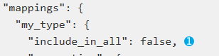
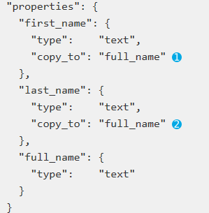
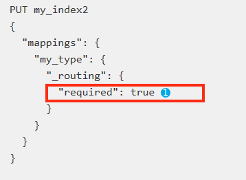

## Identity meta-fields（身份）

### _index 

The index to which the document belongs. 

一个虚拟的字段，每个索引建立时，存储是什么值呢？？，在查询是可以使用这个字段，指定查找哪些索引，并对指定的索引进行聚合排序等操作。

不需要显示指定，建立时自己赋值。

### _uid 

***_type*** and the ***_id***的组合。 

每个文档被编入索引是，都会与***_type***和***_id***关联在一起，这个两个字段的组合（***{type}#{id}***）起来，存储到***_uid***字段中并编入索引。

不需要显示指定，建立时自己赋值。

### _type 

存储的是映射中的类型名称，为了方便查找，比如类型是user，这此值为user。

不需要显示指定，建立时自己赋值。

### _id 

映射中每类文档的id，不会被编入索引，可以从***_uid***中获取

 

## Document source meta-fields（文档资源）

### _source 

The original JSON representing the body of the document. 

在插入数据时，这个字段存储了每类文档的json body，***_source***字段不编入索引，但是存储。

可以通过enabled：false取消。

可已通过including/Excluding指定哪些字段存储哪些字段不存储。

### _size 

The size of the _source field in bytes, provided by the mapper-size plugin. 

记录***_source***字段的存储文档的大小，单位为bytes，通过大小搜索时，可以使用这个字段。

需要安装插件才能有***_size***字段。

bin/elasticsearch-plugin install mapper-size

<https://artifacts.elastic.co/downloads/elasticsearch-plugins/mapper-size/mapper-size-5.6.11.zip>.

 

## Indexing meta-fields（索引）

### _all 

A catch-all field that indexes the values of all other fields. 

作为一个大字符串缓存所有字段，字段间用空格分割，编入索引，不存储，这意味着能搜索，但无法恢复。

查询是不指定字段，则在***_all***中查找

作为一个字段，可以接受的参数有***enabled******，******a******nalyzer，******t******erm_vectors，******i******ndex_options， store***。

如果***_all***启用了，每个字段可以通过***include_in_all***参数控制其是否可以加入***_all***中。如果在mappings中直接配置"include_in_all": false, 则所有字段都不加入***_all***，如下图***。***

可以自定义类似_all的字段，需要使用copy_to参数，如下：

### _field_names 

All fields in the document which contain non-null values. 

记录了所有不为空的字段的字段名称。

## Routing meta-fields（）

### _parent 

Used to create a parent-child relationship between two mapping types. 

这个用的比较少，不设置就没有。

### _routing 

自定义路由值可以路由文档到指定的分片上。

数据在分片时，用到这个值，每条数据应该被分配到哪个分片上，计算公式如下：

​	shard_num = hash(***_routing***) % ***num_primary_shards***

默认情况_routing的值为_id 或者 _parent(如果设置了)。

如果设置了路由值，则索引的增删改查都需要提供路由值。如果忘记提供路由值，则会在多个分片上查找需要的文档，为了防止这样，可以设置路由字段的required属性为true（如下图），这样不提供路由值时就会报错。

事实上，多个文档有相同的_id时，如果_routing不同，建立索引时同样会分配在不同的分片上。

自定义路由可以被设置为路由到多个分片（所有分片子集）而不是单一分片，这样有助减少集群中数据不平衡的问题和对搜索的影响，这个设置可以通过建立索引时的index.routing_partition_size 参数指定， 随着这数的增加，数据分布越均匀，搜索时需要搜索更多的分片，指定后计算分片号的公式变为如下：

​	shard_num = (hash(***_routing***) + hash(***_id***) % ***routing_partition_size***) % ***num_primary_shards***

一旦启用，分区索引有以下限制：

​	无法创建父子关系映射

​	所有索引映射，_routing字段必须标记required

 

## Other meta-field

### _meta 

Application specific metadata. 