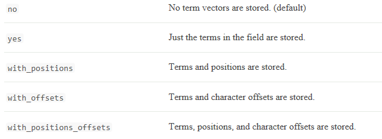

### analyzer                          

### normalizer 

### boost 

### coerce 

### copy_to 

### doc_values 

### dynamic

控制索引中字段或者所有字段是否可以动态扩展，配置参数有三个：
|项目|描述|
| --------- | ------------------------------------------------------------ |
| true   | Newly detected   fields are added to the mapping. (default)  |
| false  | Newly detected   fields are ignored. These fields will not be indexed so will not be   searchable but will still appear in the _source field of returned hits. These   fields will not be added to the mapping, new fields must be added explicitly. |
| strict | If new fields are   detected, an exception is thrown and the document is rejected. New fields   must be explicitly added to the mapping. |

### enabled 

### fielddata 

### format 

### ignore_above 

### ignore_malformed 

### include_in_all 

### index
控制字段是否被编入索引，默认为真。
如果一个字段没有被编入索引，则这个字段是不可查询的。

### index_options

控制哪些信息可以编入倒排索引，哪些可以搜索，哪些高亮。配置如下：
|项目|描述|
| --------- | ------------------------------------------------------------ |
| docs      | 文档编号编入倒排索引中。    Can answer the question Does this term exist   in this field? |
| freqs     | 文档编号，词频编入倒排索引中。   Term frequencies   are used to score repeated terms higher than single terms. |
| positions | 文档编号，词频，位置编入倒排索引中。    Positions can be used for proximity or   phrase queries. |
| offsets   | 文档编号，词频，位置,字符的开始结束偏移量编入倒排索引中。    偏移量高亮是会使用的到。 |

index为true的字段默认是positions, and all other fields use docs as the default.

### fields 

### norms 

### null_value 

### position_increment_gap 

### properties 

### search_analyzer 

### similarity 

### store

默认情况下，字段会被编入索引用以搜索，但是这些字段是不会存储的。这意味着可以查询字段，但无法检索原始字段值。通常这也无所谓，因为字段已经是**_source**元字段的一部分了（如果没有禁用），**_source**元字段默认存储但是不编入索引。如果想检索单一字段或者几个字段，可以通过source filtering查询命令指定要展示哪些字段。
如果存储字段是有意义的，比如一个文档的title和date字段，我们可以采用如下形式建立

```
PUT my_index
{
  "mappings": {
    "my_type": {
      "properties": {
        "title": {
          "type": "text",
          "store": true 
        },
        "date": {
          "type": "date",
          "store": true 
         },
         "content": {
          "type": "text"
        }
      }
    }
  }
}
```
搜索形式如下：

```
GET my_index/_search
{
    "stored_fields": [ "title", "date" ] 
}
```
另外，一些有意义的字段但是没有在_source中出现的字段也可以存储，比如 copy_to 的字段，可以设置是否存储。
### term_vector 
词向量包含关于分析过程产生的词的信息，包括： 
词向量 
每个词的位置或者顺序
词在源字符串中的开始和结束偏移量 
词向量可以被存储，被遍历，接收配置参数




 

 