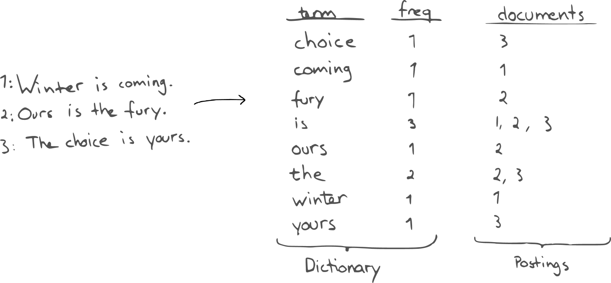

#### 环境地址
172.16.176.2448/243 root/123456

#### 参考资料
https://github.com/NLPchina/ansj_seg/wiki/%E5%88%86%E8%AF%8D%E6%96%B9%E5%BC%8F
https://github.com/NLPchina/elasticsearch-analysis-ansj
https://www.elastic.co/guide/en/elasticsearch/reference/current/analysis-ngram-tokenizer.html

#### ELK是什么
ELK = elasticsearch + logstash + kibana 
elasticsearch : 后台分布式存储 全文检索 
logstash : 日志加工 搬运工 
kibana : 可视化操作界面 

#### 倒排索引
每一个文档都对应一个ID，倒排索引会按照***指定分词语法***对每一个文档进行分词。
然后维护一张表，列举所有文档中出现的***词***以及它出现的文档ID和出现频率。
搜索时同样会对***关键词***进行同样的分词，然后查表得到结果。

#### 注意事项
分片建立索引时制定，不能动态修改。 
副本可以动态扩展。 
red : 有节点宕掉。 
yellow : 可以使用，但是没有节点分配多余的副本。 
green : 正常状态。 

#### Cluster
