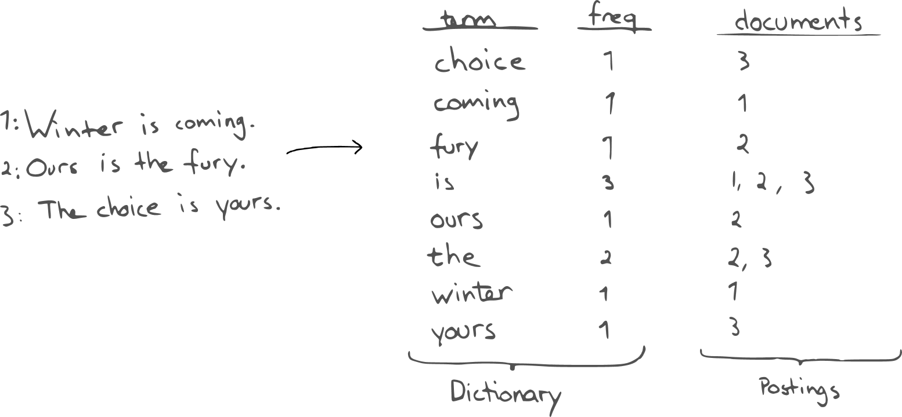

## ELK是什么

ELK = elasticsearch + logstash + kibana

elasticsearch : 后台分布式存储 全文检索

logstash : 日志加工 搬运工

kibana : 可视化操作界面

 

## 倒排索引

每一个文档都对应一个ID，倒排索引会按照**指定分词语法**对每一个文档进行分词。然后维护一张表，列举所有文档中出现的**词**以及它出现的文档ID和出现频率。搜索时同样会对**关键词**进行同样的分词，然后查表得到结果。

 

 

## 分析器

一个分析器有三个组件构成：字符过滤器(character filters)、分词器(tokenizer)、分词过滤器(token filters)。

1. 字符过滤器：在文本被切割之前进行清理操作，例如移除HTML标签，将&替换为字符等；

2. 分词器：将文本切分为独立的词项；简单的分词器通常是根据空白及标点符号进行切分；

3. 分词过滤器：转换字符(如将大写转为小写)、移除词项(如移除a、an、of及the等)或者添加词项(例如，添加同义词)；

 

## 注意事项

索引的分片，建立索引时指定，之后不能动态修改。

分片的副本可以动态扩展。  

## 环境地址

172.16.176.244/243 root/123456

 

## 参考资料

<https://github.com/NLPchina/ansj_seg/wiki/%E5%88%86%E8%AF%8D%E6%96%B9%E5%BC%8F>

<https://github.com/NLPchina/elasticsearch-analysis-ansj>

<https://www.elastic.co/guide/en/elasticsearch/reference/current/analysis-ngram-tokenizer.html>

 

 

solution

<http://172.16.32.38:7020/sjcjgjV215/form/5dff0b1496986802b43b43feb401b665/insert###>