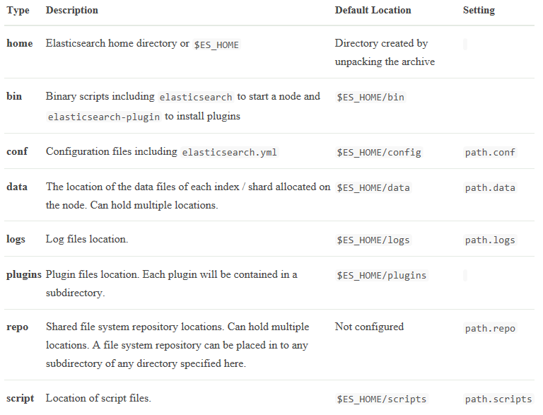

## 建立用户

```
[root@jq244 cs]# groupadd anzhy

[root@jq244 cs]# useradd anzhy -g anzhy

[root@jq244 cs]# passwd anzhy

Changing password for user anzhy.

New password: 

BAD PASSWORD: it is too short

BAD PASSWORD: is too simple

Retype new password: 

passwd: all authentication tokens updated successfully.

[root@jq244 cs]# 
```


## 安装java

配置环境变量

## 配置系统文件 /etc/security/limits.conf

```
* soft memlock unlimited

* hard memlock unlimited
```

## 安装es

下载 tar.gz

解压 tar -zxvf elasticsearch-5.6.10.tar.gz 

目录说明



##  配置elasticsearch.yml 

```
cluster.name: anzhytest

node.name: anzhy-1

bootstrap.memory_lock: true

bootstrap.system_call_filter: false

network.host: 172.16.176.244

discovery.zen.ping.unicast.hosts: ["172.16.176.244", "172.16.176.243"]

discovery.zen.minimum_master_nodes: 1
```

 

## 配置jvm.options

```
-Xms4g

-Xmx4g
```

## 第三步 运行ES
```
./bin/elasticsearch
```
此种运行方式日志打在标准输出中，并且ctrl-c可以停止其运行 
```
./bin/elasticsearch -d -p pid.file
```
守护进程方式启动，日志在ES_HOME/logs/ 下
```
kill `cat pid`
```
## 第四步 检测是否运行
通过http访问即可
GET <http://ip:9200/>