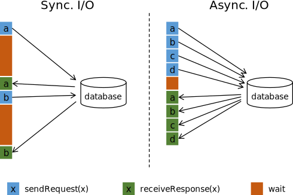

# Operators

operator可以把一个或者多个datastream转换成一个新的datastream，程序可以将多个operator组合成复杂的数据流拓扑。

本节介绍基础转换，应用转换后的有效物理分区，以及深入了解运算链。

# DataStream Transformations

***有一堆函数介绍，看官网吧***

# Physical partitioning

如果需要，Flink还通过以下函数对转换后的确切的流分区进行低级控制。

***有五个函数介绍***

# Task chaining and resource groups

链接两个子转换意味着将他们放到一个线程中，以获取更好的性能。如果可以的话，flink默认情况下会链接operator操作。

 API给出了链接的细粒度控制：

使用 `StreamExecutionEnvironment.disableOperatorChaining()` 可以禁止整个任务的链接。更细节的控制，如下function可以做到，注意，这些function只能在转换后使用，因为他们引用了前面的转换。 例如，可以这样用 `someStream.map(...).startNewChain()`但是不能这样用 `someStream.startNewChain()`.

A resource group is a slot in Flink, see [slots](https://ci.apache.org/projects/flink/flink-docs-release-1.11/ops/config.html#configuring-taskmanager-processing-slots). You can manually isolate operators in separate slots if desired.

***有三个函数介绍***

Begin a new chain, starting with this operator. The two mappers will be chained, and filter will not be chained to the first mapper.

```java
someStream.filter(...).map(...).startNewChain().map(...);
```

Do not chain the map operator

```java
someStream.map(...).disableChaining();
```

Set the slot sharing group of an operation. Flink will put operations with the same slot sharing group into the same slot while keeping operations that don't have the slot sharing group in other slots. This can be used to isolate slots. The slot sharing group is inherited from input operations if all input operations are in the same slot sharing group. The name of the default slot sharing group is "default", operations can explicitly be put into this group by calling slotSharingGroup("default").

```java
someStream.filter(...).slotSharingGroup("name");
```

# Windows

Windows 是无限数据流的核心，Windows把流分割成有限的大小到 `bucket` 中，我们用这些 `bucket` 计算。本文档重点介绍如何在Flink中执行窗口化，以及程序员如何从这个功能中最大限度地受益。

窗口程序的结构是如下两种，一个*keyed* 流，另一个是 *non-keyed* 流，区别就是`keyBy(...)` 函数的调用，以及`window(...)`和  `windowAll(...)` 的调用：

**Keyed Windows**

```java
stream
       .keyBy(...)               <-  keyed versus non-keyed windows
       .window(...)              <-  required: "assigner"
      [.trigger(...)]            <-  optional: "trigger" (else default trigger)
      [.evictor(...)]            <-  optional: "evictor" (else no evictor)
      [.allowedLateness(...)]    <-  optional: "lateness" (else zero)
      [.sideOutputLateData(...)] <-  optional: "output tag" (else no side output for late data)
       .reduce/aggregate/fold/apply()      <-  required: "function"
      [.getSideOutput(...)]      <-  optional: "output tag"
```

**Non-Keyed Windows**

```java
stream
       .windowAll(...)           <-  required: "assigner"
      [.trigger(...)]            <-  optional: "trigger" (else default trigger)
      [.evictor(...)]            <-  optional: "evictor" (else no evictor)
      [.allowedLateness(...)]    <-  optional: "lateness" (else zero)
      [.sideOutputLateData(...)] <-  optional: "output tag" (else no side output for late data)
       .reduce/aggregate/fold/apply()      <-  required: "function"
      [.getSideOutput(...)]      <-  optional: "output tag"
```

以上代码，方括号（[...]）中的是可选的，flink允许用户自定义自己的widow逻辑以适合自己的程序需要。

## Window Lifecycle

In a nutshell, a window is **created** as soon as the first element that should belong to this window arrives, and the window is **completely removed** when the time (event or processing time) passes its end timestamp plus the user-specified `allowed lateness` (see [Allowed Lateness](https://ci.apache.org/projects/flink/flink-docs-release-1.11/dev/stream/operators/windows.html#allowed-lateness)). Flink guarantees removal only for time-based windows and not for other types, *e.g.* global windows (see [Window Assigners](https://ci.apache.org/projects/flink/flink-docs-release-1.11/dev/stream/operators/windows.html#window-assigners)). For example, with an event-time-based windowing strategy that creates non-overlapping (or tumbling) windows every 5 minutes and has an allowed lateness of 1 min, Flink will create a new window for the interval between `12:00` and `12:05` when the first element with a timestamp that falls into this interval arrives, and it will remove it when the watermark passes the `12:06` timestamp.

In addition, each window will have a `Trigger` (see [Triggers](https://ci.apache.org/projects/flink/flink-docs-release-1.11/dev/stream/operators/windows.html#triggers)) and a function (`ProcessWindowFunction`, `ReduceFunction`, `AggregateFunction` or `FoldFunction`) (see [Window Functions](https://ci.apache.org/projects/flink/flink-docs-release-1.11/dev/stream/operators/windows.html#window-functions)) attached to it. The function will contain the computation to be applied to the contents of the window, while the `Trigger` specifies the conditions under which the window is considered ready for the function to be applied. A triggering policy might be something like “when the number of elements in the window is more than 4”, or “when the watermark passes the end of the window”. A trigger can also decide to purge a window’s contents any time between its creation and removal. Purging in this case only refers to the elements in the window, and *not* the window metadata. This means that new data can still be added to that window.

Apart from the above, you can specify an `Evictor` (see [Evictors](https://ci.apache.org/projects/flink/flink-docs-release-1.11/dev/stream/operators/windows.html#evictors)) which will be able to remove elements from the window after the trigger fires and before and/or after the function is applied.

In the following we go into more detail for each of the components above. We start with the required parts in the above snippet (see [Keyed vs Non-Keyed Windows](https://ci.apache.org/projects/flink/flink-docs-release-1.11/dev/stream/operators/windows.html#keyed-vs-non-keyed-windows), [Window Assigner](https://ci.apache.org/projects/flink/flink-docs-release-1.11/dev/stream/operators/windows.html#window-assigner), and [Window Function](https://ci.apache.org/projects/flink/flink-docs-release-1.11/dev/stream/operators/windows.html#window-function)) before moving to the optional ones.

> 
>

# Joining


# Process Function

## 简介

`ProcessFunction` 是一个低级别的流处理方式，他允许访问应用中所有的基础组成部分：

- events (stream elements)  事件
- state (fault-tolerant, consistent, only on keyed stream) 状态
- timers (event time and processing time, only on keyed stream) 计时器

`ProcessFunction`可以看做是一个可以访问 keyed state and timers的`FlatMapFunction` ，他被调用用以处理输入流中的每个event。

关于容错状态，`ProcessFunction` 可以通过`RuntimeContext`访问flink 的 [keyed state](https://ci.apache.org/projects/flink/flink-docs-release-1.11/dev/stream/state/state.html)  ， 类似其他状态函数访问 keyed state一样。

timers允许应用对 processing time 和 [event time](https://ci.apache.org/projects/flink/flink-docs-release-1.11/dev/event_time.html) 的改变做出反应。每次调用 `processElement(...)` 获取 `Context` 对象，他可以访问所有元素的 event time timestamp和*TimerService* 

`TimerService` 用于注册 event-/processing-time 发生时的回调函数 ，对于event-time timers ，当前watermark 被推进或者超过timer的时间戳， `onTimer(...)` 方法（回调）将被调用。对于processing-time timers,当时钟到达指定的时间是，`onTimer(...)`方法（回调）将被调用，在调用期间，所有状态再次限定key的范围是timer创建的，从而允许timers操作keyed state。

**Note** If you want to access keyed state and timers you have to apply the `ProcessFunction` on a keyed stream:

```java
stream.keyBy(...).process(new MyProcessFunction())
```


> 这一段主要说的是实现processfunction后，可以在其内部访问状态和计时器。


## 低级别join

To realize low-level operations on two inputs, applications can use `CoProcessFunction` or `KeyedCoProcessFunction`. This function is bound to two different inputs and gets individual calls to `processElement1(...)` and `processElement2(...)` for records from the two different inputs.

Implementing a low level join typically follows this pattern:

- Create a state object for one input (or both)
- Update the state upon receiving elements from its input
- Upon receiving elements from the other input, probe the state and produce the joined result

For example, you might be joining customer data to financial trades, while keeping state for the customer data. If you care about having complete and deterministic joins in the face of out-of-order events, you can use a timer to evaluate and emit the join for a trade when the watermark for the customer data stream has passed the time of that trade.


## 举个栗子

下例说明 `KeyedProcessFunction` 维护每个key的计数，并且不是等key更新再发送而是每一分钟（in event time）发送key/count：

- The count, key, and last-modification-timestamp are stored in a `ValueState`, which is implicitly scoped by key.
- 对每一条记录，the  `KeyedProcessFunction` increments the counter and sets the last-modification timestamp
- The function also schedules a callback one minute into the future (in event time)
- Upon each callback, it checks the callback’s event time timestamp against the last-modification time of the stored count and emits the key/count if they match (i.e., no further update occurred during that minute)

**Note** This simple example could have been implemented with session windows. We use `KeyedProcessFunction` here to illustrate the basic pattern it provides.

```java
import org.apache.flink.api.common.state.ValueState;
import org.apache.flink.api.common.state.ValueStateDescriptor;
import org.apache.flink.api.java.tuple.Tuple;
import org.apache.flink.api.java.tuple.Tuple2;
import org.apache.flink.configuration.Configuration;
import org.apache.flink.streaming.api.functions.KeyedProcessFunction;
import org.apache.flink.streaming.api.functions.KeyedProcessFunction.Context;
import org.apache.flink.streaming.api.functions.KeyedProcessFunction.OnTimerContext;
import org.apache.flink.util.Collector;


// the source data stream
DataStream<Tuple2<String, String>> stream = ...;

// apply the process function onto a keyed stream
DataStream<Tuple2<String, Long>> result = stream
    .keyBy(value -> value.f0)
    .process(new CountWithTimeoutFunction());

/**
 * The data type stored in the state
 */
public class CountWithTimestamp {

    public String key;
    public long count;
    public long lastModified;
}

/**
 * The implementation of the ProcessFunction that maintains the count and timeouts
 */
public class CountWithTimeoutFunction 
        extends KeyedProcessFunction<Tuple, Tuple2<String, String>, Tuple2<String, Long>> {

    /** The state that is maintained by this process function */
    private ValueState<CountWithTimestamp> state;

    @Override
    public void open(Configuration parameters) throws Exception {
        state = getRuntimeContext().getState(new ValueStateDescriptor<>("myState", CountWithTimestamp.class));
    }

    @Override
    public void processElement(
            Tuple2<String, String> value, 
            Context ctx, 
            Collector<Tuple2<String, Long>> out) throws Exception {

        // retrieve the current count
        CountWithTimestamp current = state.value();
        if (current == null) {
            current = new CountWithTimestamp();
            current.key = value.f0;
        }

        // update the state's count
        current.count++;

        // set the state's timestamp to the record's assigned event time timestamp
        current.lastModified = ctx.timestamp();

        // write the state back
        state.update(current);

        // schedule the next timer 60 seconds from the current event time
        ctx.timerService().registerEventTimeTimer(current.lastModified + 60000);
    }

    @Override
    public void onTimer(
            long timestamp, 
            OnTimerContext ctx, 
            Collector<Tuple2<String, Long>> out) throws Exception {

        // get the state for the key that scheduled the timer
        CountWithTimestamp result = state.value();

        // check if this is an outdated timer or the latest timer
        if (timestamp == result.lastModified + 60000) {
            // emit the state on timeout
            out.collect(new Tuple2<String, Long>(result.key, result.count));
        }
    }
}
```

**NOTE:** Before Flink 1.4.0, when called from a processing-time timer, the `ProcessFunction.onTimer()` method sets the current processing time as event-time timestamp. This behavior is very subtle and might not be noticed by users. Well, it’s harmful because processing-time timestamps are indeterministic and not aligned with watermarks. Besides, user-implemented logic depends on this wrong timestamp highly likely is unintendedly faulty. So we’ve decided to fix it. Upon upgrading to 1.4.0, Flink jobs that are using this incorrect event-time timestamp will fail, and users should adapt their jobs to the correct logic.

## The KeyedProcessFunction

`KeyedProcessFunction`, as an extension of `ProcessFunction`, gives access to the key of timers in its `onTimer(...)` method.

```java
@Override
public void onTimer(long timestamp, OnTimerContext ctx, Collector<OUT> out) throws Exception {
    K key = ctx.getCurrentKey();
    // ...
}
```

## 计时器 Timers

两类timers (processing-time and event-time) 由 `TimerService` 维护，并排队等待执行。

 `TimerService` 对每个key和timestamp的计时器进行重复数据消除，即每个key 和timestamp最多有一个计时器。如果为同一时间戳注册了多个计时器，则只调用“onTimer（）”方法一次。

**Note** Flink synchronizes invocations of `onTimer()` and `processElement()`. Hence, users do not have to worry about concurrent modification of state.

### 容错 Fault Tolerance

Timer是容错的，并且和应用程序的状态一起设置检查点。在故障恢复或者从savepoint启动应用程序的情况下，time将被还原。

**Note** Checkpointed processing-time timers that were supposed to fire before their restoration, will fire immediately. This might happen when an application recovers from a failure or when it is started from a savepoint.

> 应该在恢复之前触发的检查点处理时间计时器将立即触发。当应用程序从故障中恢复或从保存点启动时，可能会发生这种情况。

**Note** Timers are always asynchronously checkpointed, except for the combination of RocksDB backend / with incremental snapshots / with heap-based timers (will be resolved with `FLINK-10026`). Notice that large numbers of timers can increase the checkpointing time because timers are part of the checkpointed state. See the “Timer Coalescing” section for advice on how to reduce the number of timers.

> 计时器总是异步检查点，除了RocksDB后端/带增量快照/与基于堆的计时器的组合（将使用“FLINK-10026”解决）。请注意，大量的计时器会增加检查点时间，因为计时器是检查点状态的一部分。有关如何减少计时器数量的建议，请参阅“计时器合并”部分。

### 计时器融合Timer Coalescing

Since Flink maintains only one timer per key and timestamp, you can reduce the number of timers by reducing the timer resolution to coalesce them.

> 由于Flink为每个键和时间戳只维护一个计时器，所以可以通过降低计时器分辨率来合并它们来减少计时器的数量

For a timer resolution of 1 second (event or processing time), you can round down the target time to full seconds. Timers will fire at most 1 second earlier but not later than requested with millisecond accuracy. As a result, there are at most one timer per key and second.

> 对于1秒的计时器分辨率（事件或处理时间），可以将目标时间四舍五入到整秒。计时器最多可提前1秒启动，但不得迟于要求的毫秒精度。因此，每个键和秒最多有一个计时器

```java
long coalescedTime = ((ctx.timestamp() + timeout) / 1000) * 1000;
ctx.timerService().registerProcessingTimeTimer(coalescedTime);
```

Since event-time timers only fire with watermarks coming in, you may also schedule and coalesce these timers with the next watermark by using the current one:

> 由于事件时间计时器仅在水印传入时触发，因此您还可以使用当前的水印来计划并将这些计时器与下一个水印合并：

```java
long coalescedTime = ctx.timerService().currentWatermark() + 1;
ctx.timerService().registerEventTimeTimer(coalescedTime);
```

Timers can also be stopped and removed as follows:

Stopping a processing-time timer:

```java
long timestampOfTimerToStop = ...
ctx.timerService().deleteProcessingTimeTimer(timestampOfTimerToStop);
```

Stopping an event-time timer:

```java
long timestampOfTimerToStop = ...
ctx.timerService().deleteEventTimeTimer(timestampOfTimerToStop);
```

**Note** Stopping a timer has no effect if no such timer with the given timestamp is registered.

# 异步IO访问数据

This page explains the use of Flink’s API for asynchronous I/O with external data stores. For users not familiar with asynchronous or event-driven programming, an article about Futures and event-driven programming may be useful preparation.

> 本页介绍如何使用Flink的API实现外部数据存储的异步I/O。对于不熟悉异步或事件驱动编程的用户，一篇关于未来和事件驱动编程的文章可能是有用的准备

Note: Details about the design and implementation of the asynchronous I/O utility can be found in the proposal and design document [FLIP-12: Asynchronous I/O Design and Implementation](https://cwiki.apache.org/confluence/pages/viewpage.action?pageId=65870673).

> 注：有关异步I/O实用程序的设计和实现的详细信息，请参阅提案和设计文档FLIP-12：异步I/O设计和实现。

## 为什么需要异步IO

当与外部系统交互时，例如当使用存储在数据库中的数据扩充流事件时，需要注意一件事，那就是不要让外部系统的通信延迟影响到流程序的所有工作。

访问外部系统数据，如用`MapFunction`访问，通常意味着同步**synchronous** 交互：一个请求发送到数据库，`MapFunction` 一直等待回应。很多情境中，这个等待占用了大部分运行时间。

与数据库的异步交互意味着单个并行函数实例可以同时处理多个请求并同时接收响应。这样，等待时间可以覆盖发送其他请求和接收响应。至少，等待时间在多个请求中分摊。这在大多数情况下会导致更高的流吞吐量。



*Note:* 通过将“MapFunction”扩展提高到非常高的并行度来提高吞吐量在某些情况下也是可行的，但通常会带来非常高的资源成本：拥有更多的并行MapFunction实例意味着更多的任务、线程、Flink内部网络连接、数据库的网络连接、缓冲区，以及内部记录费用。

## 先决条件

如上所述，要实现异步IO，需要数据库支持异步请求的client，许多流行的数据库提供了这样的client。

如果没有这样的client，可以尝试将同步client转变为有限的并发client， 并用线程池处理同步调用这些client  。然而，这种方法通常比异步client效率低。

## 异步I/O API

Flink的异步I/O API允许用户异步访问client，api处理集成的数据流，处理order, event time, fault tolerance等。

如果目标数据库有异步client，则需要三部分来实现异步IO：

- 实现 `AsyncFunction` 接口，用以分派请求
- A *callback* that takes the result of the operation and hands it to the `ResultFuture`
- 在数据流上使用异步IO操作作为转换

例子展现了基础模式：

```java
// This example implements the asynchronous request and callback with Futures that have the
// interface of Java 8's futures (which is the same one followed by Flink's Future)

/**
 * An implementation of the 'AsyncFunction' that sends requests and sets the callback.
 */
class AsyncDatabaseRequest extends RichAsyncFunction<String, Tuple2<String, String>> {

    /** The database specific client that can issue concurrent requests with callbacks */
    private transient DatabaseClient client;

    @Override
    public void open(Configuration parameters) throws Exception {
        client = new DatabaseClient(host, post, credentials);
    }

    @Override
    public void close() throws Exception {
        client.close();
    }

    @Override
    public void asyncInvoke(String key, final ResultFuture<Tuple2<String, String>> resultFuture) throws Exception {

        // issue the asynchronous request, receive a future for result
        final Future<String> result = client.query(key);

        // set the callback to be executed once the request by the client is complete
        // the callback simply forwards the result to the result future
        CompletableFuture.supplyAsync(new Supplier<String>() {

            @Override
            public String get() {
                try {
                    return result.get();
                } catch (InterruptedException | ExecutionException e) {
                    // Normally handled explicitly.
                    return null;
                }
            }
        }).thenAccept( (String dbResult) -> {
            resultFuture.complete(Collections.singleton(new Tuple2<>(key, dbResult)));
        });
    }
}

// create the original stream
DataStream<String> stream = ...;

// apply the async I/O transformation
DataStream<Tuple2<String, String>> resultStream =
    AsyncDataStream.unorderedWait(stream, new AsyncDatabaseRequest(), 1000, TimeUnit.MILLISECONDS, 100);
```

**Important note**: The `ResultFuture` is completed with the first call of `ResultFuture.complete`. All subsequent `complete` calls will be ignored.

> ResultFuture是通过第一次调用结果未来完成. 所有后续的完整调用都将被忽略。 啥意思，翻译不明白 TODO anzhy

以下两个参数控制异步操作：

- **Timeout**: 设置多长时间为访问超时，以防服务器死机和请求失败
- **Capacity**: 控制异步请求的数量，尽管异步IO提高吞吐，但是太多了会到瓶颈。 Limiting the number of concurrent requests ensures that the operator will not accumulate an ever-growing backlog of pending requests, but that it will trigger backpressure once the capacity is exhausted.

### 超时处理

当异步请超时，任务会抛异常并重启，如果想修改机制可以重写 `AsyncFunction#timeout` 方法。

### 结果顺序

`AsyncFunction` 频繁发送请求，所有的请求以一种未定义的顺序完成，如果想控制结果记录的发送顺序，有两种方法：

- **Unordered**: 请求完成就发送，顺序是保证的。当使用*processing time*时间特征时，这个模式低延迟低开销，使用 `AsyncDataStream.unorderedWait(...)` 开启此模式。
- **Ordered**: 此场景，流的顺序被保留，输入发送顺序和请求顺序相同。为了这，operator缓存结果记录，直到他前面的记录都发送或超时。This usually introduces some amount of extra latency and some overhead in checkpointing, because records or results are maintained in the checkpointed state for a longer time, compared to the unordered mode. Use `AsyncDataStream.orderedWait(...)` for this mode.

### Event Time

When the streaming application works with [event time](https://ci.apache.org/projects/flink/flink-docs-release-1.11/dev/event_time.html), watermarks will be handled correctly by the asynchronous I/O operator. That means concretely the following for the two order modes:

- **Unordered**: Watermarks do not overtake records and vice versa, meaning watermarks establish an *order boundary*. Records are emitted unordered only between watermarks. A record occurring after a certain watermark will be emitted only after that watermark was emitted. The watermark in turn will be emitted only after all result records from inputs before that watermark were emitted.

  That means that in the presence of watermarks, the *unordered* mode introduces some of the same latency and management overhead as the *ordered* mode does. The amount of that overhead depends on the watermark frequency.

- **Ordered**: Order of watermarks and records is preserved, just like order between records is preserved. There is no significant change in overhead, compared to working with *processing time*.

Please recall that *Ingestion Time* is a special case of *event time* with automatically generated watermarks that are based on the sources processing time.

### Fault Tolerance Guarantees

The asynchronous I/O operator offers full exactly-once fault tolerance guarantees. It stores the records for in-flight asynchronous requests in checkpoints and restores/re-triggers the requests when recovering from a failure.

### Implementation Tips

For implementations with *Futures* that have an *Executor* (or *ExecutionContext* in Scala) for callbacks, we suggests to use a `DirectExecutor`, because the callback typically does minimal work, and a `DirectExecutor` avoids an additional thread-to-thread handover overhead. The callback typically only hands the result to the `ResultFuture`, which adds it to the output buffer. From there, the heavy logic that includes record emission and interaction with the checkpoint bookkeeping happens in a dedicated thread-pool anyways.

A `DirectExecutor` can be obtained via `org.apache.flink.runtime.concurrent.Executors.directExecutor()` or `com.google.common.util.concurrent.MoreExecutors.directExecutor()`.

### 警告

**The AsyncFunction is not called Multi-Threaded**

A common confusion that we want to explicitly point out here is that the `AsyncFunction` is not called in a multi-threaded fashion. There exists only one instance of the `AsyncFunction` and it is called sequentially for each record in the respective partition of the stream. Unless the `asyncInvoke(...)` method returns fast and relies on a callback (by the client), it will not result in proper asynchronous I/O.

For example, the following patterns result in a blocking `asyncInvoke(...)` functions and thus void the asynchronous behavior:

- Using a database client whose lookup/query method call blocks until the result has been received back
- Blocking/waiting on the future-type objects returned by an asynchronous client inside the `asyncInvoke(...)` method

**The operator for AsyncFunction (AsyncWaitOperator) must currently be at the head of operator chains for consistency reasons**

For the reasons given in issue `FLINK-13063`, we currently must break operator chains for the `AsyncWaitOperator` to prevent potential consistency problems. This is a change to the previous behavior that supported chaining. User that require the old behavior and accept potential violations of the consistency guarantees can instantiate and add the `AsyncWaitOperator` manually to the job graph and set the chaining strategy back to chaining via `AsyncWaitOperator#setChainingStrategy(ChainingStrategy.ALWAYS)`.