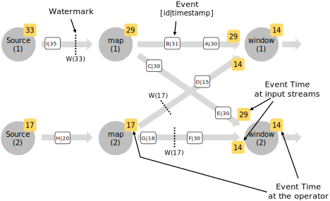

## Introduction

及时流处理是状态流处理[ [stateful stream processing](https://ci.apache.org/projects/flink/flink-docs-release-1.11/zh/concepts/stateful-stream-processing.html)]的扩展，其中“时间”在计算中起到一定作用。比如时间序列分析，基于指定时间段聚合，或者处理时间敏感事件。

接下来介绍及时流处理。

## 时间的概念: Event Time and Processing Time

当在流处理程序中提及时间时，可以有不同给的时间概念：

- **Processing time:** 正在执行相应操作的机器的系统时间

  当程序在处理时间下运行时，所有基于时间的操作都将使用机器的系统时钟，每小时处理时间窗口指将在系统时钟整小时之间所有的记录发送给指定操作。 For example, if an application begins running at 9:15am, the first hourly processing time window will include events processed between 9:15am and 10:00am, the next window will include events processed between 10:00am and 11:00am, and so on.

  处理时间是最简单的时间概念，不需要流和机器之间的协调,它提供了最佳性能和最低延迟，但是在分布式和异步环境中，处理时间不能提供确定性，因为他容易受到记录到到达系统的速度、记录在系统内部操作之间的流动速度、以及中断的影响。

- **Event time:** 事件时间是每个事件在其设备上生成时发生的时间，这个时间在进入flink前会嵌入到记录中，并且每个记录都可以提取这个时间戳。在时间时间中，时间的推进取决于数据不是其他什么时钟。事件时间程序需要指定 *时间水印* 的生成方式，水印机制下节介绍。  

  完美的情况，event time processing将产生完全一致的确定的结果，不管事件合适到达或顺序如何。 但是，除非已知事件按照时间戳顺序到达，否则在等待无序事件时processing会产生一些延迟。由于只能等待一段有限的时间，这就限制了事件时间应用程序的确定性。

  假设所有数据都到达并且程序按照预期运行，那么无论是无序事件、延迟事件或者处理历史数据，都将获得正确地一致地结果。例如，每小时的事件时间窗口将包含带有事件时间戳的所有记录，而不管这些记录到达的顺序如何，也不管它们何时被处理。

  Note that sometimes when event time programs are processing live data in real-time, they will use some *processing time* operations in order to guarantee that they are progressing in a timely fashion.

## Event Time and Watermarks

*注意：Flink实现了数据流模型中的许多技术。为了更好地介绍事件时间和水印，请看下面的文章*

- [Streaming 101](https://www.oreilly.com/ideas/the-world-beyond-batch-streaming-101) by Tyler Akidau
- The [Dataflow Model paper](https://research.google.com/pubs/archive/43864.pdf)

支持*event time*的流处理器需要一种度量事件时间进度的方法。For example, a window operator that builds hourly windows needs to be notified when event time has passed beyond the end of an hour, so that the operator can close the window in progress.

*Event time* 可以独立于 *processing time* (measured by wall clocks)，例如，in one program the current *event time* of an operator may trail slightly behind the *processing time* (accounting for a delay in receiving the events), while both proceed at the same speed. On the other hand, another streaming program might progress through weeks of event time with only a few seconds of processing, by fast-forwarding through some historic data already buffered in a Kafka topic (or another message queue).

------

flink中测量 event time进度的机制叫 **watermarks**，水印作为数据流的一部分，并携带时间戳，水印声明的时间（t）是事件到达流中的时间（t），这意味着该流中的事件的时间戳不应该<=t。

下图显示了具有（逻辑）时间戳和水印的事件流。在这个例子中，事件是有序的（相对于它们的时间戳），这意味着水印只是流中的周期性标记。

Watermarks对于无序流来说至关重要，如下，事件的时间戳是无序的，一般来说，水印是流中某点一个声明，所有高于这个点的事件应该已经到达，当水印到达某一个运算，运算可以提前它的内部事件时钟到水印的值。

Note that event time is inherited by a freshly created stream element (or elements) from either the event that produced them or from watermark that triggered creation of those elements.

### Watermarks in Parallel Streams

水印在source处或source后生成，每个source的并行的子任务都是独立生成其自己的水印。 These watermarks define the event time at that particular parallel source.

当水印在程序里流动时，当他们到达operator后会提前事件时间，每当一个operator提前了他的event time，他会生成一个新的水印给下游operators。 

Some operators consume multiple input streams; a union, for example, or operators following a *keyBy(…)* or *partition(…)* function. Such an operator’s current event time is the minimum of its input streams’ event times. As its input streams update their event times, so does the operator.

The figure below shows an example of events and watermarks flowing through parallel streams, and operators tracking event time.

## Lateness

It is possible that certain elements will violate the watermark condition, meaning that even after the *Watermark(t)* has occurred, more elements with timestamp *t’ <= t* will occur. In fact, in many real world setups, certain elements can be arbitrarily delayed, making it impossible to specify a time by which all elements of a certain event timestamp will have occurred. Furthermore, even if the lateness can be bounded, delaying the watermarks by too much is often not desirable, because it causes too much delay in the evaluation of event time windows.

For this reason, streaming programs may explicitly expect some *late* elements. Late elements are elements that arrive after the system’s event time clock (as signaled by the watermarks) has already passed the time of the late element’s timestamp. See [Allowed Lateness](https://ci.apache.org/projects/flink/flink-docs-release-1.11/zh/dev/stream/operators/windows.html#allowed-lateness) for more information on how to work with late elements in event time windows.

## Windowing

Aggregating events (e.g., counts, sums) works differently on streams than in batch processing. For example, it is impossible to count all elements in a stream, because streams are in general infinite (unbounded). Instead, aggregates on streams (counts, sums, etc), are scoped by **windows**, such as *“count over the last 5 minutes”*, or *“sum of the last 100 elements”*.

Windows can be *time driven* (example: every 30 seconds) or *data driven* (example: every 100 elements). One typically distinguishes different types of windows, such as *tumbling windows* (no overlap), *sliding windows* (with overlap), and *session windows* (punctuated by a gap of inactivity).

Please check out this [blog post](https://flink.apache.org/news/2015/12/04/Introducing-windows.html) for additional examples of windows or take a look a [window documentation](https://ci.apache.org/projects/flink/flink-docs-release-1.11/zh/dev/stream/operators/windows.html) of the DataStream API.