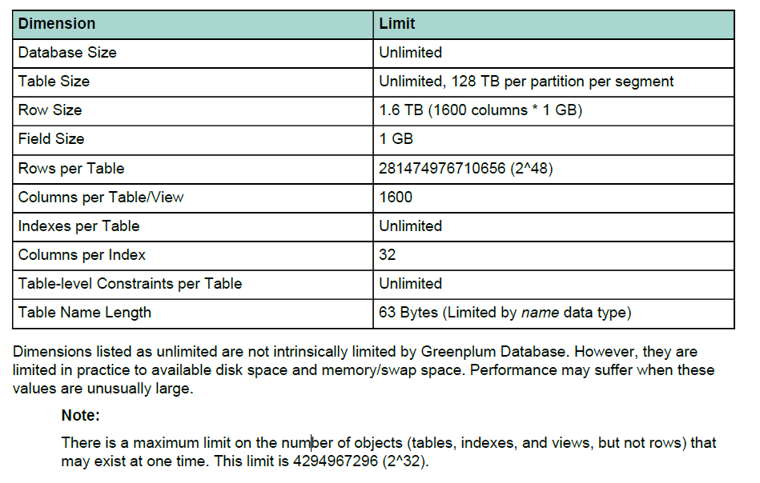

[TOC]

# 识别硬件和segment故障

GPD是一个分布式系统，是一个运行在多服务器上的系统，所以诊断的第一步是确定所有segment节点都online。GPD有短板效应，与最慢的节点一样快。

常见硬件问题：

磁盘错误 - 如果有RAID，一块磁盘坏掉并不影响性能，gpcheckperf程序可以检测磁盘的IO问题。

主机错误 - 主机down掉，则其他主机工作量增加，如果此时没有开启mirror功能，则数据库中断等待segment的恢复，**gpstate**程序可以帮助我们识别segment状态。

网络错误 - gpcheckperf程序可以检测网络问题。

磁盘容量 -  磁盘使用量请保持在70%以下，可以用过VACUUM释放空间， 在gp_toolkit模式下有很多视图可以产看数据分布情况。

# 管理工作量

数据库只有有限的资源，当大量的工作访问这些资源是，性能受影响。

使用基于角色的资源队列（role-based resource queues），数据库限制active queries 并节省资源。

资源队列限制限制查询大小或者总数到特定队列，通过角色分配给适当队列，管理员可以控制用户并发查询防止系统过载。

管理员会在下班时间运行vacuum analyze，不会和用户争夺资源。

# 避免争用

# 维护数据库统计信息

数据查询优化依赖数据库统计信息，使用ANALYZE收集静态信息。

## 执行计划中识别统计信息问题

查看计划中的以下几点：

计划中是否接近真实的查询行数？explain analyze。

谓词是否最早使用？ 提前使用where，少数据量移动。

是否是合理的join顺序？

## 调整统计信息收集

调整配置参数：

default_statistics_target

gp_analyze_relative_error

# 调整数据分布

# 调整数据库设计

数据库最大限制表

