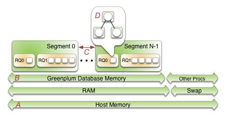
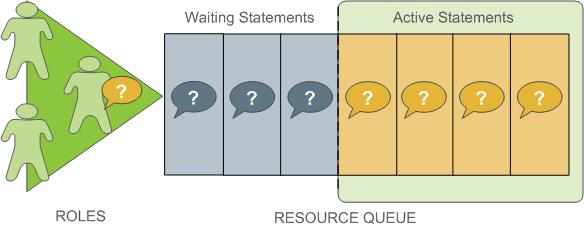

使用资源队列管理可以给不同的查询类型分配可用内存、cpu等资源，可以限制并行查询数量。

在整个管理过程中内存是至关重要的，所以先从数据库的内存结构说起。


# GP数据的内存概览


一个服务器上有多个postgre实例，他们共享服务器内存，这些segment有相同的配置，所以他们有相似的memory、cpu、disk IO的使用量，并且他们并行运行查询工作。

## segment内存结构



A 是服务器总内存，B 指有多少内存可以给GP集群使用，C指所有segment节点平分B。

在segment中，resource queues控制每个sql的内存分配。RQ把业务需求转换为执行策略，使您可以防范可能降低性能的查询。RQ接收每个查询，当有资源时才执行查询，所以RQ可以拒绝、立即执行、或者等待执行（等资源）。

用户可以创建不同类型的RQ，并为每个RQ分配一定的segment内存，也可以通过服务器配置参数为每个查询分配最大内存，而RQ上没有内存大小限制。

优化器完成执行计划，计划包含一系列的tasks，这些任务被称作operators，也就图中的D，每个operators处理例如table scans 、joins等操作，并且会得到中间结果，operators得到RQ分给自己的那份内存，如果operator在给定的内存下午无法完成所有任务，那么spill files将会缓存到磁盘上。


## 服务器内存配置选项

操作系统内存的最低建议是32GB，但是如果存在大量并发64G。

The `vm.overcommit_memory` kernel parameter should always be set to 2, the only safe value for
Greenplum Database.

`vm.overcommit_ratio`设置方式如下：

```
gp_vmem = ((SWAP + RAM) – (7.5GB + 0.05 * RAM)) / 1.7
vm.overcommit_ratio = (RAM - 0.026 * gp_vmem) / RAM
```

`gp_vmem`指这个服务器上GP集群可以用多少内存。


## 数据库内存配置选项

`p_vmem_protect_limit`每个segment节点可用的内存：

```
gp_vmem_protect_limit = gp_vmem / max_acting_primary_segments
```

另一个重要参数是`statement_mem`，配置每个查询可分配的最大内存，计算如下：

```
statement_mem = ( gp_vmem_protect_limit * .9 ) / max_expected_concurrent_queries
```

`max_expected_concurrent_queries`每个段的最大并行查询数，默认值是20。


# RQ工作量管理概览


RQ是管理并行程度的主要工具，RQ是数据库对象，需要用`CREATE RESOURCE QUEUE`命令创建，每个数据库的role都会关联到一个RQ，如果指定，则role关联到默认的RQ：`pg_default`，可以通过`create role`和`alter role`修改关联的RQ。

