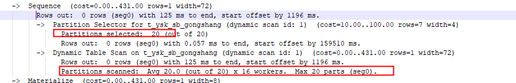

本节帮助大家认定和解决性能问题

# 如何检查系统状态

使用[gpstate](../GP4.3.28UtilityGuide/gpstate.md)查看segment信息

使用[gpcheckpert](../GP4.3.28UtilityGuide/gpcheckperf.md)查看服务器硬件问题

# 如何检查数据库活跃的状态

## 检查活动sessions

```sql
select * from pg_stat_activity
```

## 检查锁状态

```sql
SELECT locktype, database, c.relname, l.relation,l.transactionid, l.transaction, l.pid, l.mode, l.granted,a.current_query
FROM pg_locks l, pg_class c, pg_stat_activity a
WHERE l.relation=c.oid AND l.pid=a.procpid
ORDER BY c.relname;
```

To see how many queries are waiting to run from a resource queue, use the
gp_resqueue_status system catalog view. For example:

```sql
SELECT * FROM gp_toolkit.gp_resqueue_status;
```


## 如何检查查询状态和系统利用率

可以使用例如ps, top, iostat, vmstat, netstat命令监控系统状态，GPD提供的[gpssh](../GP4.3.28UtilityGuide/gpssh.md)允许运行这些命令同时监控多个主机。


同时，也可以创建并使用session_level_memory_consumption视图查看当前每个session中每个query的内存使用情况。

Creating the session_level_memory_consumption View:

```
$ psql -d testdb -f $GPHOME/share/postgresql/contrib/gp_session_state.sql
```

如果数据库听了这个视图，可以使用下列脚本卸载后重新建立：

```
psql -d testdb -f $GPHOME/share/postgresql/contrib/uninstall_gp_session_state.sql
```

这些脚本早4.3.13.0之后提供的，并且不兼容WLM(Greenplum Workload Manager) 1.7.2和更早版本。

# 如何解决查询问题

如果一个sql的运行很慢，请使用explain或者explain analyze查看执行计划，一个查询如果是内存溢出，在每segment日志上会有记录。

## 查询分析（query profiling）

在GP4.3.5.0或更新的版本中，GPORCA优化器和legacy query optimizer优化器共存，但是两个优化器生成的执行计划完全不同，默认是legacy query optimizer优化器，如果要开启GPORCA需要设置参数optimizer为on。

在GPORCA优化器下运行explain analyze命令，执行计划中将不在显示每个一个分区的scan信息，而是统一为一个扫描的分区数，如下：




### 读explain输出

执行计划的叶子通常是扫描操作：sequential（顺序）、index、bitmap index scan。

每一行中的输出值说明：

cost - 以磁盘页面提取的单位为单位，1.0等于读取一个连续磁盘页，第一个是启动成本，第二个是获取所有需要数据的成本。

rows - 此节点输出的总行数。该数目通常小于该节点处理或扫描的行数，造成这个的原因是有where子句。理想情况下，最顶层的的rows是与查询、更新、删除操作后的行数估算最近的。

width - 此节点所有行的总字节数。

注意：执行计划不包含segment间数据传输时间。

# 如何查看错误信息

数据库日志信息在pg_log目录下，大部分信息都在里面，日志每天滚动存储，格式：gpdb-YYYY-MM-DD_hhmmss.csv。路径一般在：

```
$ cd $MASTER_DATA_DIRECTORY/pg_log
```

日志太大，如果要定位WARNING, ERROR, FATAL or PANIC，可以使用gplogfilter工具查询:

```
*****************************************************
EXAMPLES 
***************************************************** 

Display the last three error messages in the master log file: 
 gplogfilter -t -n 3 

Display all log messages in the master log file timestamped in the last 10 minutes: 
 gplogfilter -d :10 

Display log messages in the master log file containing the string '|con6 cmd11|': 
 gplogfilter -f '|con6 cmd11|' 

Using gpssh, run gplogfilter on the segment hosts and search for log messages in the segment log files containing the string 'con6' and save output to a file:
 gpssh -f seg_hosts_file -e 'source 
 /usr/local/greenplum-db/greenplum_path.sh ; gplogfilter -f con6 
 /gpdata/*/pg_log/gpdb*.csv' > seglog.out 

```

