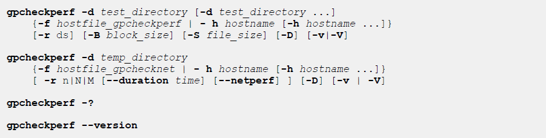

#### 简介

------


gpcheckperf可以做以下测试：

- Disk I/O Test(dd test) - 检测系统的顺序吞吐量，一般用于测试的文件的大小是主机上随机访问内存总大小的两倍，这样可以真正测试磁盘，而不是内存缓存。
- Memory Bandwidth Test(stream) - 测试内存带宽。
- Network Performance Test (gpnetbench*) - 网络带宽测试，在测试时，程序将5秒钟的数据流从当前主机传输到其他每个远程主机，数据是并行传输到每个远程主机的，并且用MB/s为单位展示最大、最小、平均和传输速率值。如果总的传输速率比预期的低（小于100MB/s），您可以使用-r n选项来串行运行网络测试以获得每个主机的结果。如果要测试全矩阵带宽，可以指定-r M选项，使集群每个主机总指定的每个其他主机发送和接收数据，这种方式可以验证交换结构是否可以承受全矩阵负载。


可以使用-f选项指定一个内容中包含要测试服务器名字列表的文件，也可以使用-h选项指定服务器名字。

如果要测试网络，则服务器列表文件中服务器需要在同一子网中。如果segment服务器有多网卡多子网，那么每个子网都要测试一次。对于内存带宽和网络测试，测试程序文件需要一个临时目录。

对于磁盘I / O测试，运行程序时必须制定至少一个测试目录，采用-d选项，***测试用户必须有其他远程主机测试目录的写权限***，测试目录应对应于segment数据目录（主目录和/或镜像目录）。





#### 选项说明

------

- -B block_size

指定IO测试使用的block的大小，默认是32KB，和GP页大小一致，最大block是1MB。

- -d test_directory

IO测试时，指定目录用于测试，每个机上的目录必须有写权限，-d命令可以写多次，比如primary和mirror不在一个目录中时，可以指定两个目录都测试。

- -d temp_directory

在测试网络和内存时，需要指定目录用于测试时文件的复制，而且要有对这个目录的写权限。

- -D (display per-host results)

增加此参数后会显示每个主机的磁盘IO的性能结果，如果没有此参数，结果报告中仅显示性能最高和最低的主机，以及所有主机的平均值和平均性能。

- --duration time

指定网络测试时的时长，默认15s，可以指定seconds (s), minutes (m), hours (h), or days (d)。

- -f hostfile_gpcheckperf

要测试的主机列表文件，文件中每行记录一个主机，格式如下：

```
[username@]hostname[:ssh_port]
```

- -f hostfile_gpchecknet

同上

- -h hostname

如果不用-f参数，则可以使用本参数，指定要测试的主机。

- --netperf

指定用netperf程序测试网络，而不是使用GP的网络测试程序，如果要使用此参数，需要下载netperf并安装到所有master和segment的bin/lib目录中。

- -r ds{n|N|M}

指定要进行哪项性能测试，默认是dsn:

​     Disk I/O test (d)

​     Stream test (s)

​     Network performance test ，顺序测试 (n), 并行测试 (N), 全矩阵测试 (M)。`--duration`选项指定测试多长时间， 如果要进行并行测试(N)，需要在偶数的服务器进行。

- -S file_size

指定用于测试IO的文件的总大小，如果没有指定，则默认为主机上的总RAM的两倍，指定是可以使用KB, MB, 或者 GB。

- -v (verbose) | -V (very verbose)

详细模式按原样显示性能测试的进度和状态消息。非常详细模式显示程序生成的所有消息。


#### 使用样例

------

host_list内容

```
[root@jq01 home]# more host_list 
jq01
jq02
jq03
```

free

测试磁盘I/O和内存带宽，所有服务器在host_file中，目录使用data1和data2：

```
[gpadmin@jq01 home]$ gpcheckperf -f host_list -d /home/gpcheckperf_dir/data1 -d /home/gpcheckperf_dir/data2 -r ds -S 10MB

--------------------
--  DISK WRITE TEST
--------------------

--------------------
--  DISK READ TEST
--------------------

--------------------
--  STREAM TEST
--------------------

====================
==  RESULT
====================

 disk write avg time (sec): 0.18
 disk write tot bytes: 31457280
 disk write tot bandwidth (MB/s): 191.10
 disk write min bandwidth (MB/s): 43.48 [jq02]
 disk write max bandwidth (MB/s): 100.00 [jq01]


 disk read avg time (sec): 0.13
 disk read tot bytes: 31457280
 disk read tot bandwidth (MB/s): 238.10
 disk read min bandwidth (MB/s): 66.67 [jq03]
 disk read max bandwidth (MB/s): 100.00 [jq01]


 stream tot bandwidth (MB/s): 25830.14
 stream min bandwidth (MB/s): 8447.74 [jq02]
 stream max bandwidth (MB/s): 8743.26 [jq03]
```


测试磁盘I/O和内存带宽，所有服务器在host_file中，目录使用data1和data2，显示每个服务器的信息：

```
[gpadmin@jq01 home]$ gpcheckperf -f host_list -d /home/gpcheckperf_dir/data1 -d /home/gpcheckperf_dir/data2 -r ds -S 100MB -D
/home/gp5/greenplum-db/./bin/gpcheckperf -f host_list -d /home/gpcheckperf_dir/data1 -d /home/gpcheckperf_dir/data2 -r ds -S 100MB -D

--------------------
--  DISK WRITE TEST
--------------------

--------------------
--  DISK READ TEST
--------------------

--------------------
--  STREAM TEST
--------------------

====================
==  RESULT
====================

 disk write avg time (sec): 0.24
 disk write tot bytes: 314572800
 disk write tot bandwidth (MB/s): 1302.52
 disk write min bandwidth (MB/s): 357.14 [jq03]
 disk write max bandwidth (MB/s): 588.24 [jq01]
 -- per host bandwidth --
    disk write bandwidth (MB/s): 357.14 [jq03]
    disk write bandwidth (MB/s): 357.14 [jq02]
    disk write bandwidth (MB/s): 588.24 [jq01]


 disk read avg time (sec): 0.14
 disk read tot bytes: 314572800
 disk read tot bandwidth (MB/s): 2213.24
 disk read min bandwidth (MB/s): 588.24 [jq02]
 disk read max bandwidth (MB/s): 1000.00 [jq01]
 -- per host bandwidth --
    disk read bandwidth (MB/s): 625.00 [jq03]
    disk read bandwidth (MB/s): 588.24 [jq02]
    disk read bandwidth (MB/s): 1000.00 [jq01]


 stream tot bandwidth (MB/s): 25557.92
 stream min bandwidth (MB/s): 8040.36 [jq02]
 stream max bandwidth (MB/s): 8863.94 [jq03]
 -- per host bandwidth --
    stream bandwidth (MB/s): 8863.94 [jq03]
    stream bandwidth (MB/s): 8040.36 [jq02]
    stream bandwidth (MB/s): 8653.63 [jq01]
```


测试磁盘I/O和内存带宽，所有服务器在host_file中，目录使用data1和data2，显示每个服务器的信息，加入-v显示执行过程的详细信息：


```
[gpadmin@jq01 home]$ gpcheckperf -f host_list -d /home/gpcheckperf_dir/data1 -r d -S 100MB -D -v
[gpadmin@jq01 home]$ gpcheckperf -f host_list -d /home/gpcheckperf_dir/data1 -r d -S 100MB -D -v
/home/gp5/greenplum-db/./bin/gpcheckperf -f host_list -d /home/gpcheckperf_dir/data1 -r d -S 100MB -D -v
--------------------
  SETUP
--------------------
[Info] verify python interpreter exists
[Info] /home/gp5/greenplum-db/./bin/gpssh -f host_list 'python -c print'
[Info] making gpcheckperf directory on all hosts ... 
[Info] /home/gp5/greenplum-db/./bin/gpssh -f host_list 'rm -rf  /home/gpcheckperf_dir/data1/gpcheckperf_$USER ; mkdir -p  /home/gpcheckperf_dir/data1/gpcheckperf_$USER'
[Info] copy local /home/gp5/gp428/bin/lib/multidd to remote /home/gpcheckperf_dir/data1/gpcheckperf_$USER/multidd
[Info] /home/gp5/greenplum-db/./bin/gpscp -f host_list /home/gp5/gp428/bin/lib/multidd =:/home/gpcheckperf_dir/data1/gpcheckperf_$USER/multidd
[Info] /home/gp5/greenplum-db/./bin/gpssh -f host_list 'chmod a+rx /home/gpcheckperf_dir/data1/gpcheckperf_$USER/multidd'

--------------------
--  DISK WRITE TEST
--------------------
[Info] /home/gp5/greenplum-db/./bin/gpssh -f host_list 'time -p /home/gpcheckperf_dir/data1/gpcheckperf_$USER/multidd -i /dev/zero -o /home/gpcheckperf_dir/data1/gpcheckperf_$USER/ddfile -B 32768 -S 104857600'

--------------------
--  DISK READ TEST
--------------------
[Info] /home/gp5/greenplum-db/./bin/gpssh -f host_list 'time -p /home/gpcheckperf_dir/data1/gpcheckperf_$USER/multidd -o /dev/null -i /home/gpcheckperf_dir/data1/gpcheckperf_$USER/ddfile -B 32768 -S 104857600'
--------------------
  TEARDOWN
--------------------
[Info] /home/gp5/greenplum-db/./bin/gpssh -f host_list 'rm -rf  /home/gpcheckperf_dir/data1/gpcheckperf_$USER'

====================
==  RESULT
====================

 disk write avg time (sec): 0.42
 disk write tot bytes: 314572800
 disk write tot bandwidth (MB/s): 779.03
 disk write min bandwidth (MB/s): 163.93 [jq02]
 disk write max bandwidth (MB/s): 344.83 [jq03]
 -- per host bandwidth --
    disk write bandwidth (MB/s): 344.83 [jq03]
    disk write bandwidth (MB/s): 163.93 [jq02]
    disk write bandwidth (MB/s): 270.27 [jq01]


 disk read avg time (sec): 0.15
 disk read tot bytes: 314572800
 disk read tot bandwidth (MB/s): 2143.79
 disk read min bandwidth (MB/s): 555.56 [jq02]
 disk read max bandwidth (MB/s): 1000.00 [jq01]
 -- per host bandwidth --
    disk read bandwidth (MB/s): 588.24 [jq03]
    disk read bandwidth (MB/s): 555.56 [jq02]
    disk read bandwidth (MB/s): 1000.00 [jq01]
```


测试并行网络的带宽：

```
[gpadmin@jq01 home]$ gpcheckperf -f host_list -d /home/gpcheckperf_dir/data3 -r N -D -v
[Info] sh -c 'cat /proc/meminfo | grep MemTotal'
MemTotal:       32778924 kB

/home/gp5/greenplum-db/./bin/gpcheckperf -f host_list -d /home/gpcheckperf_dir/data3 -r N -D -v
--------------------
  SETUP
--------------------
[Info] verify python interpreter exists
[Info] /home/gp5/greenplum-db/./bin/gpssh -f host_list 'python -c print'
[Info] making gpcheckperf directory on all hosts ... 
[Info] /home/gp5/greenplum-db/./bin/gpssh -f host_list 'rm -rf  /home/gpcheckperf_dir/data3/gpcheckperf_$USER ; mkdir -p  /home/gpcheckperf_dir/data3/gpcheckperf_$USER'

-------------------
--  NETPERF TEST
-------------------
[Info] copy local /home/gp5/gp428/bin/lib/gpnetbenchServer to remote /home/gpcheckperf_dir/data3/gpcheckperf_$USER/gpnetbenchServer
[Info] /home/gp5/greenplum-db/./bin/gpscp -f host_list /home/gp5/gp428/bin/lib/gpnetbenchServer =:/home/gpcheckperf_dir/data3/gpcheckperf_$USER/gpnetbenchServer
[Info] /home/gp5/greenplum-db/./bin/gpssh -f host_list 'chmod a+rx /home/gpcheckperf_dir/data3/gpcheckperf_$USER/gpnetbenchServer'
[Info] /home/gp5/greenplum-db/./bin/gpssh -f host_list 'F=gpnetbenchServer && (pkill $F || pkill -f $F || killall -9 $F) > /dev/null 2>&1 || true'
[Info] /home/gp5/greenplum-db/./bin/gpssh -f host_list '/home/gpcheckperf_dir/data3/gpcheckperf_$USER/gpnetbenchServer -p 23000 > /dev/null 2>&1'
[Warning] start netserver with port 23000 failed
[Warning] retrying with port 23012
[Info] /home/gp5/greenplum-db/./bin/gpssh -f host_list 'F=gpnetbenchServer && (pkill $F || pkill -f $F || killall -9 $F) > /dev/null 2>&1 || true'
[Info] /home/gp5/greenplum-db/./bin/gpssh -f host_list '/home/gpcheckperf_dir/data3/gpcheckperf_$USER/gpnetbenchServer -p 23012 > /dev/null 2>&1'
[Info] copy local /home/gp5/gp428/bin/lib/gpnetbenchClient to remote /home/gpcheckperf_dir/data3/gpcheckperf_$USER/gpnetbenchClient
[Info] /home/gp5/greenplum-db/./bin/gpscp -f host_list /home/gp5/gp428/bin/lib/gpnetbenchClient =:/home/gpcheckperf_dir/data3/gpcheckperf_$USER/gpnetbenchClient
[Info] /home/gp5/greenplum-db/./bin/gpssh -f host_list 'chmod a+rx /home/gpcheckperf_dir/data3/gpcheckperf_$USER/gpnetbenchClient'
[Info] ssh -o 'BatchMode yes' -o 'StrictHostKeyChecking no' jq01 '/home/gpcheckperf_dir/data3/gpcheckperf_$USER/gpnetbenchClient -H jq02 -p 23012 -t TCP_STREAM -l 15 -f M -P 0 '
[Info] ssh -o 'BatchMode yes' -o 'StrictHostKeyChecking no' jq03 '/home/gpcheckperf_dir/data3/gpcheckperf_$USER/gpnetbenchClient -H jq01 -p 23012 -t TCP_STREAM -l 15 -f M -P 0 '
[Info] Connected to server
0     0        32768       14.67     1283.80

[Info] jq01 -> jq02 : ['0', '0', '32768', '14.67', '1283.80']
[Info] Connected to server
0     0        32768       14.37     1115.45

[Info] jq03 -> jq01 : ['0', '0', '32768', '14.37', '1115.45']
[Info] ssh -o 'BatchMode yes' -o 'StrictHostKeyChecking no' jq02 '/home/gpcheckperf_dir/data3/gpcheckperf_$USER/gpnetbenchClient -H jq01 -p 23012 -t TCP_STREAM -l 15 -f M -P 0 '
[Info] ssh -o 'BatchMode yes' -o 'StrictHostKeyChecking no' jq01 '/home/gpcheckperf_dir/data3/gpcheckperf_$USER/gpnetbenchClient -H jq03 -p 23012 -t TCP_STREAM -l 15 -f M -P 0 '
[Info] Connected to server
0     0        32768       14.43     1182.07

[Info] jq02 -> jq01 : ['0', '0', '32768', '14.43', '1182.07']
[Info] Connected to server
0     0        32768       14.76     1255.60

[Info] jq01 -> jq03 : ['0', '0', '32768', '14.76', '1255.60']
--------------------
  TEARDOWN
--------------------
[Info] /home/gp5/greenplum-db/./bin/gpssh -f host_list 'rm -rf  /home/gpcheckperf_dir/data3/gpcheckperf_$USER'
[Info] /home/gp5/greenplum-db/./bin/gpssh -f host_list 'F=gpnetbenchServer && (pkill $F || pkill -f $F || killall -9 $F) > /dev/null 2>&1 || true'

====================
==  RESULT
====================
Netperf bisection bandwidth test
jq01 -> jq02 = 1283.800000
jq03 -> jq01 = 1115.450000
jq02 -> jq01 = 1182.070000
jq01 -> jq03 = 1255.600000

Summary:
sum = 4836.92 MB/sec
min = 1115.45 MB/sec
max = 1283.80 MB/sec
avg = 1209.23 MB/sec
median = 1255.60 MB/sec

[Warning] connection between jq03 and jq01 is no good
```


