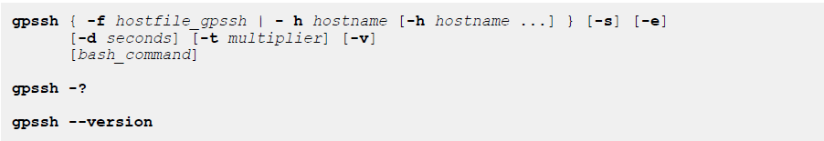

#### 简介

------

本程序在一台机器上通过SSH可以把shell脚本运行在多个服务器上。

可以在命令行上执行一条命令，也可以进入交互式会话中执行命令。

可以通过-f和-h指定要在哪些机器上运行命令，至少指定一个台服务器，-f 是读取服务器文件，-h是在命令行中写主机名。

注意：运行gpssh的服务器也不会默认加入服务器列表中，所以必须显示指定。

运行 gpssh前，必须保证主机间互相信任，可以使用gpssh-exkeys配置。

运行gpssh时如果没有指定bash_command，则进入交互模式，并用`=>`提示，要退出交互模式，可以按CTRL+D，也可以输入exit或者quit。在交互模式下数据的命令会在每个指定的服务器上运行。

如果遇到网络超时，可以使用-d和-t选项来控制gpssh验证初始ssh连接的时效，也可以通过gpssh.conf文件配置。



#### 选项说明

------

- bash_command

要在各个主机上运行的shell 命令。

- -d (delay) seconds

可选的，指定gpssh在与ssh进行交互之前等待的时间（以秒为单位）。默认0.05秒，此选项会覆盖gpssh.conf中的delaybeforesend的值。

增大该值，可能导致gpssh启动期间的等待时间较长。

- -e (echo)

可选的，回显每个机器上执行的shell命令，并显示命令的执行结果，在非交互模式下有效。

- -f hostfile_gpssh

主机列表

- -h hostname

主机列表，可以指定多个。

- -s

可选的，如果指定，在目标主机上执行命令前，gpssh在$GPHOME环境变量指定的目录中获取greenplum_path.sh文件，**获取这个文件干啥？不清楚**，这个选项对交互和命令行模式都有效。

- -t multiplier

可选的，大于0的十进制数字，它是gpssh在验证ssh 时使用的超时倍数。 默认值为1。此选项将覆盖gpssh.conf配置文件中指定的hint_validation_timeout值。在gpssh启动期间，增加此值的影响很小。


#### gpssh.conf说明

------

文件中的参数指定gpssh在与ssh进行交互之前等待的时间，这些参数影响gpssh用ssh执行命令前的网络连接，此文件有MASTER_DATA_DIRECTORY环境变量指定，如果没有指定，则用-d -t的默认值，或者用命令行中指定的-d -t的值。

文件内容：

```
[gpssh]
delaybeforesend = 0.05
prompt_validation_timeout = 1.0
sync_retries = 5
```

- delaybeforesend = seconds
- prompt_validation_timeout = multiplier
- sync_retries = attempts  gpssh连接远程机器失败是重试次数


#### 使用样例

------


 查看每个机器的top 

```
gpssh -f host_list  -v -e 'top -bcn 1'
```


查看每个机器指定目录下的内容：

```shell
[gpadmin@jq01 home]$ gpssh -f host_list -v -e 'll /home/'
Using delaybeforesend 0.05 and prompt_validation_timeout 1.0

[Reset ...]
[INFO] login jq03
[INFO] login jq01
[INFO] login jq02
[jq03] ll /home/
[jq03] total 0
[jq03] drwxr-xr-x 3 root    root     39 Jul 26 17:51 gp5
[jq03] drwxr-xr-x 4 gpadmin gpadmin 114 Aug 13 14:46 gpadmin
[jq03] drwxr-xr-x 2 gpadmin gpadmin   6 Oct 24 17:21 gpcheckperf_dir
[jq01] ll /home/
[jq01] total 12
[jq01] drwxr-xr-x  3 root    root     104 Aug 13 20:04 gp5
[jq01] drwx------ 10 gpadmin gpadmin 4096 Oct 24 17:24 gpadmin
[jq01] drwxr-xr-x  2 gpadmin gpadmin    6 Oct 24 17:15 gpcheckperf_dir
[jq01] drwxr-xr-x  4 root    root      28 Aug 13 20:05 gptest
[jq01] -rw-r--r--  1 gpadmin gpadmin   16 Oct 24 17:24 host_list
[jq01] drwxr-xr-x 14 gpadmin gpadmin  258 Sep  6 18:01 runbzk_anzhy
[jq01] drwxr-xr-x 20 gpadmin gpadmin 4096 Sep 10 09:11 runSQL_anzhy
[jq01] drwx------  2 zabbix  zabbix    62 Aug 23 13:45 zabbix
[jq02] ll /home/
[jq02] total 0
[jq02] drwxr-xr-x 3 root    root     39 Jul 26 17:51 gp5
[jq02] drwxr-xr-x 4 gpadmin gpadmin 158 Oct 15 10:12 gpadmin
[jq02] drwxr-xr-x 2 gpadmin gpadmin   6 Oct 24 17:20 gpcheckperf_dir
[INFO] completed successfully

[Cleanup...]
```


```shell
[gpadmin@jq01 bin]$ gpssh -h jq01 -h jq02 -v -e 'ls /home/gpadmin'
Using delaybeforesend 0.05 and prompt_validation_timeout 1.0

[Reset ...]
[INFO] login jq02
[INFO] login jq01
[jq02] ls /home/gpadmin
[jq02] db_cs_bbcy2_cyt1.dmp  gpAdminLogs
[jq01] ls /home/gpadmin
[jq01] 20190930            20191018  20191023             echo.sh      tmp
[jq01] 20191008jcwbzkbeijing.dmp  20191022  db_cs_bbcy2_cyt.dmp  gpAdminLogs  zt.sql
[INFO] completed successfully

[Cleanup...]
[gpadmin@jq01 bin]$ 
```

