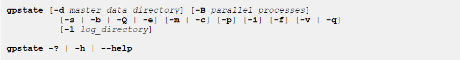

#### 简介

------

显示GP运行实例的信息：

- 哪个segment down掉了
- Master 和segment配置信息，如hosts、data dir 等
- 系统的端口使用情况
- primary segment和其mirror的映射

#### 选项说明

------

- -b (brief status)

可选的，显示数据库系统状态的摘要。

- -B parallel_processes

需要并行检查多少个segment，不指定的话，程序会启动多达60个并行进程，具体取决它需要检查segment实例的数量。

- -c (show primary to mirror mappings)

可选的，显示primary和mirror的对应关系。primary所在路径和mirror所在路径。

- -d master_data_directory

可选的，The master data directory，如果不指定，默认设置为`$MASTER_DATA_DIRECTORY`

- -e (show segments with mirror status issues)

显示存在潜在问题的primary/mirror segment 的详细信息：

1. the active segment is running in change tracking mode，说明有宕掉的segment
2. the active segment在同步模式中，说明把修改同步到镜像的工作延后了，在疯狂追赶。
3. 一个segment不是首选角色，比如一个segment初始化时是primary，但是现在却是mirror角色，说明有主机负载不均衡。

- -f (show standby master details)

如果配置了standby master，则显示器详细信息。

- -i (show Greenplum Database version)

显示每个实例的版本信息。包含master和segment，segment包含primary和mirror。

- -l logfile_directory

The directory to write the log file. Defaults to ~/gpAdminLogs.

- -m (list mirrors)

Optional. List the mirror segment instances in the system, 显示当前角色和同步状态.

- -p (show ports)

List the port numbers used throughout the Greenplum Database system.

- -q (no screen output)

Optional. 静默模式，除了warning信息，其他都不显示，但是所有的信息会写到日志中，日志在哪里，就是 `-l `指定的地方。

- -Q (quick status)

Optional. 快速在master上获取segment信息，而不是去每个segment获取。

- -s (detailed status)

Optional. Displays detailed status information for the Greenplum Database system.

- -v (verbose output)

Optional. Displays error messages and outputs detailed status and progress information

-Q (quick status)
Optional. Checks segment status in the system catalog on the master host. Does not poll the
segments for status.
-s (detailed status)
Optional. Displays detailed status information for the Greenplum Database system.
-v (verbose output)
Optional. Displays error messages and outputs detailed status and progress information.