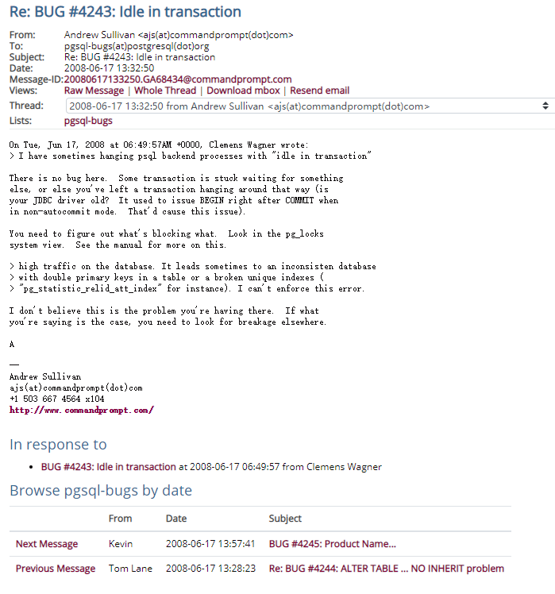

There is no bug here.  Some transaction is stuck waiting for something
else, or else you've left a transaction hanging around that way (is
your JDBC driver old?  It used to issue BEGIN right after COMMIT when
in non-autocommit mode.  That'd cause this issue).  

You need to figure out what's blocking what.  Look in the pg_locks
system view.  See the manual for more on this.

\> high traffic on the database. It leads sometimes to an inconsisten database

\> with double primary keys in a table or a broken unique indexes (

\> "pg_statistic_relid_att_index" for instance). I can't enforce this error.

I don't believe this is the problem you're having there.  If what
you're saying is the case, you need to look for breakage elsewhere.

参考：

https://www.postgresql.org/message-id/20080617133250.GA68434@commandprompt.com

https://kainwen.com/2020/02/16/motion-deadlock-and-all-related-things-in-greenplum/