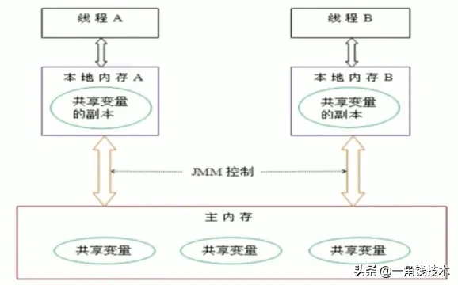
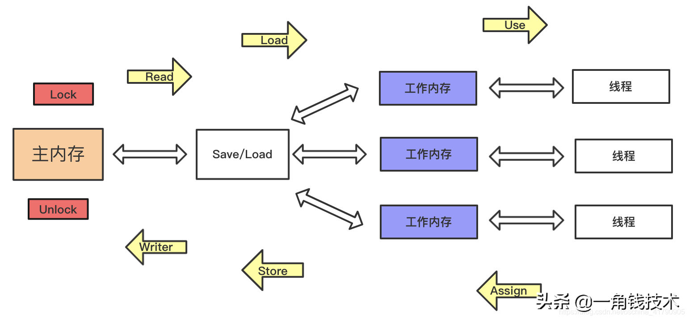

# **JMM概念**

JMM（Java内存模型Java Memory Model，简称JMM）本身是一种抽象的概念JMM（Java内存模型Java Memory Model，简称JMM）本身是一种抽象的概念并不真实存在，它描述的一组规则或规范，通过这组规范定义了程序中各个变量（包括实例字段、静态字段和构成数组对象的元素）的访问方式。

并不真实存在，它描述的一组规则或规范，通过这组规范定义了程序中各个变量（包括实例字段、静态字段和构成数组对象的元素）的访问方式。

JMM关于同步的规定：

1、线程解锁前，必须把共享变量的值刷新回主内存

2、线程加锁前，必须读取主内存的最新值到自己的工作内存

3、加锁解锁是同一把锁

由于JVM运行程序的实体是线程，而每个线程创建时JVM都会为其创建一个工作内存（有些地方称为栈空间），工作内存是每个线程的私有数据区域，而Java内存模型中的规定所有变量都存储在主内存，主内存是共享内存区域，所有线程都可以访问，但线程对变量的操作（读取赋值等）必须在工作内存中进行，首先要将变量从主内存拷贝到线程自己的工作内存空间，然后对变量进行操作，操作完成后再将变量写回主内存，不能直接操作主内存中的变量，各个线程中的工作内存中存储着主内存中的变量副本拷贝，因此不同的线程间无法访问对方的工作内存，线程间的通信（传值）必须通过主内存来完成，其简要访问过程如下图：

# **JMM 的八种内存交互操作**

为了更直观，先来看看这张图吧：

1. lock(锁定)：作用于**主内存**中的变量，一个变量在同一时间只能被一个线程锁定，即把变量标识为线程**独占**状态。
2. read(读取)：作用于**主内存**变量，表示把一个变量值从主内存传输到线程的工作内存中，以便下一步的 load 操作使用。
3. load(载入)：作用于线程的**工作内存**的变量，表示把 read 操作从主内存中读取的变量值放到工作内存的变量副本中(副本是相对于主内存的变量而言的)。
4. use(使用)：作用于线程的**工作内存**中的变量，表示把工作内存中的一个变量值传递给执行引擎，每当虚拟机遇到一个需要使用变量的值的字节码指令时就会执行该操作。
5. assign(赋值)：作用于线程的**工作内存**的变量，表示把执行引擎返回的值赋值给工作内存中的变量，每当虚拟机遇到一个给变量赋值的字节码指令时就会执行该操作。
6. store(存储)：作用于线程的**工作内存**中的变量，把工作内存中的一个变量的值传递给主内存，以便下一步的 write 操作使用。
7. write(写入)：作用于**主内存**的变量，表示把 store 操作从工作内存中得到的变量的值放入主内存的变量中。
8. unlock(解锁)：作用于**主内存**的变量，表示把一个处于锁定状态的变量释放出来，释放后的变量才可以被其他线程锁定。

JMM 还规定了以上八种操作需按照如下规则进行：

- 不允许read 和 load、store 和 write 操作之一单独出现，也就是 read 操作后必须 load，store 操作后必须 write。即不允许一个变量从主内存读取了但工作内存不接受，或者从工作内存发起回写了但主内存不接受的情况出现。
- 不允许线程丢弃它最近的 assign 操作，即变量在工作内存中改变了之后必须把该变化同步回主内存。
- 不允许线程将没有 assign 的数据从工作内存同步到主内存。
- 一个新的变量必须在主内存中诞生，不允许工作内存直接使用一个未被初始化的变量。也就是对变量实施 use 和 store 操作之前，必须经过 load 和 assign 操作。
- 一个变量同一时间只能有一个线程对其进行 lock 操作。但 lock 操作可以被同一条线程重复执行多次，多次 lock 之后，必须执行相同次数 unlock 才可以解锁。
- 如果对一个变量进行 lock 操作，会清空所有工作内存中此变量的值。在执行引擎使用这个变量前，必须重新 load 或 assign 操作初始化变量的值。
- 如果一个变量没有被 lock，就不能对其进行 unlock 操作。也不能 unlock 一个被其他线程锁住的变量。
- 一个线程对一个变量进行 unlock 操作之前，必须先把此变量同步回主内存。