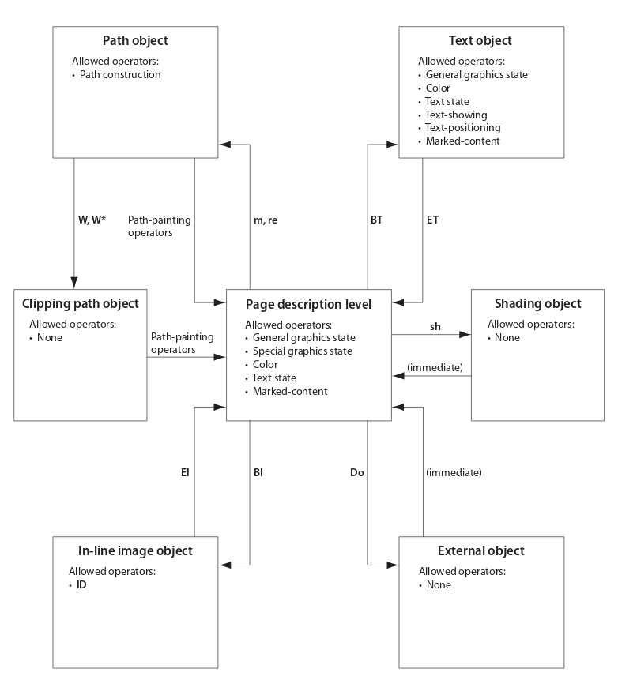

# Documentation of the core of Mozilla's PDF.js library

## Operations

### 初步标记 Preliminary mark

列表中的操作在PFD.js中使用，这些操作包含PDF规范中定义的，也包含PDF.js自定义的。

第一组操作显示PDF规范中定义的运算符、操作数和描述。在第二组中，我试图尽可能好地描述操作。

The list of operations contains all operations as defined in the PDF Specification that are used in PDF.js, aside with the operations that are only defined by PDF.js. The first group of operations show the operator, operands and description as defined in the PDF Specification. In the second group I tried to describe the operations as good as possible.

### Overview

