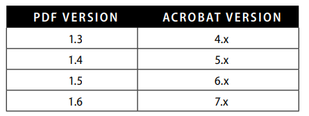
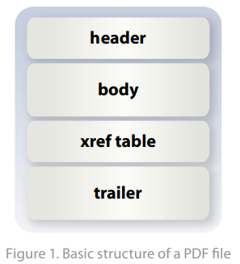
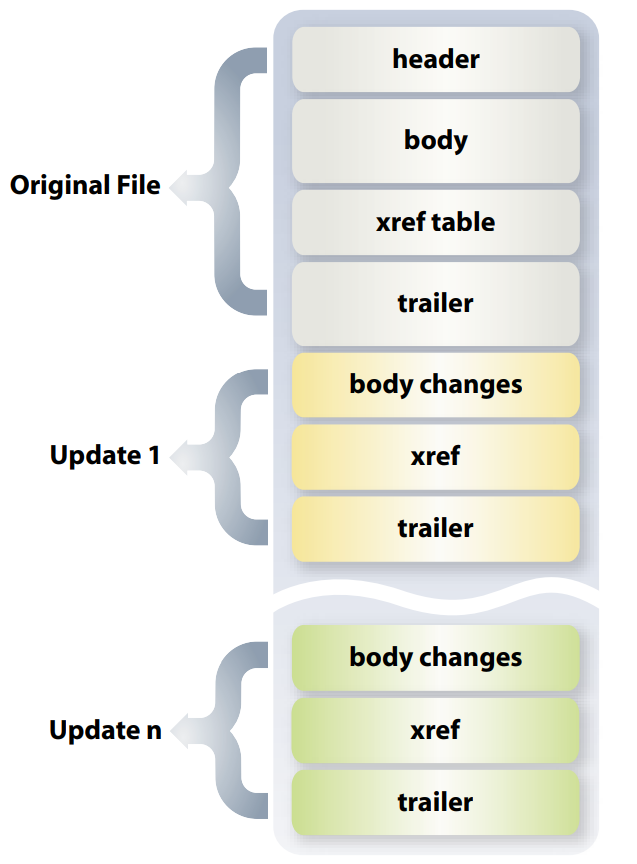

# 简介

The Adobe® Portable Document Format (PDF) 是一种格式化语言，由Adobe Systems创始人之一的 John Warnock构想，该语言庞大而复杂，但这里简要概述了与eForms一起使用的关键元素。

# PDF versions

93年是他的v1.0版本

下表显示了Acrobat和PDF规范的相应版本。PDF规范是免费提供的。Acrobat和Reader是基于PDF规范的应用程序

# 引擎之下 Under the hood

 PDF一般结构组成如下： header, body, cross-reference (xref) table, and trailer 如图一。

header只有一行，定义pdf版本，例如： **%PDF-1.6**

trailer contains pointers to the xref table and to key objects contained in the trailer dictionary. It ends with **%%EOF** to identify end of file. 

xref table 包含PDF中所有的对象的指针。它标识表中有多少对象，对象开始位置（偏移量 offset），对象的bytes长度。

body 包含所有对象的信息，对象包含fonts, images, words, bookmarks, form fields等。 

# 保存 Save and Save As

保存时，会附加新增的信息到原始结构下面，即 新body、xref table、trailer添加到pdf中，如图2：

经过多次保存后，系统会提示您“另存为...减少文件大小”，此时acrobat把增量信息合并到原始信息中，恢复成一个body、xref table、trailer。

# 原文地址：

https://web.archive.org/web/20150218210352if_/http://partners.adobe.com/public/developer/en/livecycle/lc_pdf_overview_format.pdf

