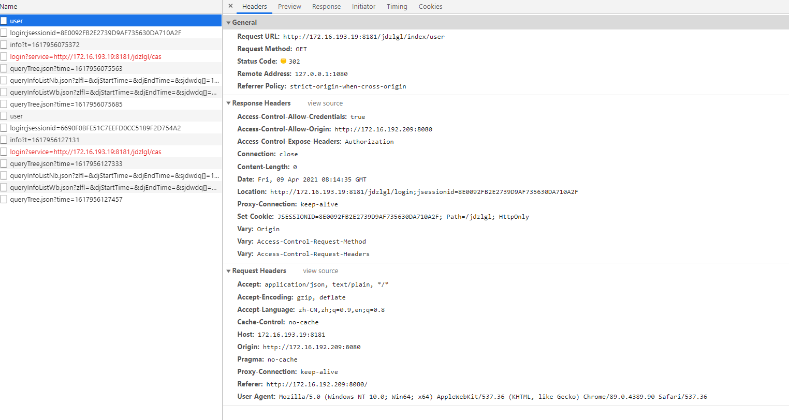
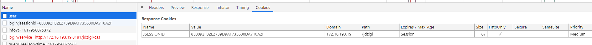
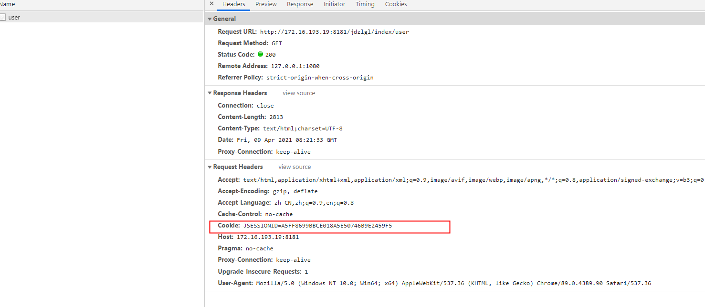
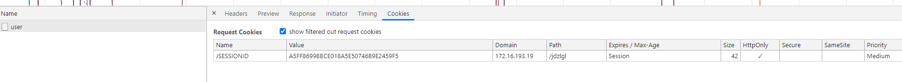

# 跨域问题1


Access to XMLHttpRequest at 'http://172.16.30.177:8082/ssoserver/login?service=http://172.16.193.19:8181/jdzlgl/cas' (redirected from 'http://172.16.193.19:8181/jdzlgl/index/user') from origin 'http://172.16.192.209:8080' has been blocked by CORS policy: No 'Access-Control-Allow-Origin' header is present on the requested resource.

ajax访问的时候，访问的服务有登陆验证，无论是先登录再访问，还是直接访问，都会报上面的错误。

是因为A 想访问B ，B 发现没有登陆，302到SSO，这时候A 访问SSO发现不允许跨域，所以报错。

那么我的B已经登录了，按理说，A访问B的时候，B不会302。

原来A访问B的时候，B认为是新的连接，为啥是新的，因为request中没有sessionid，为啥没有呢？不知道，查查查

下图是访问的时候request和response，request中没有cookies，response中有，因为建立了链接。但是下次ajax访问request中还是没有cookies，依然是新的连接，卧槽，就是不携带cookies，咋整。






好的，我问直接访问B，看！request中有cookie，浏览器让访问B请求中的request中携带，而ajax就无法让访问B请求中的request携带cookie，为啥。





原来是ajax请求的时候，没有开启携带cookie

vue中的框架

```
axios.defaults.withCredentials = true;
```

原生的jquery

```
xhrFields: {withCredentials: true},
```


天天眼查


http://172.16.193.19:8181/jdzlgl/index/user

http://172.16.192.209:8080/


this cookie did not specify a "samesite" attribute when is was stored and was defaulted to "SameSite=Lax," and was blocked because the request was made from a different site and was not initiated by a top-level navigation.

the cookie had to have been set with "SameSite=None" to enable cross-site usage.

如果有上面的错误，把下面两个设置为disable，谷歌浏览器有效。

chrome://flags/#same-site-by-default-cookies

chrome://flags/#cookies-without-same-site-must-be-secure


index.html:1 Access to XMLHttpRequest at 'http://172.16.193.19:9080/index/user' from origin 'http://172.16.192.209:8888' has been blocked by CORS policy: Response to preflight request doesn't pass access control check: Redirect is not allowed for a preflight request.

后台没有开启允许跨域策略


https://segmentfault.com/a/1190000019485883?utm_source=tag-newest

https://medium.com/it-digital-%E4%BA%92%E8%81%AF%E7%B6%B2/%E4%BB%80%E9%BA%BC-samesite-cookies-policy-%E6%9B%B4%E6%96%B0%E4%BA%86-2b317e6cf6bb

https://ianhung0529.medium.com/chrome-80-%E5%BE%8C%E9%87%9D%E5%B0%8D%E7%AC%AC%E4%B8%89%E6%96%B9-cookie-%E7%9A%84%E8%A6%8F%E5%89%87%E8%AA%BF%E6%95%B4-default-samesite-lax-aaba0bc785a3

https://blog.csdn.net/weixin_41791737/article/details/107839391


