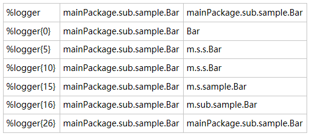
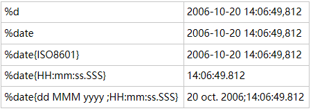

转换符 作用

| **c** {*length* }    **lo** {*length* }    **logger** {*length* } | 输出日志的logger名，可有一个整形参数，功能是缩短logger名，设置为0表示只输入logger最右边点符号之后的字符串。   Conversion specifier Logger name Result                  |
| ------------------------------------------------------------ | ------------------------------------------------------------ |
| **C** {*length* }    **class** {*length* }                   | 输出执行记录请求的调用者的全限定名。参数与上面的一样。尽量避免使用，除非执行速度不造成任何问题。 |
| **contextName**   **cn**                                     | 输出上下文名称。                                             |
| **d** {*pattern* }    **date** {*pattern* }                  | 输出日志的打印日志，模式语法与java.text.SimpleDateFormat 兼容。 Conversion Pattern Result                     |
| **F / file**                                                 | 输出执行记录请求的java源文件名。尽量避免使用，除非执行速度不造成任何问题。 |
| **caller{depth}caller{depth,   evaluator-1, ... evaluator-n}** | 输出生成日志的调用者的位置信息，整数选项表示输出信息深度。   例如， **%caller{2}**   输出为：                                                                                          0    [main]   DEBUG - logging statement       Caller+0   at   mainPackage.sub.sample.Bar.sampleMethodName(Bar.java:22)      Caller+1   at mainPackage.sub.sample.Bar.createLoggingRequest(Bar.java:17)   例如， **%caller{3}**   输出为：   16   [main]   DEBUG - logging statement       Caller+0   at   mainPackage.sub.sample.Bar.sampleMethodName(Bar.java:22)      Caller+1   at mainPackage.sub.sample.Bar.createLoggingRequest(Bar.java:17)      Caller+2   at   mainPackage.ConfigTester.main(ConfigTester.java:38) |
| **L / line**                                                 | 输出执行日志请求的行号。尽量避免使用，除非执行速度不造成任何问题。 |
| **m / msg / message**                                        | 输出应用程序提供的信息。                                     |
| **M / method**                                               | 输出执行日志请求的方法名。尽量避免使用，除非执行速度不造成任何问题。 |
| **n**                                                        | 输出平台先关的分行符“\n”或者“\r\n”。                         |
| **p / le / level**                                           | 输出日志级别。                                               |
| **r / relative**                                             | 输出从程序启动到创建日志记录的时间，单位是毫秒               |
| **t / thread**                                               | 输出产生日志的线程名。                                       |
| **replace(*****p*** **){r, t}**                              | **p** 为日志内容，**r** 是正则表达式，将**p** 中符合**r** 的内容替换为**t** 。   例如， "%replace(%msg){'\s', ''}" |

 

 

**格式修饰符，与转换符共同使用：**

可选的格式修饰符位于“%”和转换符之间。

第一个可选修饰符是**左对齐** 标志，符号是减号“-”；接着是可选的**最小宽度** 修饰符，用十进制数表示。如果字符小于最小宽度，则左填充或右填充，默认是左填充（即右对齐），填充符为空格。如果字符大于最小宽度，字符永远不会被截断。**最大宽度** 修饰符，符号是点号"."后面加十进制数。如果字符大于最大宽度，则从前面截断。点符号“.”后面加减号“-”在加数字，表示从尾部截断。

 

 

例如：%-4relative 表示，将输出从程序启动到创建日志记录的时间 进行左对齐 且最小宽度为4。

 