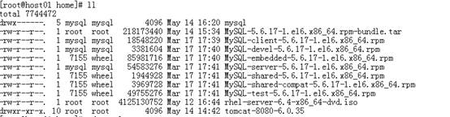
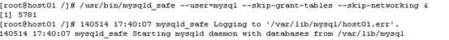
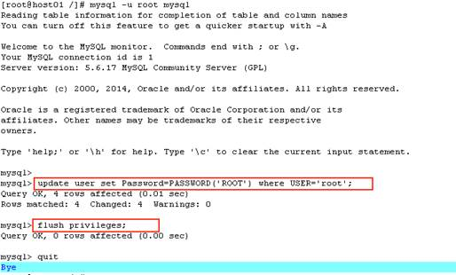
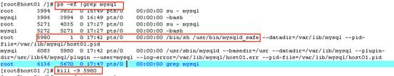
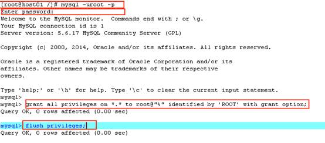

# 第一步卸载

检查本机是否安装mysql

```shell
[root@host01 home]# rpm -qa | grep -i mysql
mysql-libs-5.1.52-1.el6_0.1.x86_64
mysql-devel-5.1.52-1.el6_0.1.x86_64
mysql-5.1.52-1.el6_0.1.x86_64
```

以上说明已经安装了，我在安装的时候上面的版本无法启动，所有我删除了这个，安装了5.6版本的。 

卸载原有的mysql，如下：

```shell
[root@host01 home]# rpm -e mysql-libs-5.1.52-1.el6_0.1.x86_64 --nodeps
[root@host01 home]# rpm -e mysql-devel-5.1.52-1.el6_0.1.x86_64 --nodeps
[root@host01 home]# rpm -e mysql-5.1.52-1.el6_0.1.x86_64 --nodeps
```

 

# 第二步解压

解压MySQL-5.6.17-1.el6.x86_64.rpm-bundle.tar

```shell
[root@host01 home]# tar xvf MySQL-5.6.17-1.el6.x86_64.rpm-bundle.tar
```

解压后如下：



 

# 第三步安装

```shell
[root@host01 home]# rpm -ivh MySQL-server-5.6.17-1.el6.x86_64.rpm
```

server安装之后会自动启动 

```shell
[root@host01 home]# rpm -ivh MySQL-client-5.6.17-1.el6.x86_64.rpm 
[root@host01 home]# rpm -ivh MySQL-devel-5.6.17-1.el6.x86_64.rpm
```

 

# 第四步修改root密码

不修改密码我们是无法登陆到mysql数据库的

### 停止服务

```shell
[root@host01 /]# service mysql stop
Shutting down MySQL..[  OK  ]
```

###  安全模式启动

```shell
[root@host01 /]# /usr/bin/mysqld_safe --user=mysql --skip-grant-tables --skip-networking &
[1] 5781
140514 17:40:07 mysqld_safe Logging to '/var/lib/mysql/host01.err'.
140514 17:40:07 mysqld_safe Starting mysqld daemon with databases from /var/lib/mysql
```



 

### 安全模式登陆，修改root密码

```shell
[root@host01 /]# mysql -u root mysql
```



 

### 关闭安全登陆模式 

```shell
[root@host01 /]# ps -ef |grep mysql  查找mysql相关的进程 
[root@host01 /]# kill -9 5980  完全杀掉进程
```



 

 

### 重新启动mysql服务

[root@host01 /]# service mysql restart

Shutting down MySQL..[  OK  ]

Starting MySQL.[  OK  ] 

# 第五步解决局域网受限

登陆mysql，执行以下语句，解决局域网访问受限的问题

登陆mysql

```shell
[root@host01 /]# mysql -uroot –p    
```

 

给从任意IP地址连接的用户名为root，密码为ROOT的用户赋予所有权限。

```s
mysql> grant all privileges on *.* to root@"%" identified by 'ROOT' with grant option;
```

 



 

 

