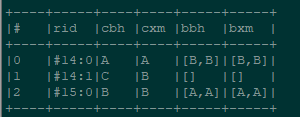

select from v where name like '贾%' or name like '林%'  

select out('parentage') from person where name='贾珠'

返回和贾珠是子女关系的人的id 

select bothE('parentage') from person where name='贾珠'

返回和贾珠是子女关系的边的ID

 

 

select expand( out('Owns') ) from Person where name = 'Luca'  通过点边关系查询出name为Luca对应的Car的值

select name from ( select expand( out('Owns') ) from Person where name = 'Luca' ) 查询输出顶点属性name的值

select out().name from ( select expand( out('Owns') ) from Person where name = 'Luca' ) 查询输出顶点属性name的值

select in().name from ( select expand( out('Owns') ) from Person where name = 'Luca' ) 查询输入顶点属性name的值

select @RID from ( select expand( out('Owns') ) from Person where name = 'Luca' ) 查询边@RID的值

 

 

 

找到每个人的配偶id

select @rid, cbh, cxm, in("spouse").cbh as bbh, in("spouse").cxm as bxm from person

 

 

找到每个人的配偶id ，分行显示

select @rid, cbh, cxm, in("spouse").cbh as bbh, in("spouse").cxm as bxm from person unwind bbh ,bxm

 

 

查找配偶的孩子

select  @rid, cbh, cxm , $rs.@rid, $rs.cbh, $rs.cxm from person let $rs=in("spouse").in("child")

 

 

select  @rid, cbh, cxm , $rs.@rid as rsid, $rs.cbh, $rs.cxm from person let $rs=in("spouse").in("child")  unwind  rsid

 

 

 

traverse * from  #16:15

 

traverse out()  from  #16:15

 

查找X的信息

select from person where c_bh='abcd003'

 

找到x的配偶

select from person where @rid in (select in('spouse') from person where c_bh='abcd003' )

 

根据关系来源找X的配偶

select from person where @rid in (select in('spouse') from person where c_bh='?' )  

 

获取某源的某人的配偶边信息

select  from relation where @rid in  (select inE('spouse') from person where c_bh='abcd003') and  c_gxlydw='计生委'

 

获取某源的某人的配偶信息

select outV()  as person from  relation where @rid in  (select inE('spouse') from person where c_bh='abcd003') and  c_gxlydw='计生委'

 

 

 

 

 

 

 

 

 

 

 

select inE('spouse') , in('spouse') from person where c_bh='?' 