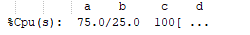

#### 简介

------

```
top -hv|-bcHiOSs -d secs -n max -u|U user -p pid -o fld -w [cols]
```


当使用top时，有两个重要的键：帮助（h）和退出（q），首次使用top，主要 分三个区域：1.摘要区；2.字段/列标题；3.任务区。列的宽度是可变的，也受命令行输入时-w选项的影响。显示的内容可以通过上下左右键移动。如果没有任何配置和自定义修改，top启动时的默认和显示有关的参数值如下，*的值可以在命令行指定：

```
Global-defaults
   A - Alt display      Off (full-screen)            -- 全屏显示默认关闭
 * d - Delay time       1.5 seconds                  -- 刷新频率1.5s
 * H - Threads mode     Off (summarize as tasks)     -- 线程模式默认关闭
   I - Irix mode        On  (no, `solaris' smp)      -- ？？？
 * p - PID monitoring   Off (show all processes)     -- 在不指定PID的情况下，默认显示所有
 * s - Secure mode      Off (unsecured)              -- 安全模式默认关闭
   B - Bold enable      On  (yes, bold globally)     -- 默认全局粗体
Summary-Area-defaults
   l - Load Avg/Uptime  On  (thus program name)      -- 显示load状态
   t - Task/Cpu states  On  (1+1 lines)              -- 显示任务和cpu状态，两行
   m - Mem/Swap usage   On  (2 lines worth)          -- 显示内存状态，两行
   1 - Single Cpu       Off (thus multiple cpus)     --？？？
Task-Area-defaults
   b - Bold hilite      Off (use `reverse')
 * c - Command line     Off (name, not cmdline)      -- 详细命令关闭，默认显示命令名字
 * i - Idle tasks       On  (show all tasks)         -- 空闲开启，所以显示所有任务
   J - Num align right  On  (not left justify)       -- 数字默认右对齐
   j - Str align right  Off (not right justify)      -- 字符默认左对齐
   R - Reverse sort     On  (pids high-to-low)       -- 默认按照pid高到底排序
 * S - Cumulative time  Off (no, dead children)      -- cpu使用累计时间关闭
 * u - User filter      Off (show euid only)         -- 按照用户过滤关
 * U - User filter      Off (show any uid)           -- 按照用户过滤关
   V - Forest view      On  (show as branches)       -- ？？？
   x - Column hilite    Off (no, sort field)         -- 高亮列关闭
   y - Row hilite       On  (yes, running tasks)     -- 高亮行开启，正在运行的任务高亮
   z - color/mono       On  (show colors)            -- 颜色开？？？
```


#### 选项说明

------

```
-hv|-bcHiOSs -d secs -n max -u|U user -p pid -o fld -w [cols]
```

##### -h | -v  :Help/Version

Show library version and the usage prompt, then quit.

##### -b  :Batch-mode operation

采用批处理模式打开top命令，这对向其他程序和文件发送输出结果很有用，此模式下top不接收任何输入（交互模式不能用了），直到达到通过`-n`指定的运行次数或被kill为止。

##### -c  :Command-line/Program-name toggle

控制command列是显示命令还是命令名，在输入top时指定，也开在启动top后（不是`-b`模式）直接键入‘c’。

##### -d  :Delay-time interval as:  -d ss.t (secs.tenths)

控制显示的输出频率，在输入top时指定，也可在启动top后（不是`-b`模式）直接键入‘d’或者‘s’。

##### -H  :Threads-mode operation

控制以线程模式显示，如果不加此参数，则显示的是进程中所有线程的总和，在输入top时指定，也可在启动top后（不是`-b`模式）直接键入‘H’。

##### -i  :Idle-process toggle

控制显示和上次更新比是否空闲任务，在输入top时指定，也可在启动top后（不是`-b`模式）直接键入‘i’。

##### -n  :Number-of-iterations limit as:  -n number

指定刷新多少次结束，在输入top时指定（-n 10），**不支持启动后键入**。

##### -o  :Override-sort-field as:  -o fieldname

指定按照某列排序，在列名前加‘+’和‘-’标识升序和降序，本参数主要支持批处理和自动化模式。

##### -O  :Output-field-names

在批处理/自动化模式是输出的内容是否包含字段列头。

#####  -p  :Monitor-PIDs mode as:  -pN1 -pN2 ...  or  -pN1,N2,N3 ...

监视指定的进程，最多支持指定20个线程，**不支持启动后键入**。启动后，如果要恢复所有进程，可以键入‘=’、‘u’或者‘U’。

> ***注意：p u U三个参数互斥的。***

##### -s  :Secure-mode operation

控制安全模式，不懂？？？

##### -S  :Cumulative-time toggle

开启累计时间后，每个进程和其子进程使用的cpu时间将列出，在输入top时指定，也可在启动top后（不是`-b`模式）直接键入**‘S’**。

##### -u | -U  :User-filter-mode as:  -u | -U number or name

显示指定用户的进程，‘u’选项是有效用户，‘U’是所有用户不管是否有效。 在用户前加‘！’会显示除了此用户外的其他线程。。

> ***注意：p u U三个参数互斥的。***

##### -w  :Output-width-override as:  -w [ number ]

批处理模式下，如果启动top时不指定参数，则结果会采用‘COLUMNS’和‘LINES’环境变量中的值作为输出格式。

使用参数后，宽度可以自定义，行数默认无限。，**不支持启动后键入**


#### 显示区说明

------

##### 摘要区

----

###### UPTIME and LOAD Averages

用户数、1/5/15分钟的平均负载


###### TASK and CPU States

线程概要

```
running
sleeping
stopped
zombie
```

cpu概要，

```
us, user    : time running un-niced user processes   -- 运行非独立用户进程的时间
sy, system  : time running kernel processes          -- 运行内核进程的时间
ni, nice    : time running niced user processes      -- 运行良好的用户进程的时间
id, idle    : time spent in the kernel idle handler  -- 在内核空闲处理程序中花费的时间
wa, IO-wait : time waiting for I/O completion        -- 等待I/O完成的时间
hi : time spent servicing hardware interrupts        -- 服务硬件中断所花费的时间
si : time spent servicing software interrupts        -- 服务于软件中断的时间
st : time stolen from this vm by the hypervisor      -- 虚拟机管理程序从此虚拟机窃取的时间
```

可以通过加入‘t’看到其他信息



```
a) is the combined us and ni percentage; 
b) is the sy percentage; 
c) is the total; and 
d) is one of two visual graphs of those representations
```


###### MEMORY Usage

内存展示，两行，可以通过键入**‘E’**来改变显示的单位，K、M、G、T、P、E。可以通过键入**‘m’**来改变视图（四视图）

第一行物理内存：

total, free, used and buff/cache

第二行虚拟内存：

 total, free, used and avail (which is physical memory)


##### 字段/列标题区

----

介绍top命令可以显示的所有列，这些列可以通过交互模式时键入**‘f’**和**‘F’**管理，键入后出现一个屏幕，内容有当前窗口名，指定的培训字段和所有字段以及这些字段哪些被选择显示了。

某些列可以通过键入**‘e’**改变显示的单位K、M、G、T、P、E。


###### 1. %CPU  --  CPU Usage

有超过100%的情况，因为显示的是进程模式，可以通过键入**‘H’**改变为线程模式。

当多处理器时，使用率是除以CPU总数，所以可以通过键入**‘I’**切换Irix/Solaris模式。

###### 2. %MEM  --  Memory Usage (RES)

已使用的物理内存占比。

###### 3. CGROUPS  --  Control Groups

进程所属控制组的名称。

###### 4. CODE  --  Code Size (KiB)

用于可执行代码的物理内存量，也称为文本驻留集大小或trs。

###### ** 5.  COMMAND  --  Command Name or Command Line

显示命令，可以通过键入 **‘c’** 改变。

###### 6. DATA  --  Data + Stack Size (KiB)

用于可执行代码以外的物理内存量，也称为数据驻留集大小或DRS。

###### 7. ENVIRON  --  Environment variables

显示各个进程所看到的所有环境变量（如果有）

###### 8.  Flags  --  Task Flags

This  column  represents  the  task's  current  scheduling  flags  which  are  expressed  in  hexadecimal  notation  and  with  zeros suppressed.  These flags are officially documented in
<linux/sched.h>.

###### 9. GID  --  Group Id

The effective group ID.

###### 10. GROUP  --  Group Name

The effective group name.

###### ** 11. NI  --  Nice Value

任务的优先级，负值优先级高，正值优先级低，零表示？？？，。

###### 12.P  --  Last used CPU (SMP)

最后使用处理器的数字，如果这个值频繁更换，则表示在切换cpu，对性能有影响。

###### 13. PGRP  --  Process Group Id

该值等于进程组第一个成员（称为进程）的进程id。

###### ** 14. PID  --  Process Id

任务进程ID

###### 15. PPID  --  Parent Process Id

The process ID (pid) of a task's parent.

###### ** 16. PR  --  Priority

任务的调度优先级。如果在该字段中看到“rt”，则表示任务正在实时调度优先级下运行。

###### ** 17. RES  --  Resident Memory Size (KiB)

任务正在使用的非交换物理内存

###### 18. RUID  --  Real User Id

The real user ID

###### 19. RUSER  --  Real User Name

 The real user name.

###### ** 20. S  --  Process Status

任务的状态，可以是：

- D=不间断睡眠

- R=运行

- S=睡觉

- T=通过工作控制信号停止

- T=跟踪期间被调试器停止

- Z=僵尸

###### ** 21. SHR  --  Shared Memory Size (KiB)

一个任务可用的共享内存量，并不是所有的共享内存都是常驻的。它只是反映了可能与其他进程共享的内存。

###### 22. SID  --  Session Id

A session is a collection of process groups (see PGRP), usually established by the login shell.  A newly forked process joins the session of its creator.  By convention, this value equals the process ID (see PID) of the first member of the session, called the session leader, which is usually the login shell.

###### 23. SUID  --  Saved User Id

The saved user ID.

###### 24. SUPGIDS  --  Supplementary Group IDs

The IDs of any supplementary group(s) established at login or inherited from a task's parent.  They are displayed in a comma delimited list.

Note: The SUPGIDS field, unlike most columns, is not fixed-width.  When displayed, it plus any other variable width columns will be allocated all remaining screen width (up to the maximum
512 characters).  Even so, such variable width fields could still suffer truncation.  See topic 5c. SCROLLING a Window for additional information on accessing any truncated data.

###### 25. SUPGRPS  --  Supplementary Group Names

The names of any supplementary group(s) established at login or inherited from a task's parent.  They are displayed in a comma delimited list.

Note: The SUPGRPS field, unlike most columns, is not fixed-width.  When displayed, it plus any other variable width columns will be allocated all remaining screen width (up to the maximum
512 characters).  Even so, such variable width fields could still suffer truncation.  See topic 5c. SCROLLING a Window for additional information on accessing any truncated data.

###### 26. SUSER  --  Saved User Name

he saved user name.

###### 27. SWAP  --  Swapped Size (KiB)

The non-resident portion of a task's address space.

###### 28. TGID  --  Thread Group Id

The ID of the thread group to which a task belongs.  It is the PID of the thread group leader.  In kernel terms, it represents those tasks that share an mm_struct.

###### 29. TIME  --  CPU Time

任务开始后的cpu时间，  如果是累计模式，则显示的是主进程和子进程（包括已经死掉的）的所有时间。可以哦用过键入 **‘S’** 开启关闭累计模式。

###### 30. TIME+  --  CPU Time, hundredths

The same as TIME, but reflecting more granularity through hundredths of a second.

###### 31. TPGID  --  Tty Process Group Id

###### 32. TTY  --  Controlling Tty6

###### 33. UID  --  User Id

###### 34. USED  --  Memory in Use (KiB)

此字段表示任务已使用的非交换物理内存（res）加上其地址空间的非驻留部分（swap）。

###### 35. USER  --  User Name

###### ** 36. VIRT  --  Virtual Memory Size (KiB)

使用的内存总数，It includes all code, data and shared libraries plus pages that have been swapped out and pages that have been mapped but not used.

###### WCHAN  --  Sleeping in Function

Depending  on  the  availability of the kernel link map (System.map), this field will show the name or the address of the kernel function in which the task is currently sleeping.  Running
tasks will display a dash ('-') in this column.

By displaying this field, top's own working set could be increased by over 700Kb, depending on the kernel version.  Should that occur, your only means of reducing that overhead will be to
stop and restart top.

###### nDRT  --  Dirty Pages Count

The  number  of pages that have been modified since they were last written to auxiliary storage.  Dirty pages must be written to auxiliary storage before the corresponding physical memory
location can be used for some other virtual page.

###### nMaj  --  Major Page Fault Count

The number of major page faults that have occurred for a task.  A page fault occurs when a process attempts to read from or write to a virtual page that is not currently  present  in  its
address space.  A major page fault is when auxiliary storage access is involved in making that page available.

###### nMin  --  Minor Page Fault count

The  number  of  minor page faults that have occurred for a task.  A page fault occurs when a process attempts to read from or write to a virtual page that is not currently present in its
address space.  A minor page fault does not involve auxiliary storage access in making that page available.

###### nTH  --  Number of Threads

The number of threads associated with a process.

###### nsIPC  --  IPC namespace

The Inode of the namespace used to isolate interprocess communication (IPC) resources such as System V IPC objects and POSIX message queues.

###### nsMNT  --  MNT namespace

The Inode of the namespace used to isolate filesystem mount points thus offering different views of the filesystem hierarchy.

###### nsNET  --  NET namespace

The Inode of the namespace used to isolate resources such as network devices, IP addresses, IP routing, port numbers, etc.

###### nsPID  --  PID namespace

The Inode of the namespace used to isolate process ID numbers meaning they need not remain unique.  Thus, each such namespace could have its own `init' (PID #1) to manage various initial‐
ization tasks and reap orphaned child processes.

###### nsUSER  --  USER namespace

The  Inode  of the namespace used to isolate the user and group ID numbers.  Thus, a process could have a normal unprivileged user ID outside a user namespace while having a user ID of 0,
with full root privileges, inside that namespace.

###### nsUTS  --  UTS namespace

The Inode of the namespace used to isolate hostname and NIS domain name.  UTS simply means "UNIX Time-sharing System".

###### vMj  --  Major Page Fault Count Delta

The number of major page faults that have occurred since the last update (see nMaj).

###### vMn  --  Minor Page Fault Count Delta

The number of minor page faults that have occurred since the last update (see nMin).


##### 任务区

----


```
top -bcn 1
```

-b ：批处理，一屏一屏显示。
-c：是否显示完整的命令行信息
-n ：指定显示多少批。


