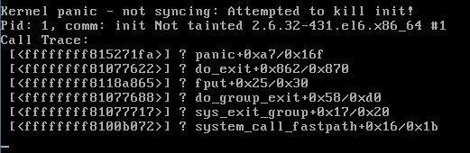
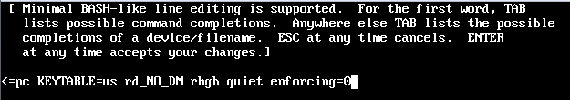

 系统安装之后reboot报错 

进行如下操作，在启动界面按 “e” 进入grub界面

编辑界面，编辑grub菜单，选择“kernel /vmlinuz-2.6.23.1-42.fc8 ro root=/dev/vogroup00/logvol00 rhgb quiet” 一栏，按‘e’键进入编辑，在末尾增加enforcing=0，即：

 

按‘b’键继续引导，OK顺利前进。

也有可能是selinux配置不当造成开不机，解决方法：在启动内核的参数上增加 selinux=0 来关闭selinux

