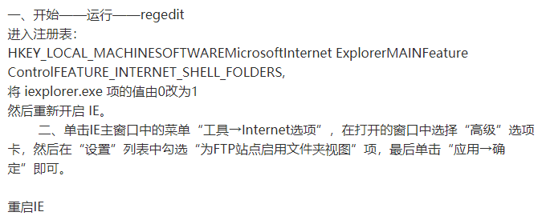

1、打开注册表编辑器“regedit”；

2、定位到如下项目“HKEY_CLASSES_ROOT\Excel.Sheet.12\shell\Open\command”；

3、编辑原有的内容，在最后添加"%1"。

如：原为"C:\Program Files (x86)\Microsoft Office\Root\Office16\EXCEL.EXE"

则：新为"C:\Program Files (x86)\Microsoft Office\Root\Office16\EXCEL.EXE" "%1" 

计算机\HKEY_LOCAL_MACHINE\SOFTWARE\Microsoft\Internet Explorer\Main\FeatureControl\FEATURE_INTERNET_SHELL_FOLDERS