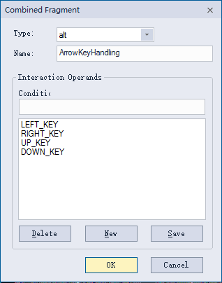
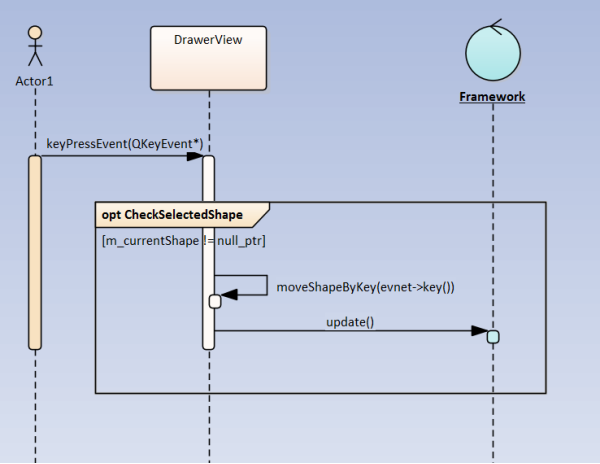
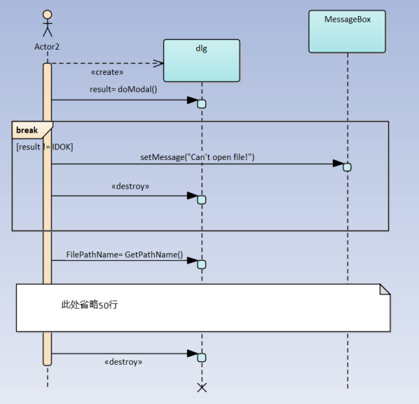

序列图提供了一种Fragment（片段），用来表现条件执行，循环，并发等情况。具体使用哪种Fragment，通过以下的对话框来选择。

今天先说条件执行相关的Fragment。

# alt（alternative 可供选择的）

alt用于表现条件执行的程序构造。和alt对应的程序结构可以是if/else结构，也可以是swtich结构。还是从图形编辑软件中找例子。

这个时序图描述的是DrawerView根据用户按下的方向键来移动图形时的处理。使用的就是名为alt的Framgment。它的设定画面如下：

设定内容

Type：alt

Name:ArrowKeyHandling。选取一个有意义的名字有助于读者的理解。

Condition:输入每个分支的判断条件。输入完成的条件可以在Condition输入框下方的列表中表示出来。

需要说明的是，这个对话框中不能调整条件的顺序。条件的顺序是通过例子图中红线框出的小箭头来调整的。

# opt（optional可选的）

 

当然，在实际的程序中，只有某个图形被选中时才可以移动该图形。这就是opt出场的时候了，具体时序图如下：

只有在m_currentShape有效时才调用移动图形方法并更新表示。opt其实就是一个没有else的if。

 

# break 

首先要明确的是，这个break不是C/C++语言中的那个break，它包含一个带有监护条件的操作片段，如果监护条件为真，则该片段被执行，该片段以后的部分被忽略；如果监护条件为假，那么该片段不会被执行，该子片段以后的部分则会被执行。

好像有点复杂，结合下面代码一起说就容易理解了。

void openfile（void）

{

CFileDialog dlg;

if(dlg.DoModal()!=IDOK)

{

MessageBox.setMessage("Can't open file!");

return;

}

CString FilePathName = dlg.GetPathName();

/*此处省略50行。*/

}

代码很简单，画成序列图如下：

上图中包含一个以result是否不等于IDOK为监护条件的break片段，如果监护条件为真，则该片段中的sendMesage和删除dlg操作被执行，GetPathName及以后的部分被忽略；如果监护条件为假，那么break片段不会被执行，GetPathName及以后的部分会被执行。

**费了半天劲，break其实就是一个有条件的中途退出处理。**

| Operator | Action                                                       |
| -------- | ------------------------------------------------------------ |
| alt      | Divide up interaction fragments based on Boolean conditions. |
| opt      | Enclose an optional可选的 fragment of interaction.           |
| par      | Indicate表明 that operands operate in parallel.              |
| loop     | Indicate that the operand repeats a number of times, as specified by interaction相互影响的constraints条件. |
| critical | Indicate a sequence that cannot be interrupted by other processing. |
| neg      | Assert that a fragment is invalid, and implies that all other interaction is valid. |
| assert   | Specify the only valid fragment to occur. This operator is often enclosed within a consider or ignore operand. |
| strict   | Indicate that the behaviors of the operands must be processed in strict sequence. |
| seq      | Indicate that the Combined Fragment is weakly sequenced. This means that the ordering within operands is maintained, but the ordering between operands is undefined, so long as an event occurrence of the first operand precedes that of the second operand, if the event occurrences are on the same lifeline. |
| ignore   | Indicate which messages should be ignored during execution, or can appear anywhere in the execution trace. |
| consider | Specify which messages should be considered in the trace. This is often used to specify the resulting event occurrences with the use of an assert operator. |
| ref      | Provide a reference to another diagram.  			The ref fragment is not created using the method described in the Create a Combined Fragment topic. To create a ref fragment, simply drag an existing diagram from the Project Browser onto the current diagram. |