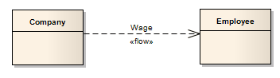
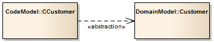
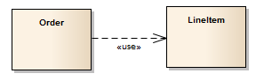

https://sparxsystems.com/enterprise_architect_user_guide/15.1/model_domains/umlconnections.html

# Abstraction 抽象关系

[Activity Diagrams](https://sparxsystems.com/enterprise_architect_user_guide/15.1/model_domains/activitydiagram.html)

- [Control Flow](https://sparxsystems.com/enterprise_architect_user_guide/15.1/model_domains/controlflow.html)
- [Object Flow](https://sparxsystems.com/enterprise_architect_user_guide/15.1/model_domains/objectflow.html)
- [Interrupt Flow](https://sparxsystems.com/enterprise_architect_user_guide/15.1/model_domains/interruptflow.html)

[Use Case Diagrams](https://sparxsystems.com/enterprise_architect_user_guide/15.1/model_domains/usecasediagram.html)

- [Use](https://sparxsystems.com/enterprise_architect_user_guide/15.1/model_domains/use.html)
- [Associate](https://sparxsystems.com/enterprise_architect_user_guide/15.1/model_domains/associate.html)
- [Generalize](https://sparxsystems.com/enterprise_architect_user_guide/15.1/model_domains/generalize.html)
- [Include](https://sparxsystems.com/enterprise_architect_user_guide/15.1/model_domains/include.html)
- [Extend](https://sparxsystems.com/enterprise_architect_user_guide/15.1/model_domains/extend.html)
- [Realize](https://sparxsystems.com/enterprise_architect_user_guide/15.1/model_domains/realise.html)
- [Invokes](https://sparxsystems.com/enterprise_architect_user_guide/15.1/modeling/usecasegroup.html)
- [Precedes](https://sparxsystems.com/enterprise_architect_user_guide/15.1/modeling/usecasegroup.html)

[StateMachine Diagrams](https://sparxsystems.com/enterprise_architect_user_guide/15.1/model_domains/statediagram.html)

- [Transition](https://sparxsystems.com/enterprise_architect_user_guide/15.1/model_domains/transition.html)
- [Object Flow](https://sparxsystems.com/enterprise_architect_user_guide/15.1/model_domains/objectflow.html)

[Timing Diagrams](https://sparxsystems.com/enterprise_architect_user_guide/15.1/model_domains/timingdiagram.html)

- [Message](https://sparxsystems.com/enterprise_architect_user_guide/15.1/model_domains/timingmessage.html)

[Sequence Diagrams](https://sparxsystems.com/enterprise_architect_user_guide/15.1/model_domains/sequence_diagrams_and_version_.html)

- [Message](https://sparxsystems.com/enterprise_architect_user_guide/15.1/model_domains/sequencemessage.html)
- [Self Message](https://sparxsystems.com/enterprise_architect_user_guide/15.1/model_domains/self-message.html)
- [Recursion](https://sparxsystems.com/enterprise_architect_user_guide/15.1/model_domains/recursion.html)
- [Call](https://sparxsystems.com/enterprise_architect_user_guide/15.1/model_domains/call.html)

[Communication Diagrams](https://sparxsystems.com/enterprise_architect_user_guide/15.1/model_domains/communicationdiagram.html)

- [Associate](https://sparxsystems.com/enterprise_architect_user_guide/15.1/model_domains/associate.html)
- [Realize](https://sparxsystems.com/enterprise_architect_user_guide/15.1/model_domains/realise.html)
- [Nesting](https://sparxsystems.com/enterprise_architect_user_guide/15.1/model_domains/nesting.html)

[Interaction Overview Diagrams](https://sparxsystems.com/enterprise_architect_user_guide/15.1/model_domains/interactionoverviewdiagram.html)

- [Control Flow](https://sparxsystems.com/enterprise_architect_user_guide/15.1/model_domains/controlflow.html)
- [Object Flow](https://sparxsystems.com/enterprise_architect_user_guide/15.1/model_domains/objectflow.html)
- [Interrupt Flow](https://sparxsystems.com/enterprise_architect_user_guide/15.1/model_domains/interruptflow.html)

[Composite Structure Diagrams](https://sparxsystems.com/enterprise_architect_user_guide/15.1/model_domains/compositestructurediagram.html)

- [Connector](https://sparxsystems.com/enterprise_architect_user_guide/15.1/automation/connector.html)
- [Assembly](https://sparxsystems.com/enterprise_architect_user_guide/15.1/model_domains/assembly.html)
- [Delegate](https://sparxsystems.com/enterprise_architect_user_guide/15.1/model_domains/delegate.html)
- [Role Binding](https://sparxsystems.com/enterprise_architect_user_guide/15.1/model_domains/rolebinding.html)
- [Represents](https://sparxsystems.com/enterprise_architect_user_guide/15.1/model_domains/represents.html)
- [Occurrence](https://sparxsystems.com/enterprise_architect_user_guide/15.1/model_domains/occurrence.html)

[Package](https://sparxsystems.com/enterprise_architect_user_guide/15.1/model_domains/packagediagram.html) and [Class](https://sparxsystems.com/enterprise_architect_user_guide/15.1/model_domains/classdiagram.html) Diagrams

- [Associate](https://sparxsystems.com/enterprise_architect_user_guide/15.1/model_domains/associate.html)
- [Generalize](https://sparxsystems.com/enterprise_architect_user_guide/15.1/model_domains/generalize.html)
- [Compose](https://sparxsystems.com/enterprise_architect_user_guide/15.1/model_domains/compose.html)
- [Aggregate](https://sparxsystems.com/enterprise_architect_user_guide/15.1/model_domains/aggregate.html)
- [Association Class](https://sparxsystems.com/enterprise_architect_user_guide/15.1/model_domains/associationclass.html)
- [Assembly](https://sparxsystems.com/enterprise_architect_user_guide/15.1/model_domains/assembly.html)
- [Realize](https://sparxsystems.com/enterprise_architect_user_guide/15.1/model_domains/realise.html)
- [Nesting](https://sparxsystems.com/enterprise_architect_user_guide/15.1/model_domains/nesting.html)
- [Package Merge](https://sparxsystems.com/enterprise_architect_user_guide/15.1/model_domains/pkgmerge.html)
- [Package Import](https://sparxsystems.com/enterprise_architect_user_guide/15.1/model_domains/pkgimport.html)
- [Abstraction](https://sparxsystems.com/enterprise_architect_user_guide/15.1/model_domains/abstraction.html)
- [Substitution](https://sparxsystems.com/enterprise_architect_user_guide/15.1/model_domains/substitution.html)
- [Usage](https://sparxsystems.com/enterprise_architect_user_guide/15.1/model_domains/usage.html)

[Component Diagrams](https://sparxsystems.com/enterprise_architect_user_guide/15.1/model_domains/componentdiagram.html)

- [Assembly](https://sparxsystems.com/enterprise_architect_user_guide/15.1/model_domains/assembly.html)
- [Delegate](https://sparxsystems.com/enterprise_architect_user_guide/15.1/model_domains/delegate.html)
- [Associate](https://sparxsystems.com/enterprise_architect_user_guide/15.1/model_domains/associate.html)
- [Realize](https://sparxsystems.com/enterprise_architect_user_guide/15.1/model_domains/realise.html)
- [Generalize](https://sparxsystems.com/enterprise_architect_user_guide/15.1/model_domains/generalize.html)

[Deployment Diagrams](https://sparxsystems.com/enterprise_architect_user_guide/15.1/model_domains/deploymentdiagram.html)

- [Associate](https://sparxsystems.com/enterprise_architect_user_guide/15.1/model_domains/associate.html)
- [Communication Path](https://sparxsystems.com/enterprise_architect_user_guide/15.1/model_domains/communication_path.html)
- [Association Class](https://sparxsystems.com/enterprise_architect_user_guide/15.1/model_domains/associationclass.html)
- [Generalize](https://sparxsystems.com/enterprise_architect_user_guide/15.1/model_domains/generalize.html)
- [Realize](https://sparxsystems.com/enterprise_architect_user_guide/15.1/model_domains/realise.html)
- [Deployment](https://sparxsystems.com/enterprise_architect_user_guide/15.1/model_domains/deployment.html)
- [Manifest](https://sparxsystems.com/enterprise_architect_user_guide/15.1/model_domains/manifest.html)
- [Nesting](https://sparxsystems.com/enterprise_architect_user_guide/15.1/model_domains/nesting.html)

Object Diagrams 对象视图

# Information Flow 信息流

代表两个元素间要传递信息项流，当使用此连接时，EA会自动提示我们去确定要传递的信息项是什么。

如图：公司给员工工资

wage：工资

# Associate 关联

指两个元素有关系，一般是一个类是目标类的成员变量。

The relationship is also used in Package, Object, Communication, Data Modeling and Deployment Diagrams

# Dependency 依赖关系

## Abstraction 抽象关系

标识两个元素具有相同的概念，两个元素在不同的模型下，如图：

在两个模型中，都表示customer概念。

Abstraction 是dependency 的子类型。

## Trace 追踪关系

是Abstraction关系的特例，连接具有相同概念的元素或者元素集。通常用于跟踪需求和模型的更改变化。

一般用在Traceability diagram, or in a Class, Use Case, Object or Composite Structure diagram.

因为两个方向都会变化，所以没有方向性、没有顺序性。

## Usage 利用关系

一般用在Class diagram 中，标识一个元素需要另一个元素才能实现或者完成操作。比如Order(订单)类由lineitem(信息项)才能实现。

usage是dependency 的子类型。

[Profile Diagrams](https://sparxsystems.com/enterprise_architect_user_guide/15.1/model_domains/profile_diagram.html)

- [Extension](https://sparxsystems.com/enterprise_architect_user_guide/15.1/modeling/profilegroup.html)
- [Generalize](https://sparxsystems.com/enterprise_architect_user_guide/15.1/model_domains/generalize.html)

- [Tagged Value](https://sparxsystems.com/enterprise_architect_user_guide/15.1/modeling/profilegroup.html)

[Common Connectors](https://sparxsystems.com/enterprise_architect_user_guide/15.1/modeling/common_group.html)

- [Dependency](https://sparxsystems.com/enterprise_architect_user_guide/15.1/model_domains/dependency.html)
- [Realize](https://sparxsystems.com/enterprise_architect_user_guide/15.1/model_domains/realise.html)
- [Trace](https://sparxsystems.com/enterprise_architect_user_guide/15.1/model_domains/trace.html)
- [Information Flow](https://sparxsystems.com/enterprise_architect_user_guide/15.1/model_domains/informationflow.html)
- [Note Link](https://sparxsystems.com/enterprise_architect_user_guide/15.1/model_domains/notelink_connector.html)

[Analysis Diagrams](https://sparxsystems.com/enterprise_architect_user_guide/15.1/model_domains/analysisdiagram.html)

- [Information Flow](https://sparxsystems.com/enterprise_architect_user_guide/15.1/model_domains/informationflow.html)
- [Object Flow](https://sparxsystems.com/enterprise_architect_user_guide/15.1/model_domains/objectflow.html)
- [Associate](https://sparxsystems.com/enterprise_architect_user_guide/15.1/model_domains/associate.html)
- [Realize](https://sparxsystems.com/enterprise_architect_user_guide/15.1/model_domains/realise.html)
- [Representation](https://sparxsystems.com/enterprise_architect_user_guide/15.1/model_domains/representation.html)

[Data Modeling Diagrams](https://sparxsystems.com/enterprise_architect_user_guide/15.1/guidebooks/tools_ba_data_modeling_diagram.html)

- [Associate](https://sparxsystems.com/enterprise_architect_user_guide/15.1/model_domains/associate.html)

[Metamodel Diagrams](https://sparxsystems.com/enterprise_architect_user_guide/15.1/model_domains/mof.html)

- [Generalize](https://sparxsystems.com/enterprise_architect_user_guide/15.1/model_domains/generalize.html)
- [Associate](https://sparxsystems.com/enterprise_architect_user_guide/15.1/model_domains/associate.html)
- [Compose](https://sparxsystems.com/enterprise_architect_user_guide/15.1/model_domains/compose.html)

- [Aggregate](https://sparxsystems.com/enterprise_architect_user_guide/15.1/model_domains/aggregate.html)

[Requirements Diagrams](https://sparxsystems.com/enterprise_architect_user_guide/15.1/model_domains/requirements_diagram2.html)

- [Aggregate](https://sparxsystems.com/enterprise_architect_user_guide/15.1/model_domains/aggregate.html)
- [Inheritance](https://sparxsystems.com/enterprise_architect_user_guide/15.1/model_domains/generalize.html)
- [Associate](https://sparxsystems.com/enterprise_architect_user_guide/15.1/model_domains/associate.html)
- [Implements](https://sparxsystems.com/enterprise_architect_user_guide/15.1/model_domains/realise.html)
- [Dependency](https://sparxsystems.com/enterprise_architect_user_guide/15.1/model_domains/dependency.html)
- [Information Flow](https://sparxsystems.com/enterprise_architect_user_guide/15.1/model_domains/informationflow.html)
- [Trace](https://sparxsystems.com/enterprise_architect_user_guide/15.1/model_domains/trace.html)

[Custom Diagrams](https://sparxsystems.com/enterprise_architect_user_guide/15.1/model_domains/customdiagram.html)

- [Associate](https://sparxsystems.com/enterprise_architect_user_guide/15.1/model_domains/associate.html)
- [Aggregate](https://sparxsystems.com/enterprise_architect_user_guide/15.1/model_domains/aggregate.html)
- [Generalize](https://sparxsystems.com/enterprise_architect_user_guide/15.1/model_domains/generalize.html)
- [Realize](https://sparxsystems.com/enterprise_architect_user_guide/15.1/model_domains/realise.html)
- [Nesting](https://sparxsystems.com/enterprise_architect_user_guide/15.1/model_domains/nesting.html)

[Maintenance Diagrams](https://sparxsystems.com/enterprise_architect_user_guide/15.1/project_management/example_maintenance_diagram.html)

- [Aggregate](https://sparxsystems.com/enterprise_architect_user_guide/15.1/model_domains/aggregate.html)

[XML Schema](https://sparxsystems.com/enterprise_architect_user_guide/15.1/model_domains/xml_schema_xsd.html)

- [Generalize](https://sparxsystems.com/enterprise_architect_user_guide/15.1/model_domains/generalize.html)
- [Associate](https://sparxsystems.com/enterprise_architect_user_guide/15.1/model_domains/associate.html)

[User Interface Diagrams](https://sparxsystems.com/enterprise_architect_user_guide/15.1/model_domains/user_interface_diagram.html)

- [Associate](https://sparxsystems.com/enterprise_architect_user_guide/15.1/model_domains/associate.html)
- [Aggregate](https://sparxsystems.com/enterprise_architect_user_guide/15.1/model_domains/aggregate.html)
- [Generalize](https://sparxsystems.com/enterprise_architect_user_guide/15.1/model_domains/generalize.html)
- [Realize](https://sparxsystems.com/enterprise_architect_user_guide/15.1/model_domains/realise.html)

