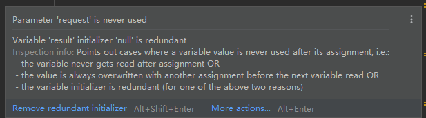
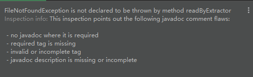

[TOC]

##### @Autowired警告：Field injection is not recommended

spring 已经不建议使用字段注入的方式了，需要修改注入方式，参考文档：https://blog.csdn.net/a907691592/article/details/97103272

##### Variable  ‘x’  initializer ‘null’ is redundant

变量赋值null 是多余的

##### is not declared to be thrown

