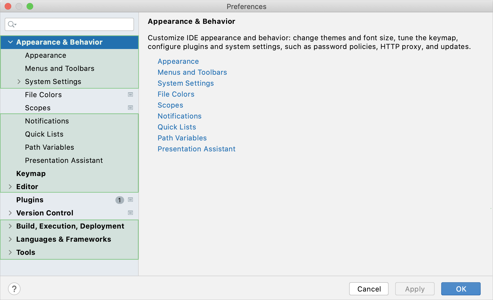
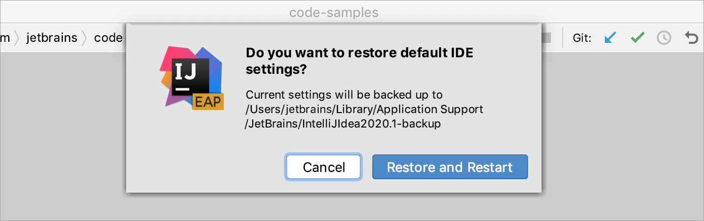

IntelliJ IDEA allows you to configure the settings on several levels: the [module](https://www.jetbrains.com/help/idea/configure-modules.html) level, the [project](https://www.jetbrains.com/help/idea/configure-project-settings.html) level, and globally.

Global settings apply to all projects of a specific installation, or version, of IntelliJ IDEA. Such settings include IDE appearance (themes, color schemes, menus and toolbars), notification settings, the set of the installed and enabled plugins, debugger settings, code completion, and so on.

To configure your IDE, select **IntelliJ IDEA | Preferences** for macOS or **File | Settings** for Windows and Linux. Alternatively, press Ctrl+Alt+S or click  on the toolbar.

Settings that are NOT marked with the  icon in the **Settings/Preferences** dialog are global and apply to all existing projects of the current IntelliJ IDEA version.

## Restore IDE settings

In IntelliJ IDEA 2020.1, the configuration paths [have been changed](https://blog.jetbrains.com/idea/2020/03/intellij-idea-2020-1-eap7/#auto_import_of_settings). That is why, the information in this section is valid for IntelliJ IDEA of version 2020.1 and later. If you use a previous version of IntelliJ IDEA, add the version number to the page URL in order to access the corresponding documentation. For example, if you use IntelliJ IDEA 2019.3, type `www.jetbrains.com/help/idea/2019.3/configuring-project-and-ide-settings.html`.

IDEA 2020.1,配置路径已经修改，这就是为什么本节内容只适用于2020.1及更高版本。如果你使用的比2020.1早，则需要修改以下url的版本号，然后访问。

When you restore the default IDE settings, IntelliJ IDEA backs up your configuration to a directory. You can always restore your settings from this backup.

恢复默认IDE设置时，IntelliJ IDEA会将当前配置备份到一个目录。您始终可以从此备份还原设置。

### Back up your settings and restore the defaults

1. From the main menu, select **File | Manage IDE Settings | Restore Default Settings**.

   Alternatively, press Shift twice and type `Restore default settings`.

   IntelliJ IDEA shows a confirmation popup:

   

2. Click **Restore and Restart**. The IDE will be restarted with the default configuration.

When IntelliJ IDEA restores the default IDE settings, it creates a backup directory with your configuration in:

Syntax

**%APPDATA%\JetBrains\<product><version>-backup**

### Apply the IDE settings from a backup

1. From the main menu, select **File | Manage IDE Settings | Import Settings**.

2. In the dialog that opens, specify the [path](https://www.jetbrains.com/help/idea/configuring-project-and-ide-settings.html#backup-dir) to the backup directory and click **Open**.

   IntelliJ IDEA shows a confirmation popup. Note, that after you apply the settings from the backup, *these settings will be overwritten* with your current IDE configuration.

   Apart from the backup configuration directory, you can select the configuration directory from another IntelliJ IDEA version or a **.zip** file with the previously [exported settings](https://www.jetbrains.com/help/idea/sharing-your-ide-settings.html#import-export-settings).

3. Click **Restart** to apply the settings from the backup and restart the IDE.