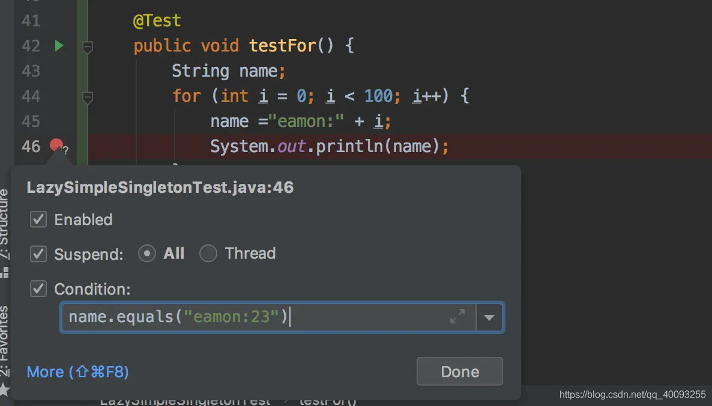
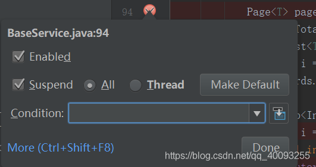
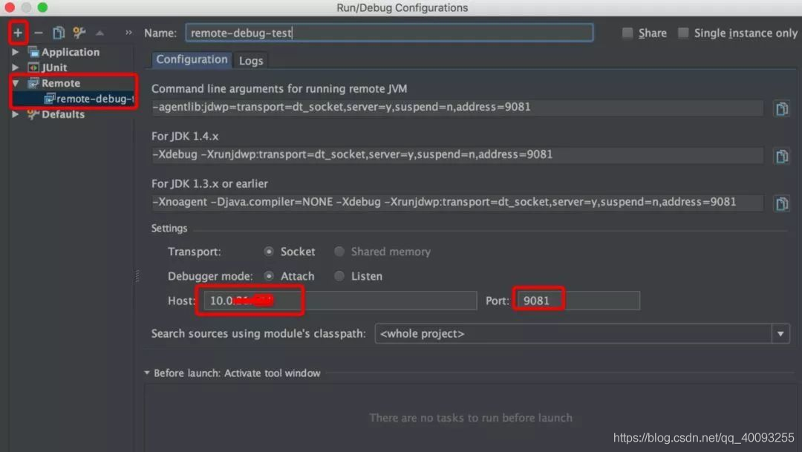

# 条件断点

一般循环体中比较有用

右键断点，在condition中写条件即可：



# 多线程调试

右键断点，suspend的类型选择thread：



**注意:千万要注意,如果想进入Thread Debug，就必须所有的断点都是Thread 类型的，否则还是进不去**

# 远程调试

远程服务器上的程序启动时，需要增加“允许远程调试”的参数：

```
java -server -Xms512m -Xmx512m -Xdebug -Xnoagent -Djava.compiler=NONE
-Xrunjdwp:transport=dt_socket,server=y,suspend=n,address=9081 -Djava.ext.dirs=. ${main_class}

```


本机的idea连接远端：




https://blog.csdn.net/qq_40093255/article/details/115177712