## Attribute: Stroke Path

As you move your finger or Apple Pencil across the screen, Procreate creates a stroke by plotting many points along a path.

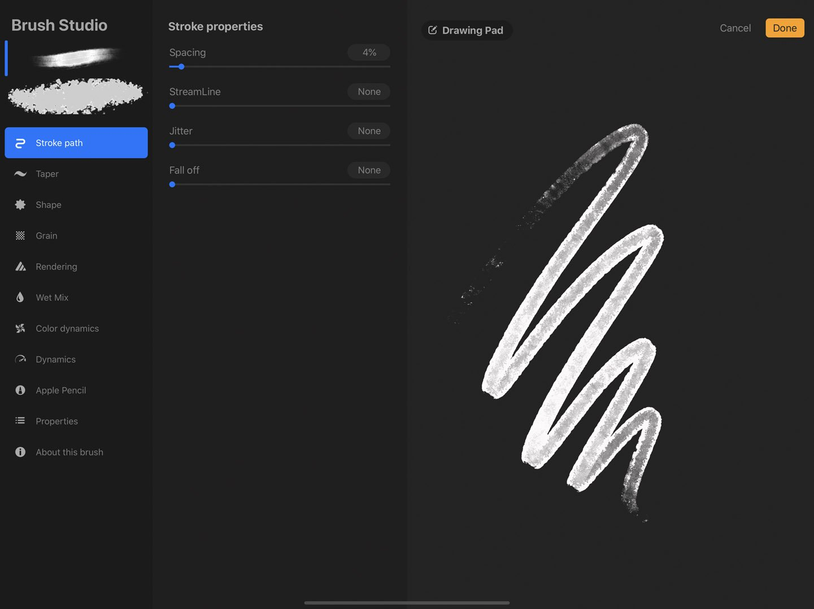

### Stroke Properties

**Adjust the behavior of your stroke by changing spacing, smoothing, jitter, and how quickly the stroke fades away.**

**Spacing** 
Sets how many times your brush shape ‘stamps’ itself along the path. When you add a lot of space, you will begin to see the brush as a series of shapes along the path with gaps between them. If you reduce down to no space, the brush shapes along the path will merge into one single fluid stroke.

**StreamLine** 
Automatically smooths out any wobbles or shakes in your line. StreamLine is particularly important for inking and calligraphy. Turn it up for a smooth and even result, and turn it down or off for more messy and natural linework.

**Jitter** 
Takes each ‘stamp’ of your brush shape along the path and offsets it by a random amount. Turn it off to keep all stamps perfectly lined up for a smooth stroke. Turn it up a little to roughen the edge of your brush. Turn it up a lot to scatter your shapes all over the place around your central path.

**Fall Off** 
Start your stroke at full opacity and then fade it away as it goes on. Turn it off for zero fade, and turn it right up to rapidly fade a stroke to invisibility.

## Attribute: Taper

Adjust how your brush changes thickness and opacity at the beginnings and ends of your strokes for a natural, tapered appearance.

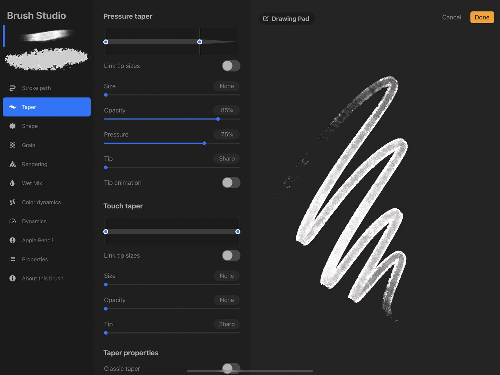

### Pressure Taper

**Extend the taper at the beginning and end of brush strokes drawn with the Apple Pencil.**

Strokes made with the Apple Pencil generally use pressure to taper strokes naturally, just like pencils and paintbrushes. But because the Apple Pencil is so sensitive, it can be tricky to achieve a nice long taper when lifting the Pencil off the canvas at the end of a stroke.

Using *Pressure Taper*, you can artificially lengthen the existing tapers at the beginning and/or end of your strokes for a more elegant line.

**Pressure Taper Slider**
A visual representation of how much artificial taper is at the beginning and end of your stroke. Pull the sliders towards the middle of the stroke to adjust taper length. You can set taper at the beginning of the stroke, the end of the stroke, or both.

**Link Tip Sizes** 
When this is switched on, adjusting one side of the Pressure Taper slider will automatically adjust the other side to match.

**Size** 
Set how severely your taper transitions from thick to thin.

**Opacity** 
Fade your taper to transparency at the ends.

**Pressure** 
Use the pressure feedback from the Apple Pencil for a more responsive natural taper that thins out faster at the ends of the line.

**Tip** 
On low settings, this makes your stroke taper behave as though you are using a brush with an extremely fine tip. On high settings, your taper responds as though drawn with a brush that has a chunky, thick tip.

**Tip Animation** 
When Procreate applies the extra taper to your stroke, you can toggle this switch on to see the effect being applied, or toggle it off to hide the animation depending on your preference.

### Touch Taper

**Add taper to the beginning and end of brush strokes drawn with a finger.**

When you paint with your finger in Procreate, pressure settings in brushes cannot be used, so it’s impossible to achieve taper using pressure.

However, you can artificially add tapers to the beginning and end of your strokes using *Touch Taper*.

**Touch Taper Slider** 
A visual representation of how much artificial taper is at the beginning and end of your stroke. Pull the sliders towards the middle of the stroke to adjust taper length. You can set taper at the beginning of the stroke, the end of the stroke, or both.

**Link Tip Sizes** 
When this is switched on, adjusting one side of the Touch Taper slider will automatically adjust the other side to match.

**Size** 
Set how severely your taper transitions from thick to thin.

**Opacity** 
Fade your taper to transparency at the ends.

**Tip** 
On low settings, this makes your stroke taper behave as though you are using a brush with an extremely fine tip. On high settings, your taped responds as though drawn with a brush that has a chunky, thick tip.

### Taper Properties

**Set the Taper function back to the type used in older versions of Procreate.**

**Classic Taper** 
The way Procreate renders a taper has been updated since older versions. This toggle returns the taper behavior and appearance to the older version.

## Attribute: Shape

Change the shape of the tip of your brush by importing an image into Shape Source, and adjust the scatter, rotation, frequency, width, and other properties of the shape.

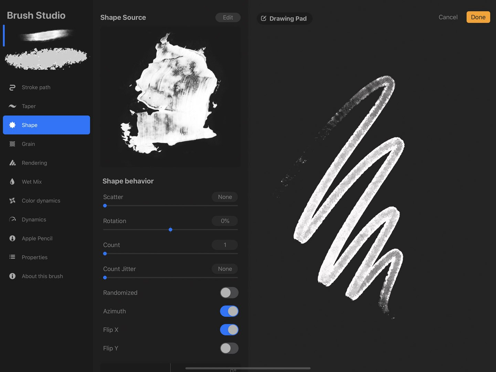

Procreate brushes are formed of a *shape* (container) that holds a *grain* (texture).

You can see the shape of any brush clearly when you tap your finger or Apple Pencil on the canvas, using the brush as a stamp instead of making a stroke.

When this shape is dragged, it creates a stroke. A smooth circular shape will create a smooth even stroke, whereas an irregular patchy shape will create a rougher stroke that changes thickness and texture as the shape is dragged in different directions.

Adjust the shapes in existing Procreate brushes, or load your own shapes from images using the *Shape Source* tool to create completely unique brushes.

### Shape Source

**With this powerful tool you can import your own images to use as the basis of brush shapes.**

Tap the icon preview in *Shape Source* to open the *Shape Editor*.

**Shape Editor** 
Tap *Import* to import a new shape from a photo or file, paste in a copied image, or access Procreate’s *Source Library* to draw from a range of pre-made default shapes.

**Source Library**
Accessed from the *Shape Editor*, the *Source Library* offers you over 150 unique shapes to use as the basis of your brushes. Scroll through the collection to browse the shapes, or use the *Search* box to search the shape names for particular types of shape. For example, searching "Gouache" will find all the shapes based on gouache paint marks.

Once you’ve imported or chosen a shape, tap *Done* to close the *Shape Editor* and begin adjusting the behavior of your shape.

### Shape Behavior

**Change the behavior of individual ‘stamps’ of the brush shape within your stroke.**

A stroke is formed by ‘stamping’ the brush shape over and over again along a path, but there are many different ways the same shape can be stamped. It can be rotated, randomised, stamped more than once at each point, or taught to follow the movement of the Apple Pencil as it turns corners.

 **Pro Tip**

To see these settings in action, it can be useful to go into *Stroke Path* and push the *Spacing*slider up so you can see the shapes as individual stamps rather than blurred together into a stroke. This will help you visualise what each setting can do, even after you’ve set the spacing back to normal.

**Scatter** 
By default, your shape will ‘stamp’ in the same direction without rotating. Use *Scatter* to randomise how it is rotated each time it is stamped. *Scatter* is not affected by stroke direction.

**Rotation** 
Adjust the rotation of your shape in relation to the direction of your stroke. When set in the middle, your shape direction will remain static no matter which way your stroke travels. Set to 100% (the right hand side of the slider), your shape will rotate to follow the rotation of your stroke. Set to -100% (the left hand side of the slider), your stroke will rotate inversely to the direction of your stroke.

**Count** 
Set the shape to stamp more than once at each point, creating up to 16 stamps each time. You can see the effect of this most easily in combination with Scatter, as each of the multiple stamps on a given point will be randomly rotated in a different direction.

**Count Jitter** 
Vary the number of times the stamp applies at a point. If you have your *Count Jitter* set to 5, you will randomly get between 1 to 5 instances of the stamp at each point.

**Randomized** 
Randomise the rotation of your shape when your stroke begins. This has the effect of making each stroke different from the one before it, creating a more organic feel.

**Azimuth** 
Detect the radius of the Apple Pencil’s tilt as it travels through the stroke to determine which way the shape stamps should tilt. This creates an effect like a calligraphy pen. *Azimuth* overrides *Rotation*, but only for strokes drawn with the Apple Pencil.

**Flip X / Flip Y**
Flip your shape horizontally or vertically to create different and more organic effects.

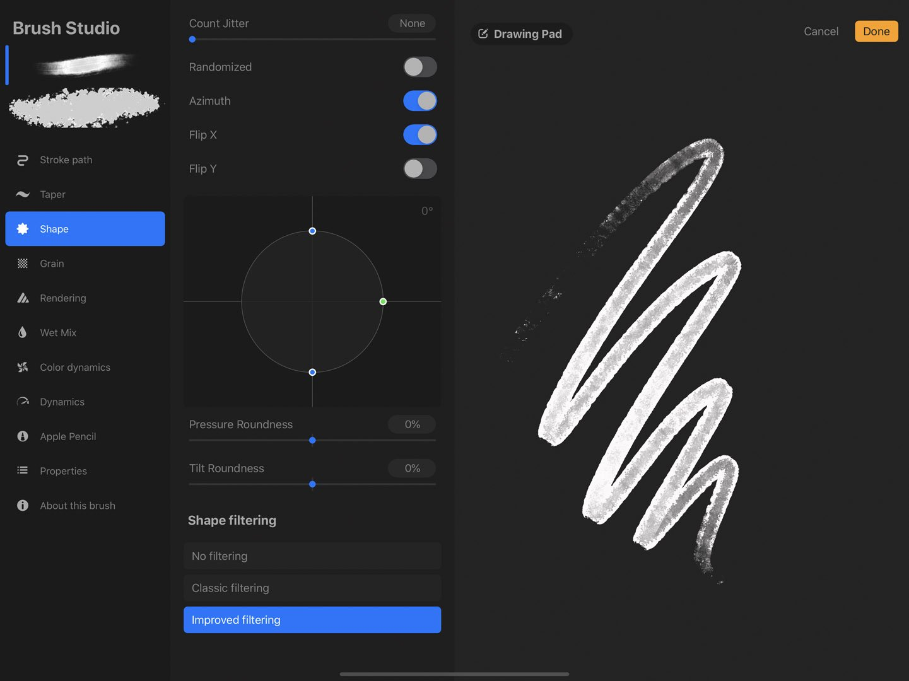

**Brush Roundness Graph**
Change the base rotation of your shape by dragging the green node around the edge of the circle. Drag the blue nodes to squash your shape.

**Pressure Roundness**
Squash your shape based on how much pressure you apply with the Apple Pencil.

**Tilt Roundness**
Squash your shape based on how much tilt you apply with the Apple Pencil.

#### Shape Filtering 

**Shape filtering adjusts ‘antialiasing’ - how the shape edges are handled by the graphics engine.**

**No Filtering** 
Does not soften the edges, and may result in a jagged look, but preserves every detail of the core brush shape.

**Classic Filtering** 
Softens the edges of your shape using the settings from earlier versions of Procreate.

**Improved Filtering** 
Subtly improved and updated antialiasing used in more recent versions of Procreate.

## Attribute: Grain

Create a new grain from any image with the powerful Grain Editor, adjust whether the grain stays still behind your stroke or moves along with it, and tweak scale, depth, blend mode and more.

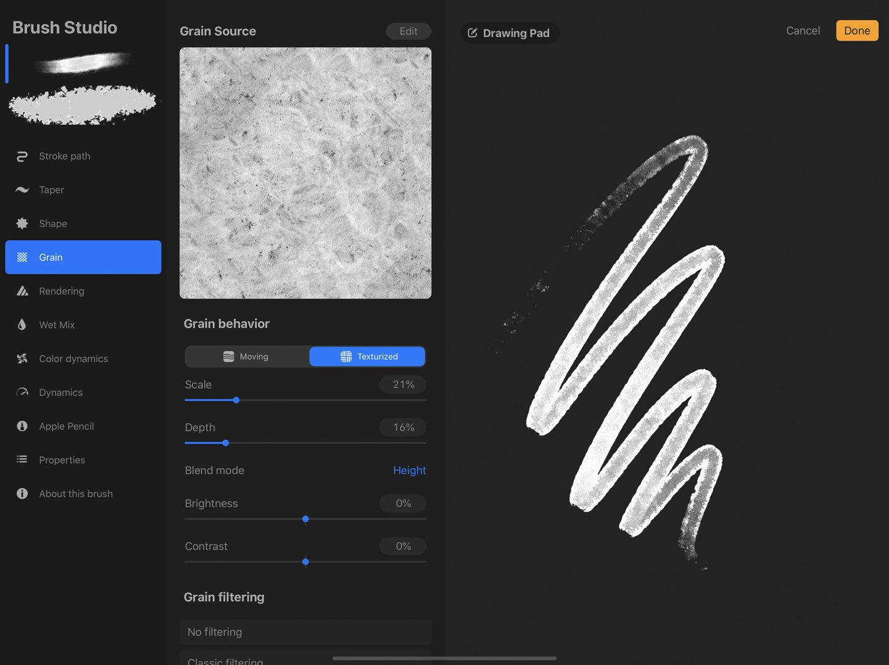

*Grain* is the texture that sits inside your brush *shape*. While the shape acts as a container for the grain, the grain acts like a paint roller. When you paint a stroke, the grain is ‘rolled’ inside the shape and onto the canvas.

### Grain Source

**Import your choice of images to use as textures for the grain of your brushes.**

Tap the icon preview in *Grain Source* to open the *Grain Editor* and access the*Source Library,* giving you the freedom to import and edit images and easily turn them into tiling textures for your brushes. See below for more information.

### Grain Behavior

**Change the behavior of the grain inside your brush shape.**

**Moving**
Set your grain to move with the stroke for a more streaky and blurred effect. Using the metaphor of grain being a paint roller, when you set it to *Moving*, the roller stops rolling, and starts dragging the texture rather than laying it down.

**Texturized** 
Set your grain to stay as a static texture ‘behind’ your brush stroke for a crisp and clear effect. Using the metaphor of grain being a paint roller, when you set it to *Texturized*, the roller is rolling properly, leaving behind an ongoing ‘stamp’ of itself with no dragging or smearing.

**Movement** 
Set the slider low for a more dragged, smeared effect, and high for a rolling effect similar to the *Texturized* setting.

**Scale** 
Adjust the size of the grain texture inside the shape.

**Zoom** 
Set to *Cropped* (left side) to keep the texture size fixed no matter how large or small you make your brush while painting. Set to *Follow Size* (right side) and the grain will scale along with your brush size. This setting is only available when grain is set to *Moving*.

**Rotation** 
This will smear the grain image based on directional stroke changes, creating a similar effect to *Moving*. 100% inverse makes the grain rotate the opposite way to the stroke direction. At 0% it locks the grain rotation in place. And *Follow Stroke* makes the grain rotate to follow your stroke direction. This setting is only available when grain is set to *Moving*.

**Depth** 
Adjust how strongly the texture establishes itself over the base color of the brush. Set at minimum, the texture won’t show at all. Set at maximum, the texture will be dark and vivid. When the grain is set to *Moving*, the pressure of a stroke affects how strongly the contrast shows.

**Depth Minimum** 
Set a minimum level of contrast in the texture, beyond which the brush can’t go regardless of how much or little pressure is applied. This setting is only available when grain is set to *Moving*.

**Depth Jitter** 
Randomly swing between the texture and the underlying color of your stroke. This setting is only available when grain is set to *Moving*.

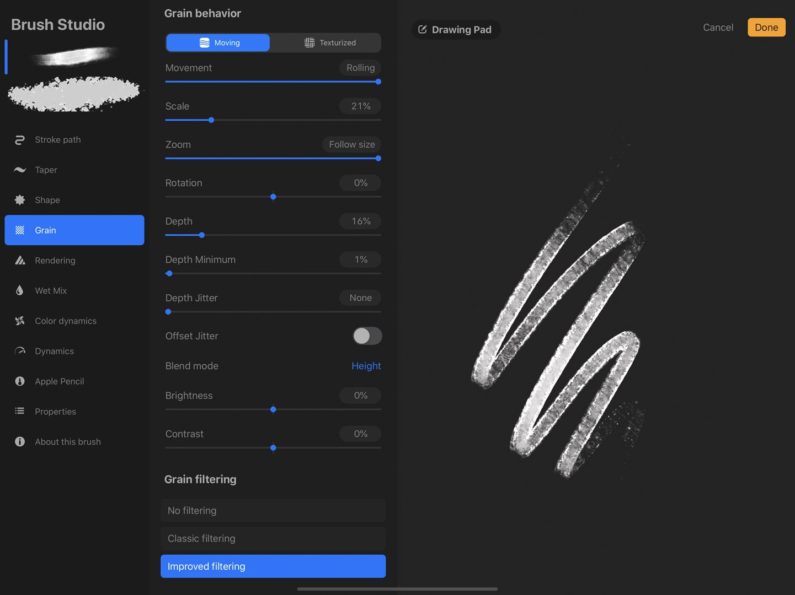

**Offset Jitter** 
Offset where your texture is placed down each time you make a new brushstroke to create a more organic effect. With brushes designed to lay down a pattern, like the *Grid* brush, *Offset Jitter* should be left switched off to keep the pattern consistent. This setting is only available when grain is set to *Moving*.

**Blend Mode** 
Control how the grain texture blends with the underlying color of the brush using *Blend Mode*. This works both on *Moving* and *Texturized* brushes.

**Brightness / Contrast** 
Make the grain lighter or darker, and increase or decrease the difference between the light and dark areas.

#### Grain Filtering 

**Grain filtering adjusts ‘antialiasing’ - how the grain edges are handled by the graphics engine.**

**No Filtering** 
Does not soften the edges, and may result in a jagged look, but preserves every detail of the grain.

**Classic Filtering** 
Softens the edges of your grain using the settings from earlier versions of Procreate.

**Improved Filtering** 
Subtly improved and updated antialiasing used in more recent versions of Procreate.

### Grain Editor 

**Import new textures from photos or files, paste in copied images, or access Procreate’s \*Source Library\* to draw from a range of pre-made default textures.** 

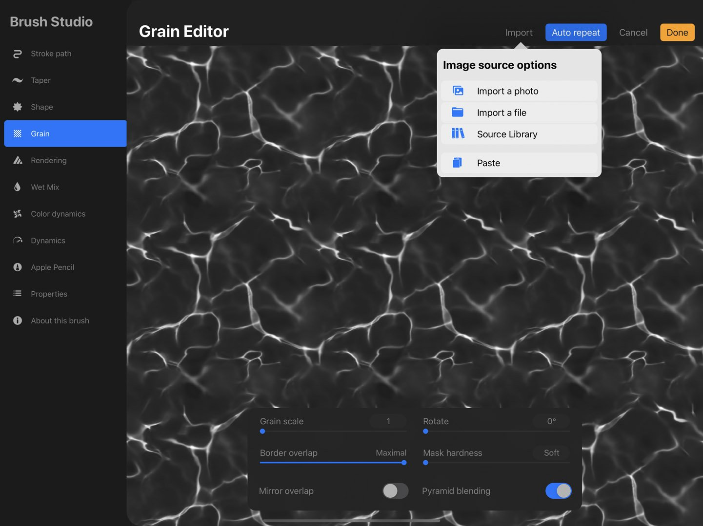

 **Pro Tip**

Create unique new brushes by using your iPad to photograph real textures from your environment. Stone, wood, cloth, and marks made with real ink and paint all make interesting and varied bases for custom brushes.

### Import 

**The \*Import\* menu offers four ways to import images to use as the basis for new brush textures.**

**Import a Photo
**Select a photo from the iOS *Photos* app, including photos you've taken yourself.

**Import a File
**Select a photo from the iOS *Files* app.

**Source Library
**Select from Procreate's inbuilt range of pre-made textures. See below for more detail on the *Source Library*.

**Paste
**Paste a copied image from your clipboard.

### Auto Repeat 

**Instantly turn a snapshot of a texture into a seamless tile using \*Auto Repeat.\***

**Grain Scale
**Adjust the size of the texture within each tile.

**Rotate
**Adjust the angle of the texture within each tile.

**Border Overlap
**Change how extensively the borders between tiles overlap.

**Mask Hardness
**Adjust the amount of blurring used to blend the tiles together.

**Mirror Overlap
**Flip the pattern at the edge of each tile so it lines up with the surrounding tiles to help conceal tile edges.

**Pyramid Blending
**This new form of blending stitches together complex patterns with differing levels of detail to help create a seamless grain.

*Auto Repeat* previews all changes live.[/sub]

 **Pro Tip**

Pyramid blending is ideal for irregular natural textures like wood and stone, but the simpler edge blending modes above are best for more high-contrast regular patterns.

### Return to Brush Studio

**Cancel
**To exit without applying any changes, tap *Cancel*.

**Done
**Tap *Done* to close the *Grain Editor* and begin adjusting the behavior of the grain you created.

 **Pro Tip**

Two-finger tap on your texture to invert the grayscale tones in your image. Dark areas will become light, and light areas will become dark. Two-finger tap again to reverse the effect.

### Source Library 

**Accessed from the \*Grain Editor\*, the \*Source Library\* offers you over 100 unique textures to use as the basis of your brushes.** 

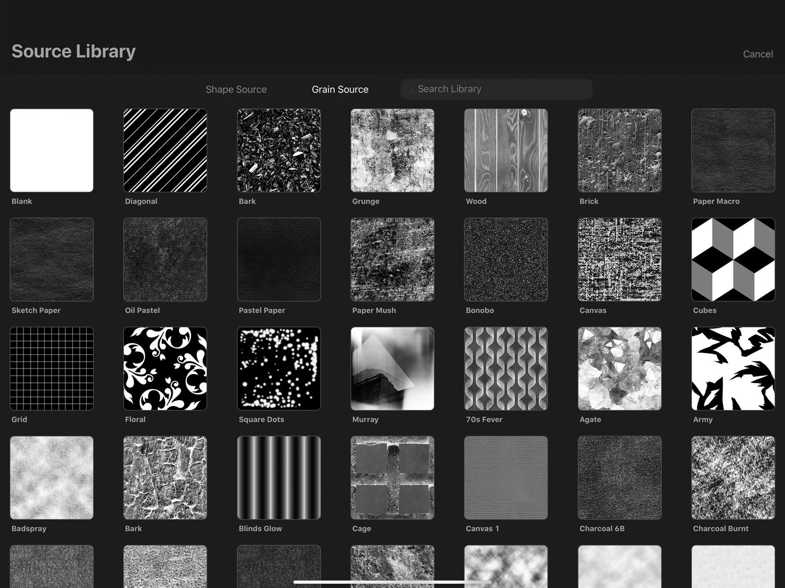

From the *Grain* section of the *Brush Studio*, tap *Grain Source > Import > Source Library.* Tap a texture to exit back to the *Grain Editor* and being making adjustments.

**Shape Source
**The *Shape Source* library is chiefly used to adjust brush shape in the Shape section above, but you can also use the shapes offered as the basis for new textures. However, the *Grain Source* library features textures specifically designed for the purpose.

**Grain Source
**Procreate's inbuilt library of premade textures opens by default when you enter the *Source Library* from the *Grain Source* interface. This searchable collection offers over 100 carefully compiled and edited textures ideal for brush creation.

**Search Library
**Search the grain names for particular types of texture. For example, searching "Paper" will find all the textures based on paper. 

**Cancel
**To exit without selecting a texture, tap *Cancel*.

## Attribute: Rendering

Procreate offers a number of ways to render the brush to the screen. Go under the hood to adjust render modes, and change the way strokes and colors behave on your brush and when interacting on the canvas.

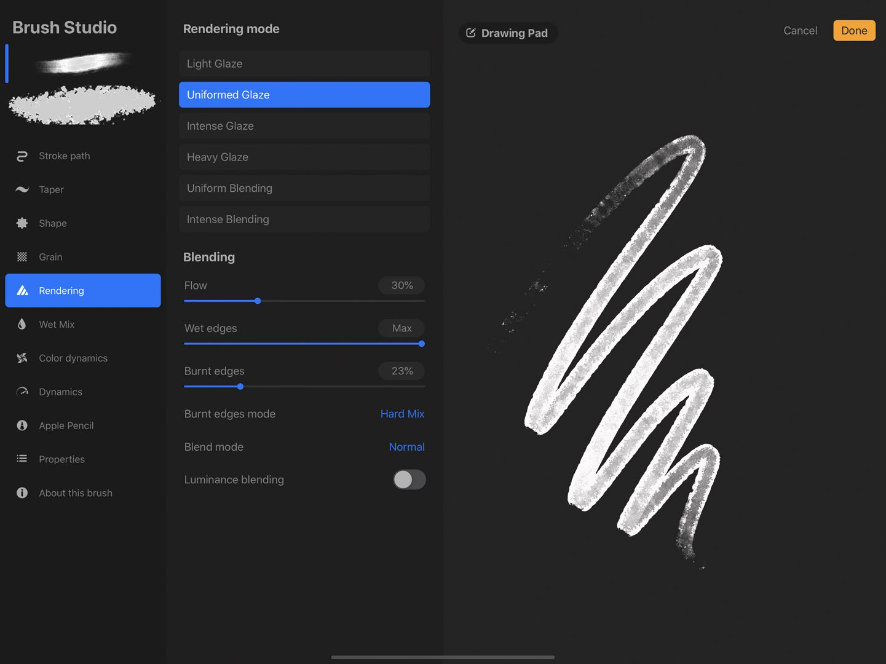

### Rendering Mode

**Procreate gives you full control over how the underlying software renders your brush strokes, and how brushstrokes interact with each other.**

These effects can be understood by imagining physical paint on canvas: on the light-rendering end of the spectrum, *Light Glaze* is like laying down diluted paints, and on the heavy-rendering end, *Intense Blending* is more like laying thick paint onto the canvas.

**Light Glaze**
This is Procreate’s standard blending mode.

**Uniformed Glaze**
This rendering mode is similar to the rendering used in Adobe® Photoshop®.

**Intense Glaze** 
This mode bashes colors onto the screen with a heavier touch.

**Heavy Glaze** 
An extremely strong blending mode.

**Uniform Blending** 
Combines the Photoshop style of rendering with a caustic approach to rendering color. Exaggerates the *Wet Mix* effect.

**Intense Blending**
The heaviest mode offered, *Intense Blending* is great for wet brushes that smash and mix colors together. Exaggerates the *Wet Mix* effect.

### Blending

**Select from a variety of options to adjust the way your strokes interact, how pigment dilutes and how colors mix into each other.** Adjust the flow of your brush, and create the effect of wet edges, burnt edges and more.

**Flow** 
Adjust how heavily color and texture flows from your brush onto the canvas.

**Wet Edges** 
Soften and blur the edges of your brushstrokes to mimic pigment bleeding into paper.

**Burnt Edges** 
When you layer brushstrokes, this creates a ‘color burn’ effect around the edges of the stroke, darkening edges where colors overlap.

**Burnt Edges Mode** 
Set the *Blend Mode* for the above effect. This enables you to create a variety of interesting layering effects that apply only to the edges of your brush.

**Blend Mode** 
Set the *Blend Mode* for the entire brushstroke, not just the edges.

**Luminance Blending** 
Blend modes typically affect the color values of a brushstroke. Flip this toggle to blend the lightness values instead.

## Attribute: Wet Mix

Tweak how your brush interacts with color and how the color you lay down interacts with the canvas.

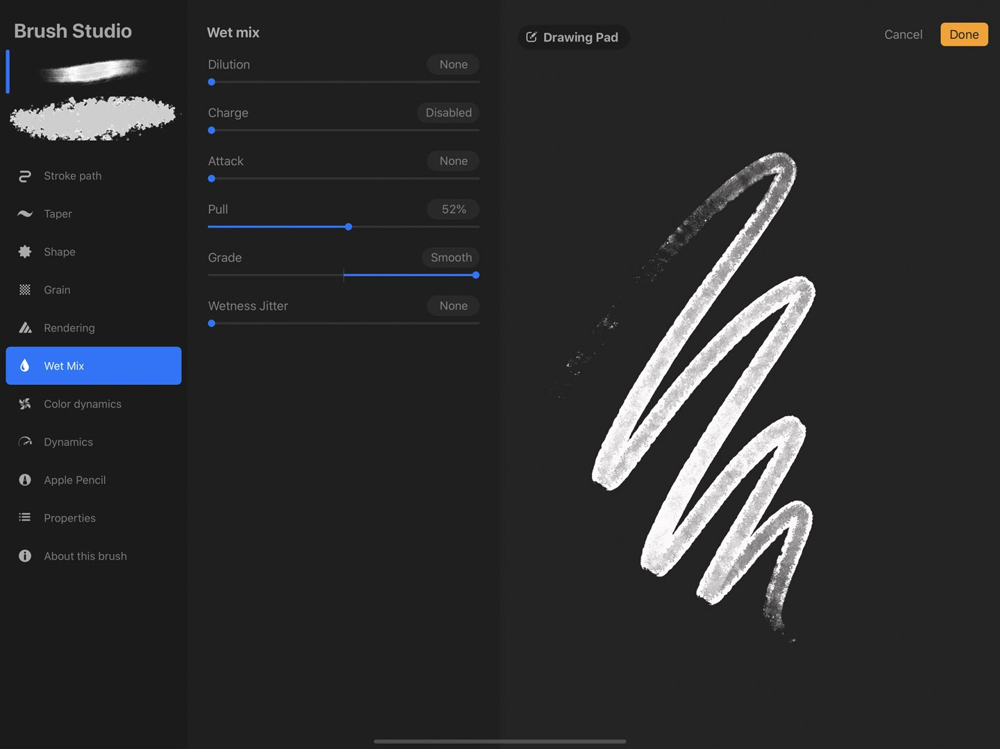

**Dilute the pigment on your brush, start out with a lot of paint on the brush or only a little, and make your pigment bleed into other colors or pull them around.**

Fine adjustments to the interplay of *Dilution*, *Attack*, and *Charge* can be layered on top of other settings to create brushes with highly realistic behaviours.

**Dilution** 
Set how much water is mixed in with the paint on your brush. Increase *Dilution* to give your paint a transparent effect. 

**Charge** 
Set how much paint is applied onto your brush when you begin to make a stroke. Like a real paintbrush, the longer you drag your stroke out, the more paint it will leave behind on the canvas. As the brush runs out of paint, the trail of color it leaves will become less intense. Recharge the brush by ending a stroke and lifting it from the canvas. When you put it down again, it will be as though you dipped it back into the color on your paint palette. This effect is most obvious in combination with high *Dilution*.

**Attack** 
Adjust the amount of paint that sticks to the canvas. Set it high for the appearance of thick, bold paint applied evenly along your whole stroke.

**Pull** 
Set how strongly your brush pulls paint around the canvas, including paint that has already been laid down. This is a great way to organically mix and drag colors around.

**Grade** 
Set the chunkiness and contrast of your brush texture.

**Wetness Jitter**
Randomly vary how much water mixes in with the paint at any point during the brushstroke, for a more realistic effect.

## Attribute: Color Dynamics

Unlock the full power of digital art by setting your brush to change color, saturation, brightness and more based on the pressure and tilt you apply to your Apple Pencil.

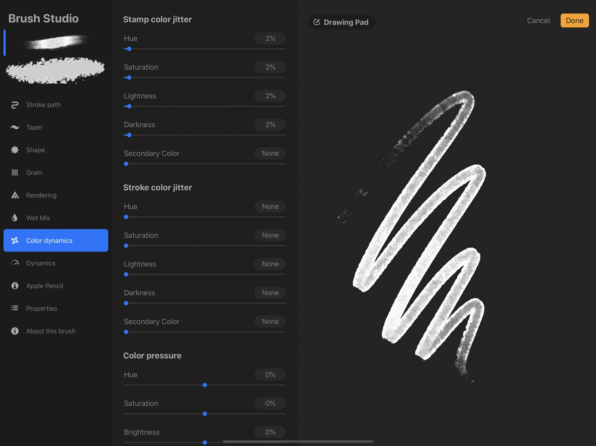

*Color Dynamics* give your brush the ability to shift through different values of hue, saturation, lightness and darkness. You can also choose a secondary color, and shift between your primary and secondary color with each stroke. You can use all these settings individually or in combination, and control them in a variety of ways.

### Stamp Color Jitter

**Each individual shape stamp within your brushstroke is randomly affected by changes you make to the \*Stamp Color Jitter\*.**

**Hue** 
Each stamp will randomly deviate from your chosen brush color. Set the slider low to make these deviations minor (for instance, a red brush that jitters into yellow and pink), or set the slider high to allow the brush to jitter through the entire spectrum of color. The best way to preview what this setting does is to set the *Stroke Path > Spacing* slider so you can see individual stamps in your stroke, and ensure that the *Saturation* slider below *Hue* is also set high.

**Saturation** 
Each stamp will randomly deviate from your chosen brush saturation. Set the slider low to make these deviations minor (for exmaple, jitter through slightly different shades of pink), or set the slider high to allow the brush to jitter between zero and full saturation (for example, between white and bright red).

**Lightness** 
Each stamp will randomly deviate from your chosen brush lightness by randomly jumping to lighter shades.

**Darkness** 
As above, but the opposite: each stamp will randomly deviate from your chosen brush lightness by jumping to darker shades.

**Secondary Color** 
Each stamp in your stroke will randomly jitter between your currently chosen (Primary) color, and a Secondary color you can set in the [Color Panel](https://procreate.art/colors/colors-interface).

### Stroke Color Jitter

**Each time you make a stroke, these jitters will change a color attribute of the entire stroke.**

**Hue** 
Each individual brushstroke will randomly deviate from your chosen color. Set the slider low for minor deviations, or set it all the way up to jitter through the entire color spectrum.

**Saturation** 
Each individual brushstroke will randomly deviate from your chosen color’s saturation. Set the slider low for minor deviations, or set it all the way up to jitter from completely desaturated (white, black, or grey) to complete saturation (extremely bright colors).

**Lightness** 
Each individual brushstroke will randomly deviate from your chosen color’s lightness by getting lighter to some degree. Set it low to allow only minor jumps in lightness, or high to allow it to go to pure white.

**Darkness** 
Each individual brushstroke will randomly deviate from your chosen color’s darkness by getting darker to some degree. Set it low to allow only minor jumps in darkness, or high to allow it to go to pure black.

**Secondary Color** 
Each individual brushstroke will randomly be a shade of color that falls anywhere between your chosen Primary and Secondary colors.

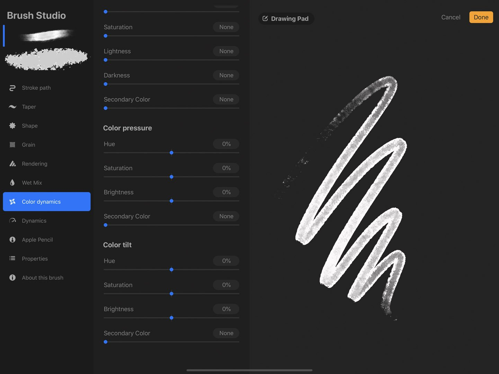

### Color Pressure 

**The pressure applied with your Apple Pencil determines what color you will apply to the canvas.**

**Hue** 
Pressure changes the color within a stroke. If you set this at 100%, you can create a stroke that transitions through the entire spectrum when you go from light to heavy pressure.

**Saturation** 
Pressure changes the saturation within a stroke. If you set this at 100%, you can create a stroke that transitions from white to a fully saturated color when you go from light to heavy pressure.

**Brightness** 
Pressure changes the brightness within a stroke. If you set this at 100%, you can create a stroke that transitions from white to black when you go from light to heavy pressure.

**Secondary Color** 
Pressure transitions from the Primary to the Secondary color within a stroke.

### Color Tilt 

**The tilt applied with your Apple Pencil determines what color you will apply to the canvas.** 

**Hue** 
The tilt of your Apple Pencil changes the color within a stroke.

**Saturation** 
The tilt of your Apple Pencil changes how vivid your chosen color appears within a stroke.

**Lightness** 
The tilt of your Apple Pencil changes how light or dark your chosen color appears within a stroke.

**Secondary Color** 
Tilt transitions from the Primary to the Secondary color within a stroke.

## Attribute: Dynamics

Set your brush to make dynamic changes based on how fast you make strokes, and add a little unpredictability to your brush by setting you brush to jitter (randomly change) size and opacity.

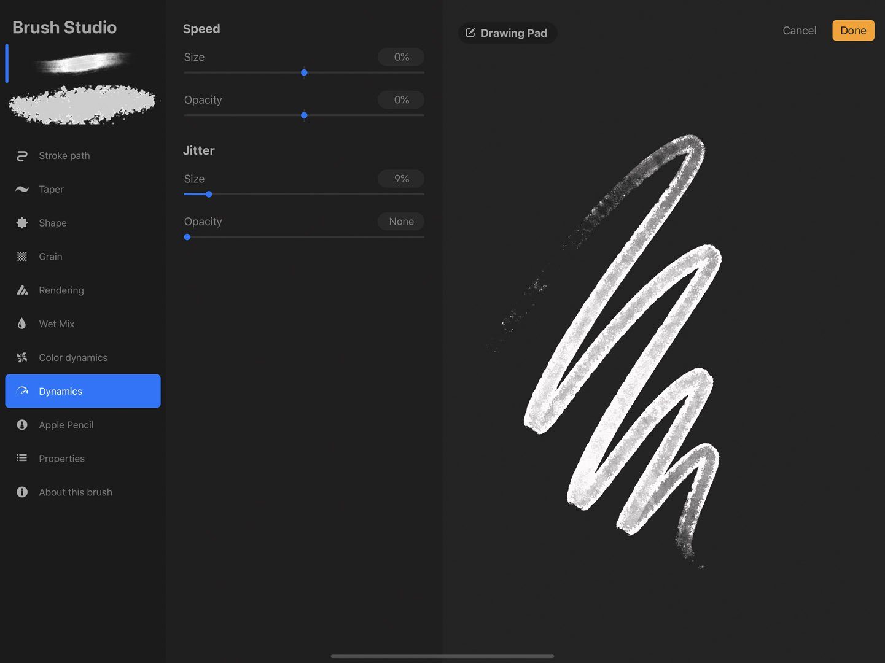

Because these settings are not dependent on the pressure and tilt of the Apple Pencil, they can be useful to create more dynamic brushstrokes for those painting with a finger.

### Speed

**Use the speed of your stroke to determine its appearance.** 

**Size** 
Use the speed of your stroke to change its size. Draw slowly for a thin stroke and faster for a thicker stroke, or vice versa.

**Opacity** 
Use the speed of your stroke to change its opacity. Draw slowly for a transparent stroke and faster for a more solid stroke, or vice versa.

### Jitter

**Dynamically alter the appearance of the shape stamp throughout your stroke.**

This setting is random, and not affected by speed.

**Size** 
Randomly alter the size of the shape stamp throughout your stroke.

**Opacity** 
Randomly alter the opacity of the shape stamp throughout your stroke.

## Attribute: Apple Pencil

Make fine adjustments to how the Apple Pencil interacts with your brush. Set pressure or tilt to affect fundamental behaviors of your brush like size, opacity, flow, bleed, smoothing and more.

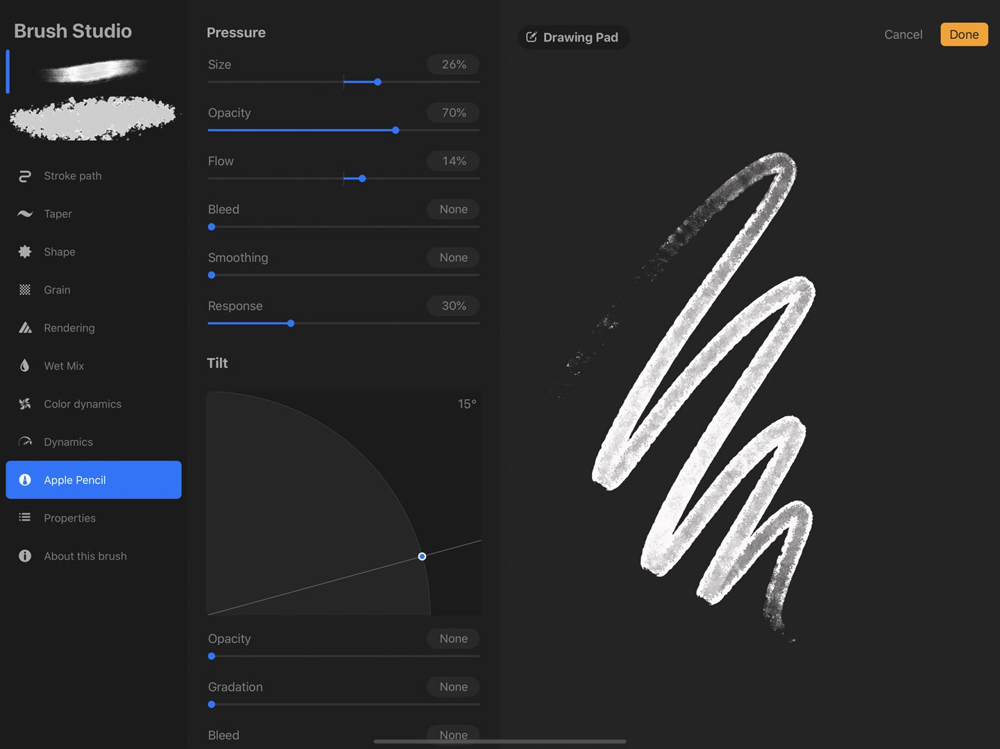

For more control over the way the Apple Pencil interacts with Procreate in general, see [*Actions > Preferences*](https://procreate.art/actions/actions-preferences).

### Pressure

**Tweak the way the Apple Pencil responds to pressure. These Apple Pencil pressure settings have a trickle-down effect on all other pressure-based adjustments.**

**Size** 
Adjust how large or small the tip of your brush becomes under varying pressure.

**Opacity** 
Adjust the transparent-to-opaque range of your brush under varying pressure.

**Flow** 
Adjust how much paint your brush lays down under varying pressure.

**Bleed** 
Adjust how heavily your brush bleeds into the canvas around the edges under varying pressure.

**Smoothing** 
Adjust how smoothly your brush transitions from low to high pressure. This is essentially StreamLine for pressure. Set the slider high and pressure transitions will be extremely smooth. Set the slider to nothing and the brush will express every bit of raw pressure data it receives from the Apple Pencil.

**Response** 
Adjust how fast your Apple Pencil responds to variations in pressure. Push this slider all the way up to get a smooth result perfect for fine ink work and calligraphy.

### Tilt

Tweak the way the Apple Pencil responds to being tilted. These Apple Pencil *Tilt*settings have a trickle-down effect on all other tilt-based adjustments.

You can tilt your Apple Pencil through a range of 90 degrees (Pencil held completely upright) to 0 degrees (Pencil laid flat against the canvas).

While the Tilt graph goes from 0 to 90 degrees, the tip of the Apple Pencil does not physically touch the canvas between 0 to 15 degrees, so settings tied to a number within this range will have no effect. Between 16 to 30 degrees, the response from the Apple Pencil may be inaccurate. Tilt settings are best triggered between 30 to 90 degrees: this range of tilt corresponds with how people realistically hold and use pencils.

Use the *Tilt Graph* to set a tilt ‘trigger point’ - a degree of tilt at which an attribute of your brush suddenly changes to something else. If you set the *Tilt Graph* to 45 degrees, all other tilt-based features will be triggered only once your brush is on a 45 degree angle.

 **Pro Tip**

Using the *Tilt Graph*, you could create a brush that behaves like a graphite pencil, offering a sharp point when you draw with it upright, but switching to a broader, smoother surface for shading when you tilt it on an angle.

**Tilt Graph** 
The *Tilt Graph* is a visual representation of how tilted your Pencil needs to be before other *Tilt* settings take effect. Pull the blue node to adjust the degree of tilt.

**Opacity** 
Adjust the way the tilt of your Apple Pencil affects the overall opacity of your stroke.

**Gradation** 
Turn this slider up to create a softening effect when shading with a brush on an angle, mimicking the behaviour of physical pencils.

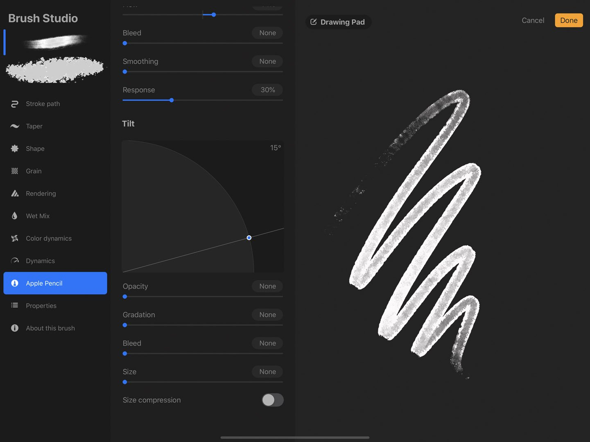

**Bleed** 
Adjust how much the brush bleeds around the edges when tilted, creating a reduction in fine detail.

**Size** 
Adjust the effect of tilt on brushstroke thickness.

**Size Compression** 
Toggle on to prevent the texture within the brush growing along with the brush size.

## Attribute: Properties

Establish miscellaneous settings that establish how the brush looks in preview form in the Brush Library and how it behaves within the Procreate interface.

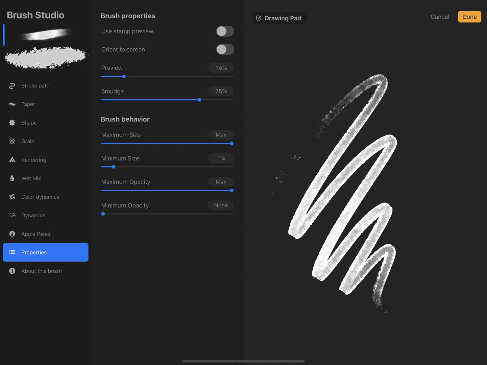

### Brush Properties

**Change the way your brush preview displays in the Library, how the brush orients to your screen rotation, and set a default Smudge strength.**

**Use Stamp Preview** 
The preview of each brush in the *Brush Library* is usually expressed as a stroke. Toggle this switch to express the preview as a shape stamp instead.

**Orient to Screen** 
When a brush has a distinct ‘up’ and ‘down’, this toggle sets whether it expresses itself the same way regardless of current screen rotation, or whether it rotates along with the interface.

**Preview** 
Set the size of the stroke or shape stamp in the preview of this brush appears in the Brush Library.

**Smudge**

Adjust how forcefully this brush smudges when set as the Smudge tool.

### Brush Behavior

Set size and opacity boundaries on your brush. These settings control the upper and lower limits of the size and opacity sliders in the Procreate [sidebar](https://procreate.art/interface-gestures/interface).

**Maximum / Minimum Size** 
Set an upper and/or lower size limit on the sidebar size slider.

**Maximum / Minimum Opacity** 
Set an upper and/or lower opacity limit on the sidebar opacity slider.