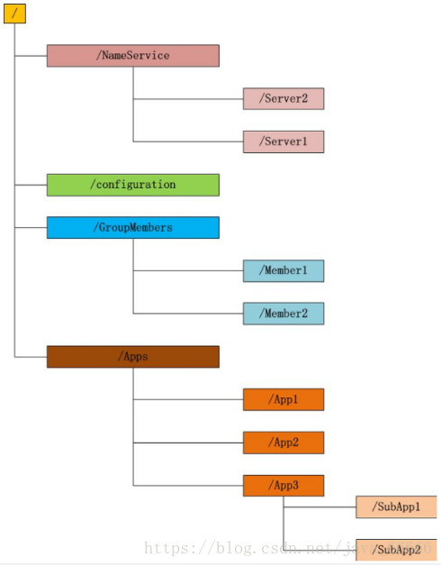
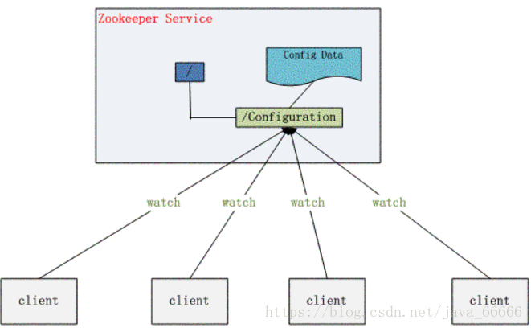

zookeeper=文件系统+监听通知机制。

# 文件系统

维护一个类似文件系统的目录结构

每个目录是一个znode（目录节点）

四种类型的znode

- persistent 持久化目录节点，断开后，节点存在
- persistent_sequential 持久化顺序编号目录节点
- ephemeral 临时目录节点，断开后，节点删除
- ephemeral_sequential 临时顺序编号目录节点

# 监听通知机制

客户端注册监听它关心的目录节点，当目录节点发生变化（数据改变、被删除、子目录节点增加删除）时，zookeeper会通知客户端。

# 能做什么

分布式应用配置管理

统一命名服务

状态同步服务

集群管理