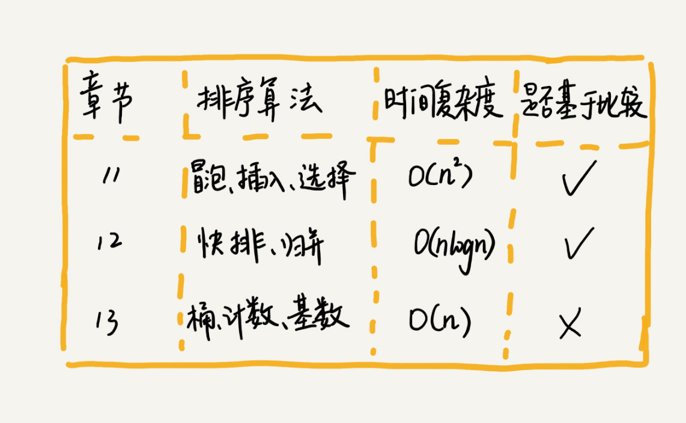

#### 常用8种

冒泡排序、插入排序、选择排序、归并排序、快速排序、计数排序、基数排序、桶排序

#### 如何评价分析一个排序算法

1. 执行效率
   - 最好、最坏、平均时间复杂度
   - 时间复杂度的系数、常数、低阶
   - 比较次数和移动次数
2. 内存消耗
   - 原地排序 - 空间复杂度是 O(1) 的排序算法
   - 非原地排序
3. 稳定性
   - 排序后，相等元素质检的原有顺序不变。

#### 冒泡排序 bubble sort

稳定排序

#### 插入排序 insertion sort

稳定排序

#### 选择排序 selection sort

不稳定排序，在交换的时候，会破坏原有的顺序。

#### 小结

#### 归并排序 merge sort

#### 快速排序 quick sort

#### 桶排序 bucket sort

#### 计数排序 counting sort

#### 基数排序 radix sort

#### 总结

