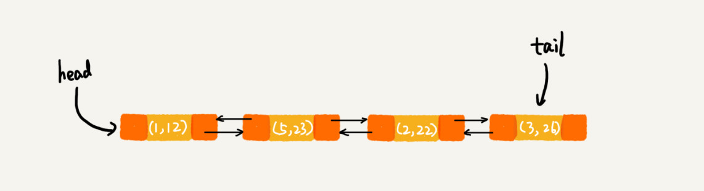

## 散列表 Hash Table

### 思想

数组的查找很快，应为只要给定下标，就可以通过下标一次命中数据。

散列表就是把不同的**key**通过**散列函数**计算成一个数值，这个数值就是数组下标，这样后续通过**key**查找时，就很快，因为后端是数组。

把key 转换成数据下标映射的方法叫**散列函数** （哈希函数），函数计算后的值叫**散列值** （哈希值）。

### 散列函数

散列函数基本要求

1.计算得到的散列值是一个非负整数

2.如果key1 = key2，那么hash(key1)  == hash(key2)

3.如果key1 != key2 ，那么hash(key1) != hash(key2)

但是，通过散列函数计算的散列值一般都会出现**散列冲突**，即key不一样但是散列值一样，MD5、SHA、CRC等算法都无法避免这种冲突。

散列函数的设计不能太复杂，过于复杂浪费时间；计算的散列值要尽可能随机并均匀分布，减少散列冲突。

散列表的**装载因子**=填入表中的元素个数/散列表的长度，装载因子越大，说明空闲位置越少，冲突越多，散列表的性能会下降。

### 扩容问题

当装载因子超过指定阀值后，两倍扩容散列表。

扩容时涉及数据迁移，一种是一次性迁移，一种是每次有新数据插入从旧表取部分数据迁移。

### 散列冲突

装载因子越大，冲突越大，解决散列冲突的两类方法：开放寻址法、链表法。

#### 开放寻址法

思想 - 如果出现散列冲突，从新探测一个空闲位置，将其插入。


x 经过 Hash 算法之后，被散列到位置下标为 7 的位置，但是这个位置已经有数据了，所以就产生了冲突。于是我们就顺序地往后一个一个找，看有没有空闲的位置，遍历到尾部都没有找到空闲的位置，于是我们再从表头开始找，直到找到空闲位置 2，于是将其插入到这个位置。


适用场景：当数据量比较小、装载因子小的时候，适合采用开放寻址法。


#### 链表法

思想 - 每个“桶（bucket）”或者“槽（slot）”会对应一条链表，所有散列值相同的元素我们都放到相同槽位对应的链表中。


word中拼写错误检查就是用的散列表实现的，把所有词写入散列表字典，然后去匹配，有的话就对，没的话就错误。**新的问题，如何做到建议改为正确的单词的呢？**

适用场景：因为链表有指针，所以如果存储的对象小，反而浪费空间，所以比较适合存储大对象、大数据量的散列表，而且，比起开放寻址法，它更加灵活，支持更多的优化策略，比如用红黑树或者跳表代替链表。


## HashMap实现

初始大小：16，如果知道数据大小，建立map时指定初始化，免去后面的扩容消耗。

最大装载因子默认是 0.7，超过括两倍。

散列冲突用的是链表，jdk1.8后，当链表长度大于8，转为红黑树，小于8再转为链表。

散列函数：

```java

int hash(Object key) {
    int h = key.hashCode()；
    return (h ^ (h >>> 16)) & (capicity -1); //capicity表示散列表的大小
}
```

## LinkedHashMap实现

也是通过散列表和链表一起实现的，但是他支持按照插入顺序遍历数据，并且还支持按照访问顺序来遍历数据。


比如按照访问顺序遍历数据，则如下代码和图：

```java

// 10是初始大小，0.75是装载因子，true是表示按照访问时间排序
HashMap<Integer, Integer> m = new LinkedHashMap<>(10, 0.75f, true);
m.put(3, 11);
m.put(1, 12);
m.put(5, 23);
m.put(2, 22);

m.put(3, 26);
m.get(5);

for (Map.Entry e : m.entrySet()) {
  System.out.println(e.getKey());
}
```


初始


put 3 后




get 5 后


按照访问顺序的实现方式，和LUR缓存淘汰算法一致。

## LRU缓存淘汰算法

思想：使用链表结构缓存数据，当空间不足时，删除链表头部，要缓存某个数据时，查找其是否已经在链表中，如果不在，加入尾部，如果存在，把他移动到尾部。