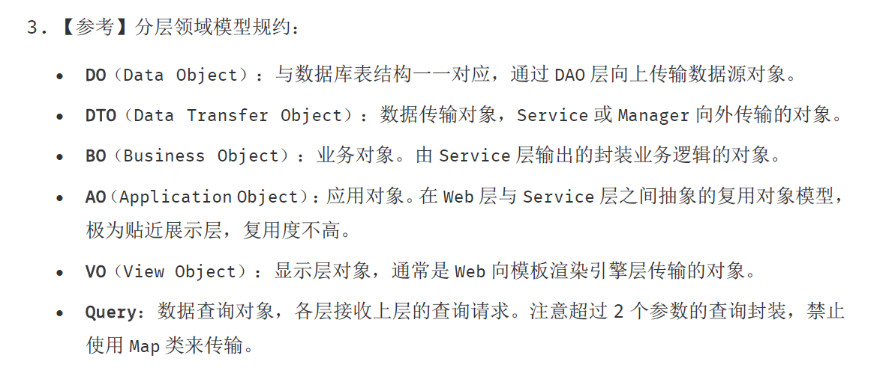

一个 POJO 持久化以后就是 PO
直接用它传递、传递过程中就是 DTO
直接用来对应表示层就是 VO

VO：值对象、视图对象
PO：持久对象
DAO：数据访问对象
DTO：数据传输对象

PO(Persisent Object) ：与数据库表映射的java对象，一般是DAO或者mapper的出参入参。

VO(Value Object 或者 View Object) ：值对象或者视图对象，一般情况下都是只controller的入参出参

DTO（Data Transfer Object）数据传输对象，两个系统之间传输使用的对象。

BO(business object) 业务对象，由Service层输出的封装业务逻辑的对象

POJO(plain ordinary java object) 简单无规则 java 对象

DO（Domain Object）领域对象

