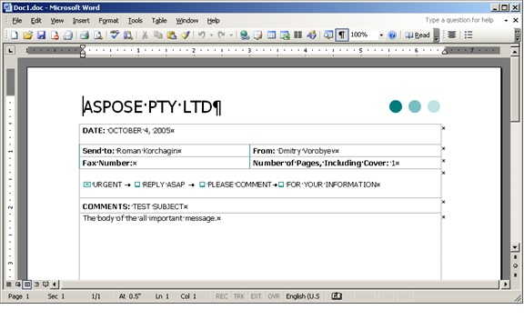
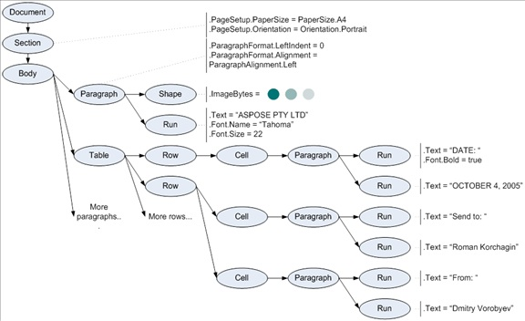

# word在aspose中的结构

参考网站：https://www.cnblogs.com/sguozeng/p/7747987.html

当上述文档被Aspose.Words的DOM读取时，会创建如下结构的树形对象：

Document, Section, Paragraph, Table, Shape, Run 以及图中的其他椭圆形的都是Aspose.Words对象，这些对象具有树形的层级结构，图中的注释同样说明这些文档对象树中的对象具有多个属性。

Aspose.Words中的DOM有以下特点：

1.所有的节点(node)类最终都继承于Node类，它是Aspose.Words DOM的基本类型。

2.节点可以包含(嵌套)其他节点，例如Section和Paragraph都继承自CompositeNode类，而CompositeNode类来源与Node类。

# 在doc中画图

https://blog.csdn.net/weixin_40029679/article/details/102564143?utm_medium=distribute.pc_relevant_bbs_down.none-task-blog-baidujs-1.nonecase&depth_1-utm_source=distribute.pc_relevant_bbs_down.none-task-blog-baidujs-1.nonecase

https://www.cnblogs.com/itljf/p/10179028.html

https://forum.aspose.com/t/insert-an-image-into-a-document-using-aspose-words-for-java/54465

https://forum.aspose.com/t/insert-page-number-in-header-of-word-document/171041

# API

https://apireference.aspose.com/words/java/com.aspose.words/WrapType