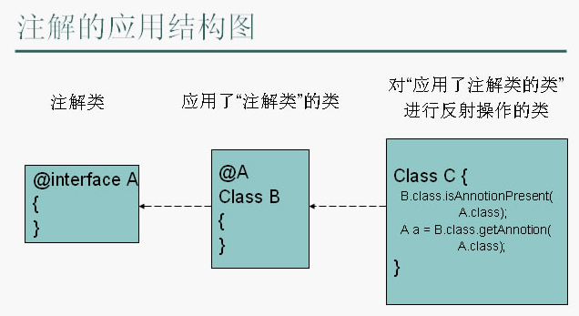

# java注解

## 注解类定义

注解（Annotation） 相当于一种标记，在程序中增加注解，就是给程序增加标记，标记可以加在包、类、属性、方法、方法参数、局部变量上。




定义一个注解类时，使用的是@interface，如下：

```java
package orz.anzhy.annotaion;
public @interface MyAnnotation {
}

```

## 注解类的行为

在定义一个注解类时，要用到另外一些 ***注解***  来控制这个类的行为，那么这些注解 注解类 的注解，叫元注解，代码如下：

```java
package orz.anzhy.annotaion;

import java.lang.annotation.ElementType;
import java.lang.annotation.Retention;
import java.lang.annotation.RetentionPolicy;
import java.lang.annotation.Target;

@Retention(RetentionPolicy.CLASS)
@Target({ElementType.METHOD,ElementType.TYPE})
public @interface MyAnnotation {
}

```


元注解有五种：

**@Retention - 保留期**

说明这个注解类的存活时间。

取值如下：

- RetentionPolicy.SOURCE 注解只在源码阶段保留，在编译器进行编译时它将被丢弃忽视。
- RetentionPolicy.CLASS 注解只被保留到编译进行的时候，它并不会被加载到 JVM 中。
- RetentionPolicy.RUNTIME 注解可以保留到程序运行的时候，它会被加载进入到 JVM 中，所以在程序运行时可以获取到它们。

**@Documented**

顾名思义，这个元注解肯定是和文档有关。它的作用是能够将注解中的元素包含到 Javadoc 中去。

**@Target**

指明注解运用的地方。比如只能张贴到方法上、类上、方法参数上等等，取值如下：

- ElementType.ANNOTATION_TYPE 可以给一个注解进行注解
- ElementType.CONSTRUCTOR 可以给构造方法进行注解
- ElementType.FIELD 可以给属性进行注解
- ElementType.LOCAL_VARIABLE 可以给局部变量进行注解
- ElementType.METHOD 可以给方法进行注解
- ElementType.PACKAGE 可以给一个包进行注解
- ElementType.PARAMETER 可以给一个方法内的参数进行注解
- ElementType.TYPE 可以给一个类型进行注解，比如类、接口、枚举

**@Inherited**

父类被贴了一个注解，子类是否也要有这个注解呢？如果父类中贴的注解在定义时由这个元注解，则子类会继承。

**@Repeatable**

Persons 是一张总的标签，上面贴满了 Person 这种同类型但内容不一样的标签。把 Persons 给一个 SuperMan 贴上，相当于同时给他贴了程序员、产品经理、画家的标签。

```java
@interface Persons {
    Person[]  value();
}


@Repeatable(Persons.class)
@interface Person{
    String role default "";
}


@Person(role="artist")
@Person(role="coder")
@Person(role="PM")
public class SuperMan{
}
```


## 注解类的属性

注解的属性也叫做成员变量。注解只有成员变量，没有方法。

注解的成员变量在注解的定义中以“无形参的方法”形式来声明，其方法名定义了该成员变量的名字，其返回值定义了该成员变量的类型。

```java
@Target(ElementType.TYPE)
@Retention(RetentionPolicy.RUNTIME)
public @interface TestAnnotation {
    int id();
    String msg();
}
```


如果注解中有一个属性，则可以直接赋值：

```java
@TestAnnotation(3)
public class Test {
}
```

如果 有多个，如下：

```java
@TestAnnotation(id=3,msg="hello annotation")
public class Test {
}
```


## 注解类的测试

首先获取每个类中的所有注解，

```java
// Test 类中是否添加了TestAnnotation注解
boolean hasAnnotation = Test.class.isAnnotationPresent(TestAnnotation.class);

// 如果有，获取到这个注解。
if ( hasAnnotation ) {
    TestAnnotation testAnnotation = Test.class.getAnnotation(TestAnnotation.class);
    System.out.println("id:"+testAnnotation.id());
    System.out.println("msg:"+testAnnotation.msg());
}
```


如果要得到某一个类或接口的注解信息，可以使用如下代码：

Annotation annotation = TestAnnotation.class.getAnnotation(MyAnnotation.class);

如果要得到全部的注解信息可使用如下语句：

Annotation[] annotations = TestAnnotation.class.getAnnotations();

或

Annotation[] annotations = TestAnnotation.class.getDeclaredAnnotations();

getDeclaredAnnotations与getAnnotations类似，但它们不同的是getDeclaredAnnotations得到的是当前成员所有的注解，不包括继承的。而getAnnotations得到的是包括继承的所有注解。

 

如果要得到其它成员的注解，可先得到这个成员，然后再得到相应的注解。如得到myMethod的注解。

Method method = TestAnnotation.class.getMethod("myMethod", null);

Annotation annotation = method.getAnnotation(MyAnnotation.class);

注：要想使用反射得到注解信息，这个注解必须使用

@Retention(RetentionPolicy.RUNTIME)进行注解。

 

## 注解类的使用场景

我写一个自定义注解类，然后去标注了一些方法、或者类、或者其他什么，

1. 在spring中，就需要写一个aop，aop的切点就是被加了自定义注解的这些方法、类、其他，然后通过aop实现在这么方法、类的前后执行一些内容。https://blog.csdn.net/wooyulin/article/details/79158483

```java
@Around("@annotation(com.hxh.unified.param.check.annotation.Encryption)")
public ResultVo encryptPoint(ProceedingJoinPoint joinPoint) throws Throwable {
  ResultVo resultVo = (ResultVo) joinPoint.proceed();

  // 获取注解
  MethodSignature methodSignature = (MethodSignature) joinPoint.getSignature();
  Method method = methodSignature.getMethod();
  Encryption annotation = method.getAnnotation(Encryption.class);

  // 如果被标识了，则进行加密
  if(annotation != null){
    // 进行加密
    String encrypt = null;
    switch (annotation.value()){
      case "AES":
        encrypt = EncryptUtil.encryptByAes(JSON.toJSONString(resultVo.getData()));
        break;
      case "DES":
        encrypt = EncryptUtil.encryptByDes(JSON.toJSONString(resultVo.getData()));
        break;
      default:
        break;
    }
    resultVo.setData(encrypt);
  }

  return resultVo;
}
```


2. 如果在java中，则需要自己写反射，去获取方法、类中是否有这个注释，然后执行一些其他操作。


## 注解类的运行顺序

当在同一Join Point上出现多个Advice时怎么办呢？ Spring AOP遵循与AspectJ相同的优先级规则来确定建议执行的顺序。在进来时，优先级最高的Advice首先运行，在出去时，优先级最高的Advice最后运行。

当在不同aspect定义的两条Advice都需要在同一Join Point上运行时，除非专门指定顺序，否则它们的执行顺序是不确定的。您可以通过指定优先级来控制执行顺序，方法有两种：1. 在aspect类中实现org.springframework.core.Ordered接口，2. 使用Order注解。通常来说，Ordered.getValue()（或者注释值）返回较低值的aspect具有较高的优先级。


当在相同aspect定义的两条Advice都需要在同一Join Point上运行时，其执行顺序也是不确定的（因为通过对java已编译好的类进行反射操作，是无法获取声明顺序的）。要么，你可以考虑将这两条Advice合并成一个Advice，要么，可以将这两条Advice重构成两个aspect类，就能够使用Order来自定义顺序了。


## java预置的注解

@Deprecated

@Override

@SuppressWarnings

@SafeVarargs


### @RestControllerAdvice

  https://www.cnblogs.com/UncleWang001/p/10949318.html

It is typically used to define [`@ExceptionHandler`](https://docs.spring.io/spring-framework/docs/5.0.0.M1/javadoc-api/org/springframework/web/bind/annotation/ExceptionHandler.html), [`@InitBinder`](https://docs.spring.io/spring-framework/docs/5.0.0.M1/javadoc-api/org/springframework/web/bind/annotation/InitBinder.html), and [`@ModelAttribute`](https://docs.spring.io/spring-framework/docs/5.0.0.M1/javadoc-api/org/springframework/web/bind/annotation/ModelAttribute.html) methods that apply to all [`@RequestMapping`](https://docs.spring.io/spring-framework/docs/5.0.0.M1/javadoc-api/org/springframework/web/bind/annotation/RequestMapping.html) methods.

这是一个【开关】注解，如果A类被这个【开关】注解（标注）了，则A类会在所有被@RequestMapping注解的方法上执行一些内容，这些内容定义在A类中。

这些方法有三类， [`@ExceptionHandler`](https://docs.spring.io/spring-framework/docs/5.0.0.M1/javadoc-api/org/springframework/web/bind/annotation/ExceptionHandler.html), [`@InitBinder`](https://docs.spring.io/spring-framework/docs/5.0.0.M1/javadoc-api/org/springframework/web/bind/annotation/InitBinder.html) 和 [@ModelAttribute`](https://docs.spring.io/spring-framework/docs/5.0.0.M1/javadoc-api/org/springframework/web/bind/annotation/ModelAttribute.html) 

这里主要讲@ExceptionHandler

A类中如果有如下定义：

```java
@ResponseBody
@ExceptionHandler(value = X.class)
public Map xHandler(X ex) {
    Map map = new HashMap();
    map.put("code", 100);
    map.put("msg", ex.getMessage());
    return map;
}

@ResponseBody
@ExceptionHandler(value = Y.class)
public Map yHandler(Y ex) {
    Map map = new HashMap();
    map.put("code", 200);
    map.put("msg", ex.getMessage());
    return map;
}


```

这个的意思是，如果被@RequestMapping注解的方法中有的方法抛了X异常，则会执行xHandler方法，如果有抛Y异常的，则会执行yHandler方法。

这也就是所谓的controller层异常的统一处理方法。


### @SneakyThrows

由lombok封装，使用后不用写try...catch块，而是自动上抛异常。


@Order控制注解执行的顺序


# 参考

https://blog.csdn.net/bibiboyx/article/details/89233034