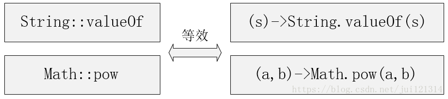

lambda

 Lambda表达式**将原本匿名内部类的一段代码简化** 

 表达式“->”的右边即实现该接口方法的具体代码 

 方法的参数正是写在了“->”左边 

 **要求该接口必须有且仅有一个方法待实现**，这样的接口有一个名字，叫做***“函数式接口(Functional Interface)”*** 

 Lambda表达式的第二个显著用途，则是为Java8新特性中的另一个东西：Stream（流）提供服务 

  

