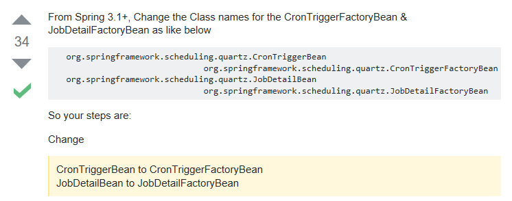

时间大小由小到大排列，从秒开始，顺序为 秒，分，时，天，月，年    *为任意 ？为无限制。 

具体如下： 

"0/10 * * * * ?" 每10秒触发 

"0 0 12 * * ?" 每天中午12点触发 

"0 15 10 ? * *" 每天上午10:15触发 

"0 15 10 * * ?" 每天上午10:15触发 

"0 15 10 * * ? *" 每天上午10:15触发 

"0 15 10 * * ? 2005" 2005年的每天上午10:15触发 

"0 * 14 * * ?" 在每天下午2点到下午2:59期间的每1分钟触发 

"0 0/5 14 * * ?" 在每天下午2点到下午2:55期间的每5分钟触发 

"0 0/5 14,18 * * ?" 在每天下午2点到2:55期间和下午6点到6:55期间的每5分钟触发 

"0 0-5 14 * * ?" 在每天下午2点到下午2:05期间的每1分钟触发 

"0 10,44 14 ? 3 WED" 每年三月的星期三的下午2:10和2:44触发 

"0 15 10 ? * MON-FRI" 周一至周五的上午10:15触发 

"0 15 10 15 * ?" 每月15日上午10:15触发 

"0 15 10 L * ?" 每月最后一日的上午10:15触发 

"0 15 10 ? * 6L" 每月的最后一个星期五上午10:15触发 

"0 15 10 ? * 6L 2002-2005" 2002年至2005年的每月的最后一个星期五上午10:15触发 

"0 15 10 ? * 6#3" 每月的第三个星期五上午10:15触发 

```xml
    <bean id="scheduler" lazy-init="false" autowire="no"
        class="org.springframework.scheduling.quartz.SchedulerFactoryBean">
        <property name="triggers">
            <list>
                <!-- 触发器列表 -->
                <ref bean="secondTimerJobTrigger" />
            </list>
        </property>
    </bean>

    <bean id="secondTimer" class="com.thunisoft.surface.cache.Cache"></bean>

    <bean id="secondTimerJobDetail"
        class="org.springframework.scheduling.quartz.MethodInvokingJobDetailFactoryBean">
        <property name="targetObject" ref="secondTimer" />
        <property name="targetMethod" value="secondMapReload" />
        <property name="concurrent" value="false" />
    </bean>

    <bean id="secondTimerJobTrigger" class="org.springframework.scheduling.quartz.CronTriggerBean">
        <property name="jobDetail" ref="secondTimerJobDetail" />
        <property name="cronExpression">
            <value>0/30 * * * * ?</value>
        </property>
    </bean>
```

