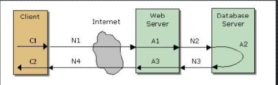

[TOC]

# 性能设计不足导致的问题

被动调整性能，代价较大

设计不合理，浪费资源（硬件成本，运维成本）

性能架构不合理，通过硬件扩展变的困难

# 性能指标说明

后端

吞吐量 - 单位时间内可处理的业务量

并发数 - 保证响应时间前提下可同时处理的最大请求数（各个资源80%以下）

前端

响应时间 - 用户发起请求到请求完成所花费的时间

在线用户数 - 一定时间区间内访问系统的用户数

瓶颈 - 随着处理量的增加，最先达到能力上限的环节，通常单机性能瓶颈是硬盘，联机性能是网络

## 响应时间

用户对系统最直观的感受

# 性能工作范围

需求分析 - 分析业务，定义性能需求，明确性能指标

架构设计 - 性能设计（软硬件，实现方式设计，扩展性） ，性能验证。

开发 - 数据结构 算法

测试 - 验证性能、评估、优化

运维 - 监控、扩展

# 性能需求

## 性能需求分析原则

考虑实际业务场景，基于已知数据推导

通常用吞吐量和响应时间定义总体性能指标

## 性能需求分析步骤

估计系统总用户数

分析用户使用系统的时间段，使用习惯等

估算同时在线的最大用户数

估算业务占比

估算用户平均操作时间间隔

定义响应时间（2-5-8 2-5-10）

# 性能设计

好的性不是测试出来的，而是设计出来的

## 性能设计目标

满足性能指标

解决响应时间问题

解决后端资源占用问题

成本最低原则

## 性能设计内容

确认系统性能需求（ 需求分析阶段的产物）

确认资源约束（软硬件的使用约束或者采购约束，比如必须国产化）、软硬件技术选型。

分析系统特点，估算瓶颈所在，估算峰值

应用程序实现方式设计

扩展方式设计（扩展不停机、扩展时花费等） 

**调整业务规则** （需求给的规则可能需要修改）

## 性能设计层次

程序架构、组件、算法

基础软件选型

操作系统

硬件驱动、设备参数（最大进程，打开文件数等）

硬件、固件（raid卡 网卡等）

### 硬件性能设计

了解硬件的参数，按照业务确定硬件的选择。

#### cpu

内核数 - 一个机器可以同时执行多少个线程，intel有超线程技术，可并行的线程数是内核数*2

主频 - 主流的1.6-3.5质检，单个处理的执行时间。

有无内置GPU - 一般音视频会用到，硬件加速编解码。

#### 内存

规格 - ddr3 ddr4

容量

速度 - 1600MHZ 1866 2133

数量

#### 硬盘

类型 - 7.2K 10K 15K SSD  共享存储

接口 - sata  sas

容量

磁盘组RAID -  0 1 5 10 50

吞吐量 - 机械 100M/s   ssd 500M/s

#### 网卡

千兆 - 125MB/s

万兆 - 1.25GB/s

举例说明选择时的考虑

比如文件存储服务器，吞吐量要求200M/s，确定采用2机械盘和网卡万兆，如果数据不可丢失，则采用raid10，则需要4块机械盘。

### 基础软件性能设计

#### 中间件

单机，负载均衡，内存分配，最大连接数，访问控制

#### 数据库

单机，主从，读写分离，集群，分库，分表，分区，索引，列式存储

### 应用程序性能设计

#### 缓存

本地缓存代替远程内容

内存缓存代替磁盘内容

调整算法更多使用cpu缓存

减少重复处理（数据库连接池，线程池）

#### io

减少低效处理（磁盘io，网络io），合并IO，批量IO，减少数据库的读写，减少日志的读写

#### 多线程

异步、并行（多进程，多线程等）

#### 算法

高效算法（二分查找代替遍历查找）

#### 数据结构

实体的结构设计，前后端交互的结构设计，结构压缩，信息冗余，

#### 层次结构

动静分离，读写分离，分布式

# 性能调优

确认问题

分析问题

确定目标和解决方案

测试方案

分析调优结果

# 总结

性能非小时，关系用户满意度、企业形象、成本等，要谨慎对待。

性能设计，始于开始。

# 参考资料

https://wenku.baidu.com/view/2c31b6c36429647d27284b73f242336c1eb930d2.html?pn=50